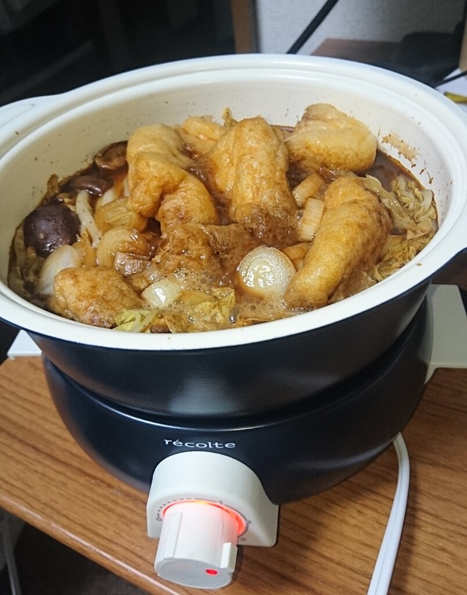

普段は普通の鍋を使って鍋物を作って食べてたんですが、台所で作って器に移して居室で食べるのが面倒なので居室で調理できたらいいなと思い卓上電気調理鍋を買ってみました。  

 

買ったのはポットデュオ フェット。  

[oembed:"http://recolte-jp.com/products/pot-duo-fete/"]

<!-- more -->

一台で煮る・炊く・蒸す・揚げる・焼くができて、デザインもスタイリッシュ。思ってたより安かったので選びました。  

届いた箱はこんな感じ。

 

中身。  
 

つまみには0,1,2,3としか記載されておらず、温度調整としてはちょっと弱いです。  

今回は味噌煮込み鍋を作りました。 

 

一定の温度まで上がると自動的に通電解除され、温度が下がるとまた通電するので温度が上がりすぎるということがないのはやっぱり便利ですね。  

消費電力は650Wなので一時間使っても16円くらいです。  

揚げ物もできるようになったので今後揚げ物にも手を出してみたいな・・・。  

[amazon:B01MF78210]