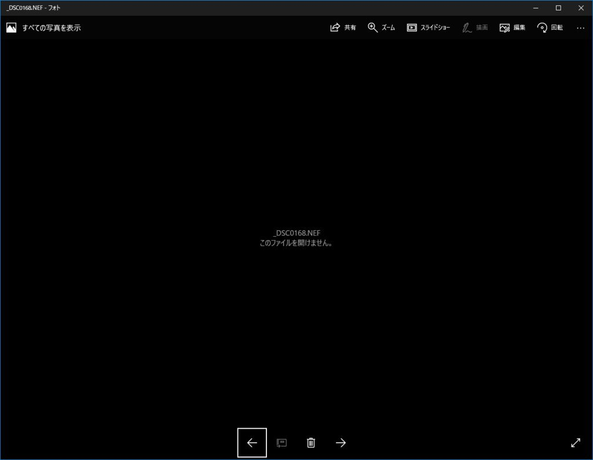
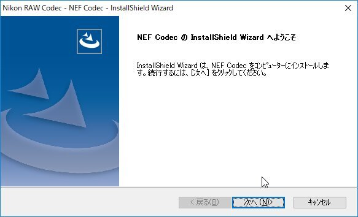
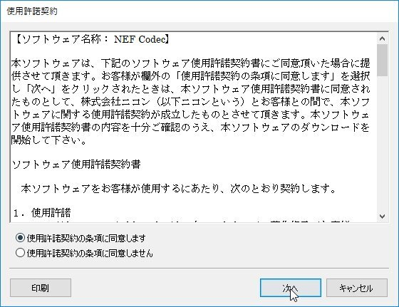
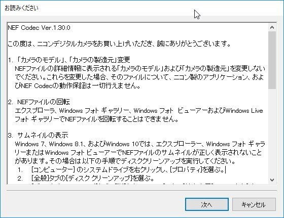
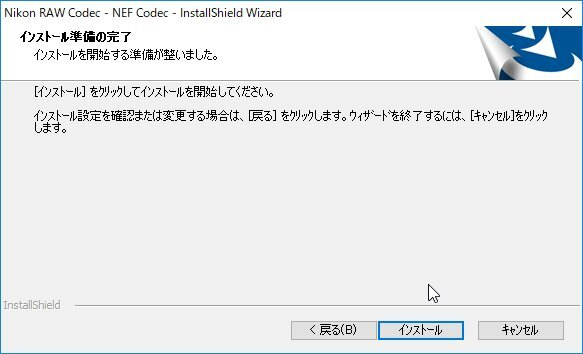
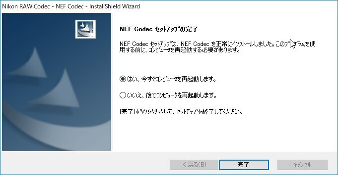
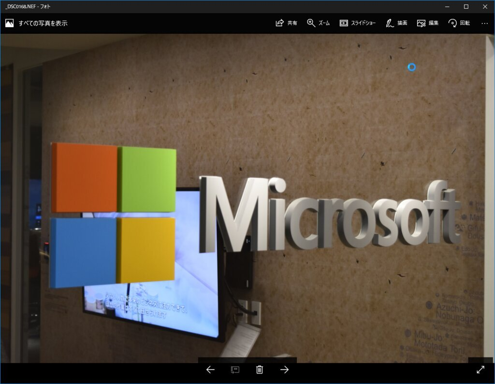
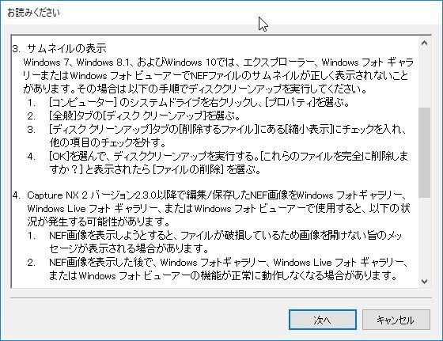

たぶんNikonユーザーには常識なんだろうけども・・・。  

これまで使っていたD5100からD5500に切り替え、写真を撮った後にPCで開こうとしたところ、  
  

フォトアプリがNEFファイルを開けず、「このファイルを開けません。」とエラーが表示されました。  

D5100のNEFファイルは開けるので、D5100以降のどこかで互換性が変わったんでしょうか。  
NEFファイルの仕様を知らないのでわかってないのですが。  

<!-- more -->

ざっと調べたところ、Nikonがコーデックを公開していました。  

[oembed:"http://downloadcenter.nikonimglib.com/ja/products/170/NEF_Codec.html"]

ダウンロードしたインストーラを起動して  
 

利用許諾契約を流し読みして（こら）  
 

お読みくださいをスルーしないで読んで  
 

インストール完了後、Windowsを再起動したら  
 
 

はい。  
フォトアプリでD5500で撮ったRAWファイルを無事に開くことができました。  
 

「お読みください」によれば、サムネイルが正しく表示されない場合は、一度ディスククリーンアップで縮小表示のキャッシュファイルを削除する必要があるそうです。  

 

