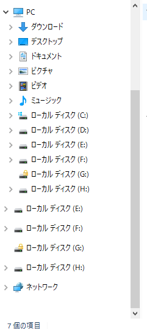
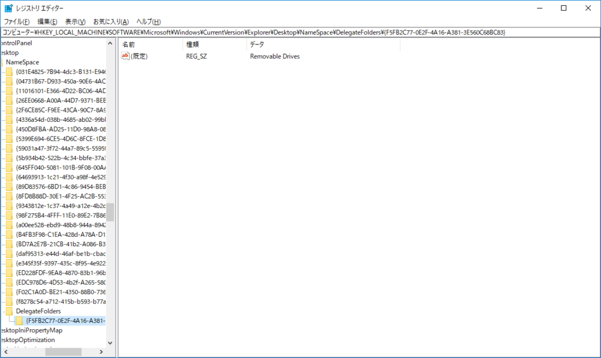
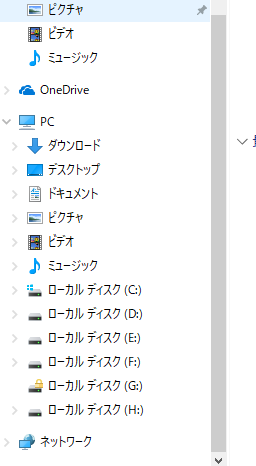

前々から気になっていたけど直していなかったやつ。  

Windows 8からなのか10になってからなのかは記憶にないですが、エクスプローラの左ツリーに、外付けHDDが重複表示されるようになりました。  
こんな感じで。  
 

てっきり不具合なのかと思ってましたけど、これだけ長いこと放置されてるってことは仕様なんでしょうかね、これ。。  

これはレジストリをいじることで解消できます。  

[oembed:"http://aoytsk.blog.jp/archives/313462.html"]

``` reg
[HKEY_LOCAL_MACHINE\SOFTWARE \Microsoft\Windows\CurrentVersion\Explorer\Desktop\NameSpace \DelegateFolders\{F5FB2C77-0E2F-4A16-A381-3E560C68BC83}] 
```

 

これを削除することでエクスプローラのPCツリーの下に外付けHDDが出てこなくなります。  
上のサイトだと、二つのレジストリが明記されてますが、WOW6432Nodeのほうは削除しなくてもよさそう。（たぶん64bitPCで64bitエクスプローラを使う場合？）  

   

すっきり。  