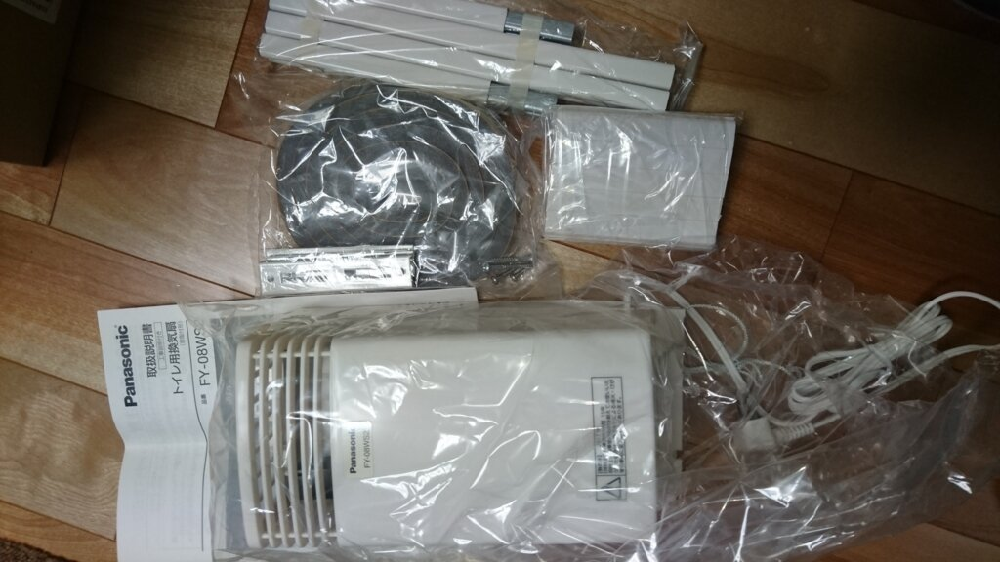
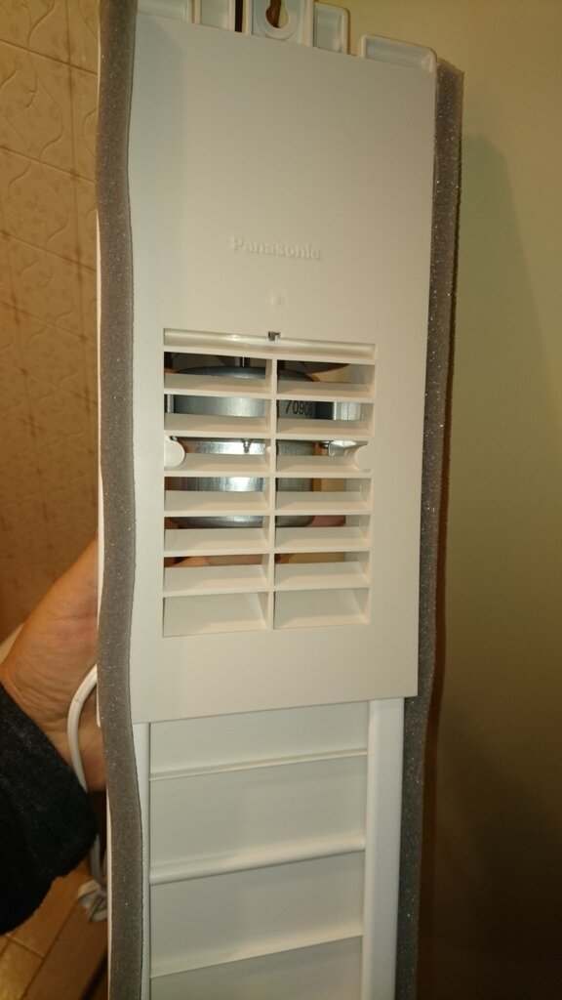

叔母の持ち家に引っ越して家賃0円生活を始めたひつじです。  

古い家なので大分くたびれたところもあるんですが、好きなようにしてよいと言質をもらったのでいろいろいじって遊んでます。    

で、この家のトイレなんですが、窓はあるものの換気扇がないんです。  
窓があれば十分だろってことなんでしょうけども、一つの窓だけだと空気のめぐりが悪く、匂いがちょっとこもりがちです。  
一応消臭剤は置いているけれど、きちんと空気を換えておきたい・・・。  
 

というわけで窓に設置できる換気扇を買ってみました。  

<!-- more -->

今回買ったのはPanasonicのFY-08WS2という窓用換気扇です。  
[amazon:B00ATZRC02]

届いた箱の中身はこんな感じ。  

 

本体の下側にサッシとパネルを取り付けて、高さを調整して窓にはめ込む作りです。  

 

いったんパネルを取り付けずに窓にはめ込むとこんな感じ。  
上側はアルミサッシのレールにひっかけています。

   
このままだと隙間から虫が入ってきてしまうので、付属のソフトテープを張って隙間を埋めます。   
 

パネルも取り付けた状態で窓にはめ込んだら作業完了。正味30分もあれば設置できますね。  
   

肝心の換気効率ですが、トイレ利用後10分程度で匂いがしないレベルだったので十分かなと。  
電気代もそんなにかからない（消費電力2.7Wですし）ので、24時間入れておいても気にならないです。  

