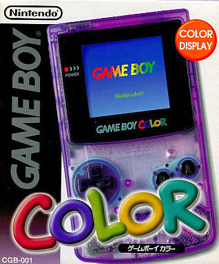
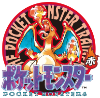
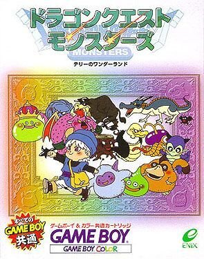

この記事は[Game Boy Advent Calendar 2017](https://adventar.org/calendars/2505) の10日目の記事になります。  
前日の記事は酢酸先生の<?# OEmbed "http://blog.ch3cooh.jp/entry/20171209/1512829800" /?>でした。  

<?# OEmbed "http://blog.ch3cooh.jp/entry/20171209/1512829800" /?>

<?# OEmbed "https://adventar.org/calendars/2505" /?>

#### 購入したゲームボーイ(ハード、ソフト)の思い出  

私が初めて買ったゲーム機がゲームボーイカラーでした。  
色はクリアパープル。半透明で中が微妙に透けているのがお気に入りでした。  

<?# OEmbed "https://www.suruga-ya.jp/product/detail/165003012001" /?>
 

ところで、クリアパープルを購入した少年は将来オタクになるというネタがねとらぼに上がっていたようです。  
確かにオタクになったな・・・。  

<?# OEmbed "http://nlab.itmedia.co.jp/nl/articles/1602/14/news018.html" /?>

GBCと一緒に購入したソフトは「ポケットモンスター 赤」（以下レッド版）でした。  

 

なんでレッド版を買ったかは全く記憶にないんですが、レッド版を遊んでるのに選んだ最初の一匹はゼニガメという謎。  
ニビジムでさくっとタケシを倒した後、ハナダジムで辛い思いをした記憶。  

クリアしてからだったかクリアする前だったかは記憶にないのですが、このポケモンのカートリッジを失くしてしまいました。  
相当ショックを受けてたらしい私に父が買ってくれたのが「ドラゴンクエストモンスターズ テリーのワンダーランド」です。  
 

<?# OEmbed "https://www.youtube.com/watch?v=YGmWWzANsnE" /?>  
これこれ。オープニングが流れる前のﾁﾁﾁﾘｰﾝという星が降るサウンドを聞いた瞬間思い出がぶわーっと脳裏をかすめます。  
この動画で使っているスーパーゲームボーイ2、私の家にもあったのですが、ゲーム映像周りのフレームが選べて、動画のようにゲームオリジナルデザインのものが選べてときめいた記憶があります。  

DQM、正直ポケモンよりはまりました。  
ポケモンはのちに発売された「ポケットモンスター 金」以降プレイしていないのですが（弟がルビーサファイアをやっているのを見ていた）、ドラゴンクエストは外伝作品であるDQMを足掛かりにDQ1～8まで遊びましたし、DQM2(ルカ・イル）やトルネコの大冒険もプレイしていました。そういえばDQ1,2,3はGBでプレイした記憶があります。    
たぶん高校・大学時代にはまった日本ファルコムの軌跡シリーズと同格レベルで遊んだゲームシリーズです。なおファイナルファンタジーはプレイしたことがありません。（なぜかFFAえりいくなる非公式ブラウザゲームは中学時代やってた）  

ポケモンはひたすら集めて強くするわけですが、DQMはそれに「配合」システムを加えてよりキャラクター(モンスター）を育成させる楽しさを際立たせた点で画期的だったかと思います。  

上記以外にも、「ドラえもんカート2」を遊んだ記憶はあるのですが、それ以外だと何をプレイしたんだったか・・・。  
私は案外ゲームで遊んでないんですよね。  

#### 今でも強く覚えているゲームボーイの思い出  
前述のDQMをプレイしているときのことでした。  
ゲームボーイって単三電池二本で遊べるんですが、結構すぐになくなってしまうので、充電池であることは必須。  
充電中はACアダプタを接続して遊んでいました。  
連れているモンスターが弱くてなかなか進められないので、友人から強いモンスター（確かストロングアニマルでした）を一時的に借りて遊んでいた私。  

その横をまだ保育園に通っていた頃の弟が通りかかり、そのままACアダプターから伸びているケーブルに足を引っかける。ケーブルがGBから引っこ抜け、電池が入っていないGBは当然電源が落ちる。  

今でも忘れられないです。恐る恐るもう一度電源を入れた時に、「さいしょからあそぶ」のメニューしかなかった時のことを。  
あの後友人にどうやって謝ったか、これはよく覚えていません。しばらくその友人に声をかけ辛かった記憶だけは残っています。  

#### 振り返って  

ゲームボーイカラーを手に入れるまで、家にスーパーファミコンしかなかった私。  
いつでもどこでも遊べるゲーム機は(当然カラーでないゲームボーイなどGBC以前からあったわけですが）当時の私にとって画期的でした。  
布団の中でこっそり遊んだのも良い思い出です。  

今やスマホで様々なゲームが遊べる時代ですが、最近はあまりゲーム欲がありません。  
単に忙しいのもあるのですが、今のゲームはグラフィカルで情報量が多く、遊んでいて疲れるのも一因なのかもと思います。  
そういう点で、ドット絵かつ少ないROM内に工夫を凝らしていたGB時代のゲームは私にあっていたのかもしれません。  

