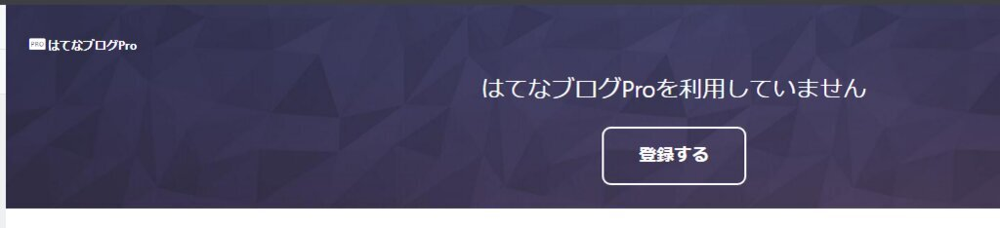

さっきふとメールを見ていたらこんなのが来てました。  

 

<!-- more -->

ぐぇっ・・・。  

そういえば更新しろってメールが来ていたのに、クレジットカード払いに切り替える方法がまだ提供されておらず、ポイントを購入する従来の方法しかできないので面倒くさがって後回しにしたまま忘れていたのでした。  

停止したってことはドメインでブログに飛べなくなってるよな・・・と思いつつブログを開いたら普通に開けます。  

管理画面でもPro利用中と表示されていました。  

 

しかし利用状況ページに飛んでみると

 

というわけでまだ部分的に無効化されているだけで、完全ではなかったようです。  

というわけで再申し込み。  

 

最近はてなブログProから乗り換えました！！って人をたまに見ますが、私はこのまま使い続ける予定なので2年契約。  

 

怪我の功名というか、再申し込みなのでポイント購入で契約しなくとも直接クレジットカード決済可能です。  
さくっとクレカ情報を入力して  

 

 

 

はい契約完了。  
 
  

今回まだ完全に停止されていなかったので何も設定しなくてもよかったのですが、完全に停止されていたらドメイン設定を再度しなければならないようなので注意してください。  

 