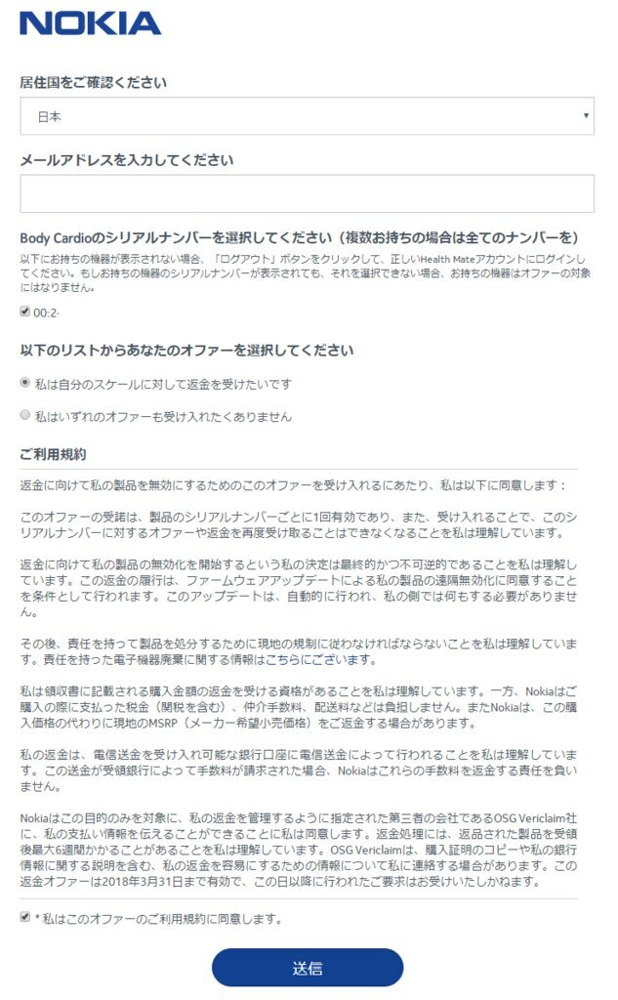
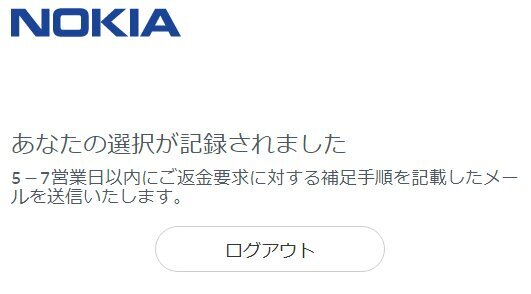

昨年三月に購入したWithings Body Cardio(買収されてNokia Body Cardioになった）ですが、売りの一つだった脈波伝播速度が、「異なるレベルの規制上の承認を必要」とやらで無効化されてしまいました。  

<!-- more -->

これが無くなると下位製品との差が  

* 心拍数を測れるか否か  
* 体重を0.1kg単位で測れるか  
* 充電式かどうか  
の3点になってしまいます。  
心拍数は体重を測る時だけ計測してもあまり意味がないし、私の場合体重が0.1tレベルなので、0.1kg単位で測れなくてもあまり影響なし。  
バッテリーもそうすぐに無くなってしまうわけでもないので、充電式でなくても問題なし。  

というわけで、別の製品に乗り換えるべく、返金をお願いすることにしました。  
(2018年3月31日まで受け付けています。)

[こちら](https://account.health.nokia.com/bodycardio/product_form)のページを開いて、Nokia アカウントでログインすると下記のようなページが表示されます。  

 

すでにアカウントと紐づけている場合はシリアルナンバーが表示されているので、チェックを入れ、規約を確認して送信ボタンを押せば完了。  

 

7営業日程度で連絡が来るみたいです。  

気になるのは、返金は購入時の金額になるのかということ。  
私はAmazonで買ったので領収書をAmazonから取得できますが、量販店で買った場合は捨ててしまっていることもあるわけで。 
そのあたりがどうなっているのか気になります。  

 