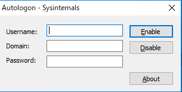
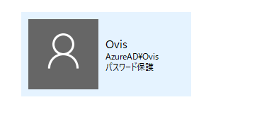
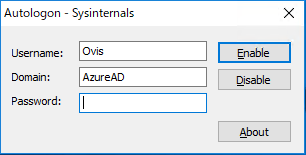

[oembed:"https://x.com/hitsuji_no_hito/status/1007962572476186624"]

Office 365を契約してから、そちらで作ったアカウントを用いてWindowsのユーザーを作成してたんですが、そのユーザーでWindowsの自動ログインをしようとしてはまったのでメモ。  

<!-- more -->

#### ローカルアカウントやMicrosoftアカウントの場合  
> control userpasswords2    

もしくは  

> netplwiz  

でユーザーアカウントダイアログを表示して、ユーザー一覧から自動ログインさせたいアカウントを選んで「ユーザーがこのコンピューターを使うには、ユーザー名とパスワードの入力が必要」のチェックを外してOKボタンを押し、パスワードを入力、OKボタンを押せば設定完了。  

#### 企業アカウントの場合  
Office 365で作成したメールアドレスはMicrosoftアカウントではなく、企業アカウント扱いなので、上記の方法が使えないらしいです。  
ドメインに参加してる状態と同じってことみたいです。  

[oembed:"http://www.atmarkit.co.jp/ait/articles/1306/17/news054.html"]

上記サイトを参考に、MicrosoftのサイトからAutologonのツールをダウンロードします。  

[oembed:"http://technet.microsoft.com/ja-jp/sysinternals/bb963905.aspx"]

起動するとこんな画面が出てきます。  
 

UserNameには多分メールアドレスが自動的に入力されているかと。  
ここで悩んだのがDomainの項目。  

Office 365ユーザーってだけでドメインに参加してるわけではないような・・・。  
実際コントロールパネルのシステムを見ても、ワークグループ：WORKGROUPと出ていて、ドメインに参加しているとはなってない。  

で悩んだのですが、ユーザーアカウントの設定画面開いたらわかりました。  

   

なるほど「AzureAD」がドメインとなるのか。  

というわけで下記のように入力します。  
   

入力したら「Enable」ボタンを押してやれば、パスワードが間違ってない限り成功とダイアログが表示されるはずです。  
