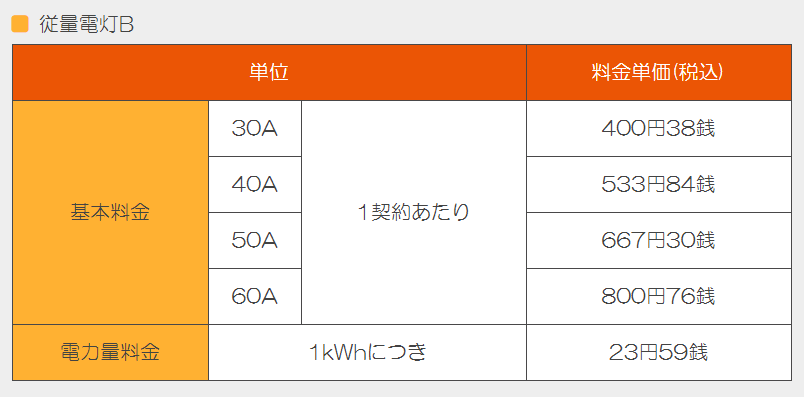
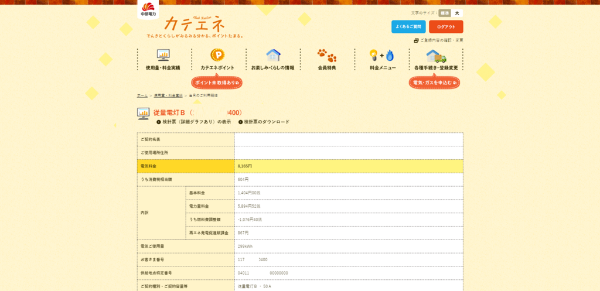
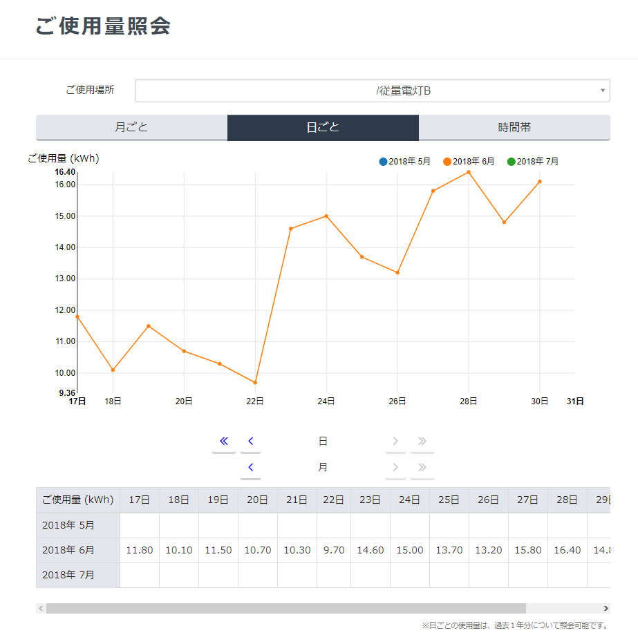
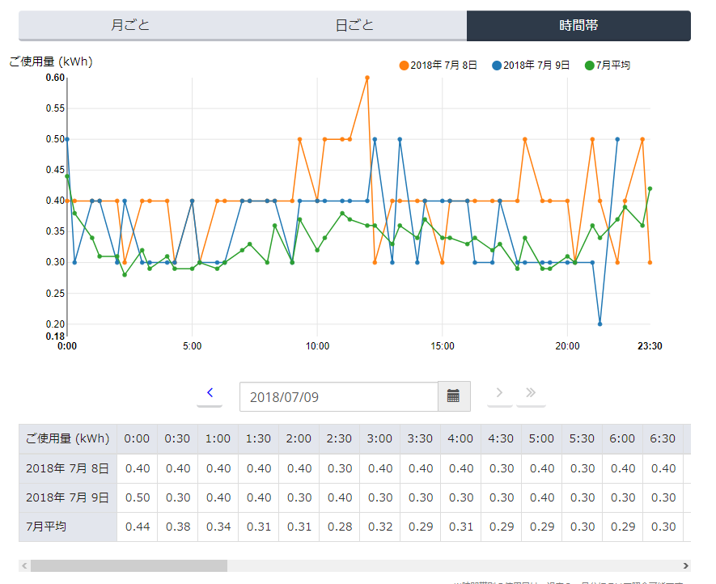

PCが常時2台稼働し、NASも2台稼働させ、夏冬はエアコンをかけっぱなしという生活を続けているので、一人暮らしなのに毎月300kWhくらい使っています。  
大体月8000円程度電気代に使っているわけで、少しは削減したいなと。  

というわけで、電力会社を中部電力から別の事業者に乗り換えることにしました。  

当初は東邦ガスのプランにしようかと思ったんですが、思っていたより安くもならなかったため、ほかに安い事業者はないか調べたところ、中部圏では「きらめきでんき」が一番安いようで。  

<?# OEmbed "http://www.kiramekidenki.jp/" /?>

安かろう悪かろうでは困りますが、まぁ事業者によって電力の質が変わるわけでもないので、問題ないかなぁと。  

中部圏での電気料金は下記の通り。  

 

大体10%ほど安くなりそうな感じです。  

切り替えにあたり、供給地点特定番号が必要なんですが、いったいどこに書いてあるのかわからなくて困りました。  

カテエネだと、当日のご利用明細に記載されているようです。  

 

契約自体はネットですべて完結します。  

申し込みをしたらいつから供給が切り替わるかを通知するメールが届きます。  

「F-Power電気」から届くので「え？っ」となりましたが、

> 2016年4月、電力の小売全面自由化を受け、株式会社F-Power（小売電気事業者登録 No.A0001）と販売代理店契約を締結し、2017年4月1日から、「きらめきでんき」の名称で、一般家庭や商店などの50kW未満の低圧電力を対象に電力の販売を開始しました。   

ということなので間違ってません。  

供給が開始されると、マイページから利用量を参照可能になります。  

 
   

正直使い勝手は微妙ですが・・・。  

実際の電気料金も、確認した感じでは想定通り10%程度安くなっています。  

これからエアコンをバンバン使う時期になるので、10%は大きいですね。  

