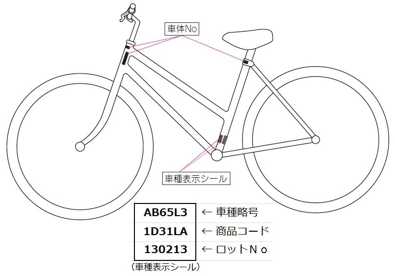

普段買い物に行く際は自転車を利用しています。  
昨日もいつも通り自転車で買い物に行こうとしたのですが、自転車のカギがない。  

さんざん探して、前回自転車を利用したときにはいていたズボンのポケットの中(洗濯してしまってあった）にあるのを見つけて事なきを得ましたが、いざって時に探し回るのは辛い(ちゃんとしまっておけって) 。 
引っ越した時にスペアキーをなくしてしまったのですが、本当になくしてしまうと自転車に乗れなくなってしまうので、スペアキーを注文することにしました。  

私の自転車はショップブランドのブリヂストン製自転車なので、ブリヂストンのサイトからスペアキーの注文方法を確認したところ、  

[oembed:"http://faq.bscycle.co.jp/content/1094.html"]

> お買い上げ販売店、または弊社製品取扱店でご注文を承ります。  
> 品質保証書（ロビンフッド手帳）をご持参の上、キーに刻印のあるキーNo.および品質保証書（ロビンフッド手帳）に記載されている商品コード、車種略号（型式）をお申し出ください。  

あ、詰んだ・・・。ロビンフッド手帳もない・・・。  

注文できないじゃん・・・と思ったのですが、どうもキーNo、商品コード、車種の型式が分かればロビンフッド手帳がなくても行けるようです。  
また、通販でも注文できるんですね。  

[oembed:"https://item.rakuten.co.jp/auc-vanward/spkslkb/"]

私はブリヂストンの購入者登録を行っていたので、サイトから商品コードなどを取得して注文しました。  
もし登録していない場合は、下記の画像([oembed:"http://faq.bscycle.co.jp/content/1115.html"]  より引用)の場所にある記載をメモる必要がありますね。 
 

受注生産で大体10日～20日くらいみたいです。  
今度はなくさないようにキーホルダーかなんかつけておかないと・・・。  

