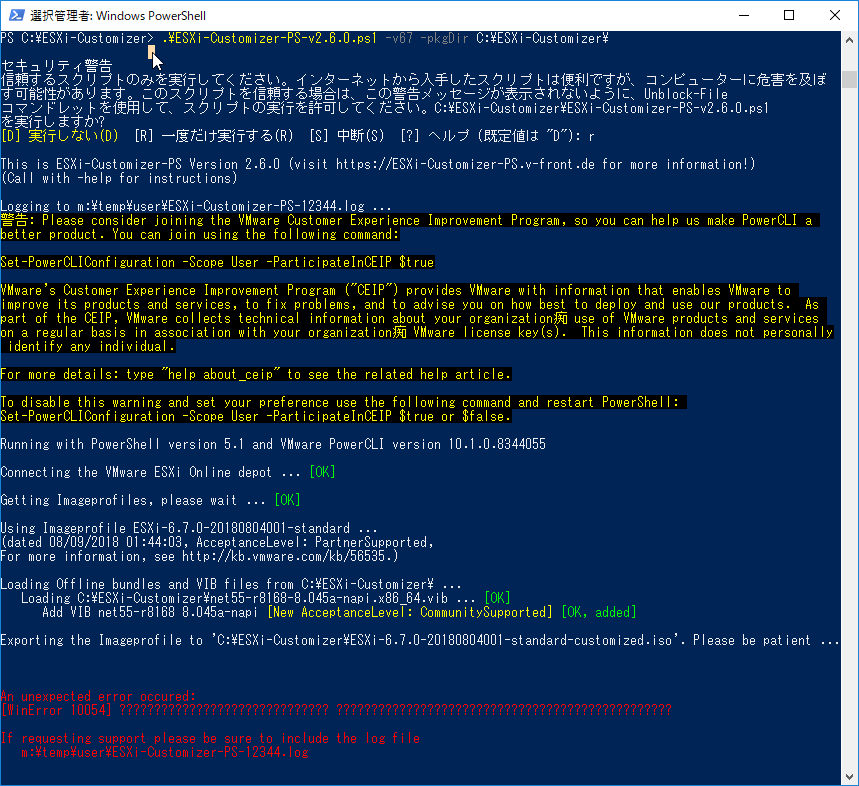
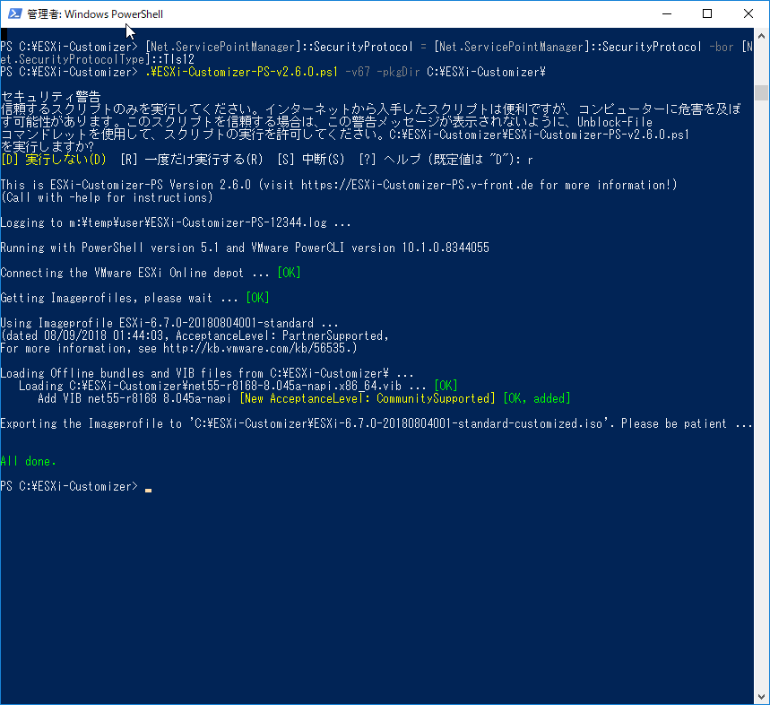

録画マシンを新たに作って一台マシンがあいたので、久しぶりにESXiをインストールして遊ぼうかなと。  
Realtek製NICしかないマシンなので、ドライバを組み込んだカスタムイメージを作成するために下記のブログをもとに作業に入ったのですが、ESXi-Customizer-PS の作業ではまったので覚書。  

[oembed:"https://tech-mmmm.blogspot.com/2018/05/realteknicesxi-67.html"]

<!-- more -->

まずPowerCLIなんですが、これ今はPowerShell Gallery経由でインストールするんですね。  


> Install-Module -Name VMware.PowerCLI   

管理者権限で起動したPowerShellに上記のコマンドをぶち込むだけでインストール完了。なんて便利。  

カスタムイメージを作成するために必要なESXi-Customizer-PS は下記のサイトからダウンロード。  

[oembed:"https://www.v-front.de/p/esxi-customizer-ps.html"]

実行する前に  

```powershell
Set-ExecutionPolicy Unrestricted  
```

を実行しておくことを忘れずに。  
デジタル署名されていないスクリプトとしてはじかれてしまいました。  

NICドライバとスクリプトを用意し、上記ブログ記事にある通り  

```powershell
.\ESXi-Customizer-PS-v2.6.0.ps1 -v67 -pkgDir C:\ESXi-Customizer\  
```

と実行したのですが、私の環境だと下記のようなエラーが発生しました。  

> An unexpected error occured:  
> [WinError 10054] ?????????????????????????????? ????????????????????????????????????????????????  
>   
> If requesting support please be sure to include the log file  
>    C:\temp\user\ESXi-Customizer-PS-12344.log  

   

ザクっと調べたところ、下記のツイートを発見。  

[oembed:"https://x.com/VFrontDe/status/998868087586934785"]

VMwareのサイトでTLS1.2が強制化されたことによる影響らしいです。  

レジストリをいじって恒久対応させてもいいんですが、手っ取り早い方法として、  

> [Net.ServicePointManager]::SecurityProtocol = [Net.ServicePointManager]::SecurityProtocol -bor [Net.SecurityProtocolType]::Tls12   

のコマンドを先に実行しましょう。(一行コマンドです。改行されてますが。。）  
これでTLS1.2が有効になります。  

[oembed:"https://blog.shibata.tech/entry/2018/04/30/184744"]


 

今度はエラーも出ず、ちゃんとカスタムイメージが作成されました。  

