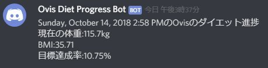

ダイエット仲間と進捗状況をDiscordで共有すべく、HealthPlanetからデータを取得してDiscordに投稿するプログラムを書いてみました。  

<!-- more -->

投稿結果はこんな感じで。  
 

自分が利用することしか念頭に置いていないので、色々ハードコーディングで作ってます。  
めっさコードが汚い・・・というか糞すぎて人に見せるのに勇気がいるレベル・・・。  
(OAuthなのにID、パスワードを環境変数に埋め込むとかアホかと突っ込まれそう）  
エラーハンドリングとかは追々やります。  

[oembed:"https://github.com/Ovis/SendDietProgress"]

##### 参考にしたサイト  

[oembed:"http://blog.livedoor.jp/tkarasuma/archives/1037075216.html"]

[oembed:"http://www.mirandora.com/?p=808"]

[oembed:"https://muziyoshiz.hatenablog.com/entry/2016/01/11/234921"]

[oembed:"http://ryuichi111std.hatenablog.com/entry/2017/07/20/061843"]

[oembed:"https://qiita.com/TsuyoshiUshio@github/items/190437a7099ded9ce731"]

