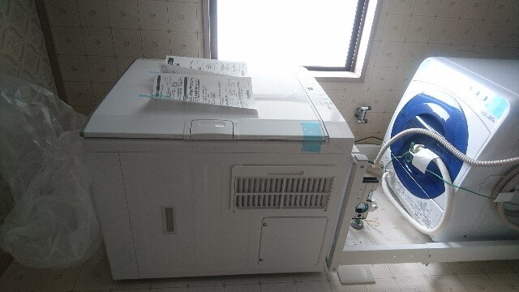

今弟と一緒に暮らしているんですが、二人暮らしで今一番困っているのが洗濯物。  
弟は仕事が朝早いので必然的に夜早く寝てしまうんですが、洗濯物を干す物干し台が弟の部屋からでないと行けないので、早く家に帰った時でないと干せない・・・。  

また、10月末に駅の階段から落ちて足を痛めてしまったために、しばらく洗濯物を干す行為自体に支障を来してしまった始末。  
2か月たった今は階段を降りるとき以外不自由しないレベルに回復しているんですが、今後もケガしたときに洗濯物を干せないってのは非常に困る。  

というわけで、衣類乾燥機を導入することにしました。  

衣類乾燥機を導入するにあたって、ぜひ導入したいなと思っていたのがガス式の衣類乾燥機。  
実家では電気式衣類乾燥機を使っていたんですが、あれ乾くの遅いんですよね。2時間3時間かかるのはちょっと・・・。  

あとふわふわ感がガス式と電気式では違うのも大きい。  
せっかくならいいものを使いたい。都市ガスを引いているのでランニングコストが低いのも一つのポイントでした。    

というわけでリンナイの乾太くん(RDT-52S)に決定。  

<?# OEmbed "https://rinnai.jp/products/sanitary/laundry_dryer/" /?>

ちなみに衣類乾燥機能付きの洗濯機も当初考えましたが、きちんと乾く乾燥機能はドラム式洗濯機くらいしかなく、我が家の脱衣所は入り口が狭くて導入不可能だろうということで諦めました。めちゃくちゃ高いですし。  

近所のガス屋さんに相談してまずは見積もりを出してもらったんですが、工事代を含めた総額が<b>202000</b>円(値下げ交渉後）。

本体が10万ほど、台が純正なので17000円ほど、設置工事やコンセント増設工事、排湿管代にその排湿管を通すための穴をあける工事、ガス栓の増設までをやるとここまで行っちゃうんですね・・・。  
とはいえ今回は弟と折半なので10万円ほど。まぁいいやとゴーサインを出して設置してもらいました。  

こんな感じで排湿管を通す穴を壁に開けて、  

 

専用台を設置して、洗濯機の上に設置されました。  

 

設置したので試運転がてら洗濯したものを入れて回してみたところ、  

 

一回回しただけでこんなに埃が・・・。  
今回取り付けてもらったタイプは扉側に糸くずフィルターがついているので掃除はとても楽でした。  
あまり埃がたまっていると乾きが悪くなるほか、電気代ガス代も無駄にかかるのでここは日ごろきれいにしておきたいところです。  

 

設置後何度か使ってみましたが、やっぱり乾燥機があるって便利だと再認識しました。  
利用できない衣類もありますが、日ごろたくさん使うタオル類が洗ったそばから乾かしてすぐ使えるのはとてもありがたい。  
天気に左右されないだけでなく、夜遅く帰ってきてもすぐに洗って乾かせるので、汚れた洗濯物を放置せずに済むのは精神衛生上もよいです。  

12月に設置したけど、今年買ったものの中で一番勝ってよかったといえる品ですねこれは。

