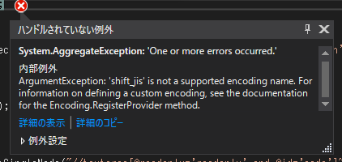
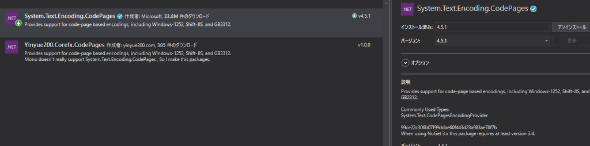

.NET CoreではShift-JISがそのままでは利用できない。  

.NET Frameworkで作成していた時は問題なく動いていたプログラムをそのまま移植すると、  

   

> ArgumentException: 'shift_jis' is not a supported encoding name. For information on defining a custom encoding, see the documentation for the Encoding.RegisterProvider method.  

と怒られる。  

#### 対策  

エラーメッセージにある通り、カスタムエンコーディングを登録してやる必要がある。  

NuGetから[System.Text.Encoding.CodePages](https://www.nuget.org/packages/System.Text.Encoding.CodePages/)を参照し、  

   

コードのどこか(Shift-JIS処理するより前)に下記を挿入。  

>Encoding.RegisterProvider(CodePagesEncodingProvider.Instance);  

これでShift-JISが正常に利用できる。  

UWPとかやっていた方からしたら基本的な知識なのかも。  

いい加減Shift-JISを利用したサイト滅びてくれないかな・・・。  
