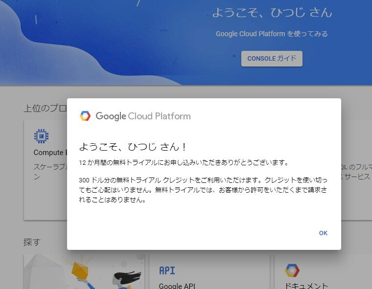

伊勢さん(id:iseebi)のTwitterでの投稿を見て初めて知ったのですが、Google Compute Engineって無償枠ってのがあったんですね。  

Google Compute EngineはいわゆるIaaS。 AWS の EC2やAzure VMと同じく、時間単位での仮想マシンリソースを提供するサービスになります。  
Google Cloud Platformの一サービスですね。  

無償枠の上限は下記の通り。  

* 1 つの非プリエンプティブ f1-micro VM インスタンス（米国リージョン(オレゴン州(us-west1)、アイオワ州(us-central1)、サウスカロライナ州(us-east1))  
* 30 GB の標準永続ディスク ストレージ（1 か月あたり）  
* 5 GB のスナップショット ストレージ（1 か月あたり）  
* トラフィックは北米の GCP リージョンから送信する必要がある
* まとめて送信できる下りトラフィックは 1 GB まで  

[oembed:"https://cloud.google.com/free/docs/always-free-usage-limits"]

メモリーは600MBと小さな仮想マシンですが、ただで使えるのは良いですね。  

早速登録しました。  

<!-- more -->

#### Google Cloud Platform の利用登録
まずページに飛んで、「無料トライアル」のボタンをクリック。  

   

利用規約の確認にチェックを入れて、「AGREE AND CONTINUE」をクリック。    
 

支払い方法などを入力して「START MY FREE TRIAL」をクリック。  
 

登録完了。  
 

#### インスタンスの作成

左メニューからCompute Engineにマウスカーソルを充てるとメニューが表示されるので、一番上のVMインスタンスをクリック。  
   

「課金を有効にする」をクリック。  
 

作成ボタンをクリック。  
   

インスタンスの作成画面が表示されます。  

 

##### 名前  
名前は適当に。わかりやすいものにしました。    
   

##### リージョン、リビジョン  
リージョンは下記のいずれかにしないと課金対象になってしまうので注意。  
* オレゴン州(us-west1)  
* アイオワ州(us-central1)  
* サウスカロライナ州(us-east1)

今回は日本に近いオレゴンにしました。  
リビジョンは特に変えてません。  
 

##### マシンタイプ  
マシンタイプはmicroにする必要があります。  
 

##### コンテナ  
今回はコンテナを使うつもりがないのでチェックは入れません。  
そもそもこのスペックでコンテナ使っても微妙な気がする・・・。   
 

##### ブートディスク  
標準の10GBの永続ディスクでもいいんですが、30GBまで使えるので変更しておきました。  
OSは標準のDebianからUbuntu LTSに。ここはよく使ってるOSにしただけで他意はなし。  
 
 

##### ID と API へのアクセス  
今回特にAPIを使うつもりもないのでデフォルトのまま。  
   

##### ファイアーウォール  
後でも設定できますが、とりあえず両方とも開けておきました。  
 

##### ネットワーキング  
外部IPアドレスの設定。  

ネットワーク インターフェースの鉛筆マークをクリック。  
   

外部IPをクリックして、IPアドレスを作成をクリック   
 

名前は適当に。  
予約ボタンをクリックすると、IPアドレスが予約されます。  
   

元の画面に戻ったら完了ボタンをクリック。  
   

ここまで終わったら作成ボタンをクリック。  
   

これで仮想マシンインスタンスが作成されました。  

   

#### SSHでの接続  

作成した仮想マシンへSSHで接続してみます。  

まずはSSH接続用に公開鍵認証の設定を。  

左メニューのメタデータをクリック。  

 

SSH認証鍵をクリック。  
 

SSH認証鍵を追加をクリック。  
 

あらかじめ作成しておいた公開鍵を記載して、登録ボタンをクリック。    
 

これでSSH認証鍵の登録は完了。  

ターミナルで秘密鍵を使ってログインしてみたところ。  
 

標準だとタイムゾーンが協定世界時になっているので、JSTに変えておく場合は下記のコマンドを実行。  
> $ sudo timedatectl set-timezone Asia/Tokyo  

実行するとJSTに切り替わります。  
   

多分これをしておかないと、Cronで設定するときにUTCで記載する必要が出てくるはず。  

あとは本当はSSHが利用するポートを変更しておくべきなのだと思いますが、とりあえずはここまで。  

#### 参考にしたサイト  

[oembed:"https://qiita.com/ndxbn/items/7ef0a96e409a5b5837bd"]  
 
[oembed:"https://blog.apar.jp/web/6966/"]

