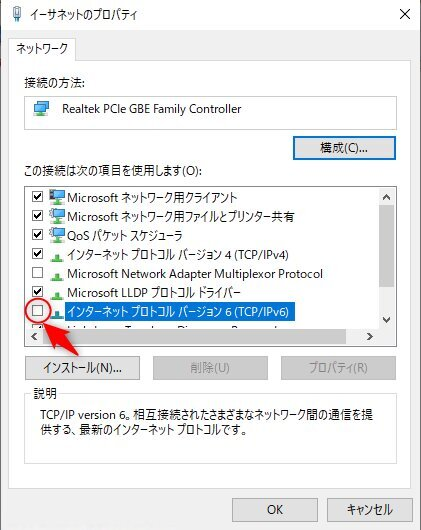

Mirakurunを動かしているマシンを初期化して再度環境を作り直した際、下記のエラーが発生した時の暫定対応メモ。  

> Error: getaddrinfo ENOTFOUND \*\*\*\*::\*\*\*\*:\*\*\*\*:\*\*\*\*:\*\*\*\*%イーサネット
>    at GetAddrInfoReqWrap.onlookup [as oncomplete] (dns.js:57:26)
※\*の部分はIPv6アドレス  

#### 前提  
Mirakurunを動かしているマシンはLinux環境ではなくWindows 10環境。  
Node.jsのバージョンは10.15.1 LTS。  
Mirakurunのバージョンは2.8.4。

#### 対応  

ネットワークアダプタのプロパティから「インターネットプロトコルバージョン6(TCP/IPv6)」のチェックを外す。  
   

とりあえずこれで発生しなくなる。  

あまりにやっつけな対応なので、いつか時間があったらちゃんと確認するかもしれない。(たぶんしない）  

まぁメインパソコンではなく、録画専用パソコンなので、IPv4さえあれば問題ない。  