[oembed:"https://blog.hitsujin.jp/entry/2017/05/12/001333"]

 以前購入したWindows Storage Server 2012搭載のNASにWindows Storage Server 2016を入れて遊んでいるのですが、標準のイーサネットドライバ(MS製)だとWake On LANが利用できないようです。  

調べてみると下記のブログを見つけました。  

[oembed:"https://satsumahomeserver.com/blog/267644"]

こちらの記事では2012 R2にドライバをインストールしており、同じように試してみたのですが、うまくいかず。  

さらにほかの記事を参照してうまくいったのでまとめ書き。  

<!-- more -->

#### テストモードに変更  

Windows Server 2012 R2以降はデジタル署名が必須となってます。  
この後でinfファイルを修正するのですが、それをやると署名が失効するようで、デジタル署名されていませんとはじかれてしまうので、いったんデジタル署名を無効化します。  

1. コマンドプロンプトかPowerShellを管理者権限で起動。  

2.   下記のコマンドを実行してサーバーを再起動。  

> bcdedit /set TESTSIGNING ON  

実行して再起動すると、画面右下にテストモードと表示されるようになります。  
 

#### ドライバのダウンロード  
Intelのサイトから82574Lのドライバをダウンロードします。  
[oembed:"https://downloadcenter.intel.com/ja/download/21694/Ethernet--Windows-2012-?product=32209"]

バージョンは23.5.1にしてください。  
それ以降のバージョンだとそもそもドライバが入ってないらしいです。  

#### ドライバINFファイルの展開  
Windows Server 2016でもインストールできるよう、INFファイルを修正します。(自己責任)  

1. ドライバインストーラを展開するか、インストーラーを起動してTEMPフォルダに作成された「RarSFX0」フォルダを任意のフォルダに移動する。  

2. PRO1000\Winx64フォルダ内のNDIS63フォルダにあるINFファイルの記載を下記の通り置換する。  
> NTamd64.6.2  
> ↓  
> NTamd64.10.0  

#### ドライバのインストール  

1.デバイスマネージャを開き、対象のドライバを右クリックしてプロパティを開く。  
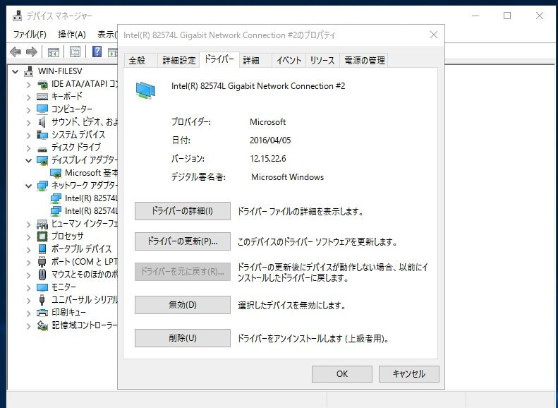 

2. ドライバータブのドライバーを更新ボタンをクリック。開いたウィンドウのコンピュータを参照してドライバーソフトウェアを検索しますをクリック。  
  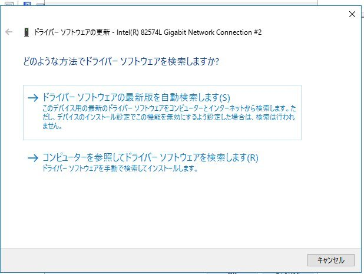 

3.  コンピューター上のデバイスドライバーの一覧から選択します をクリック。  
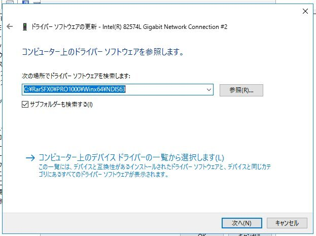 

4. ディスク使用をクリック。  
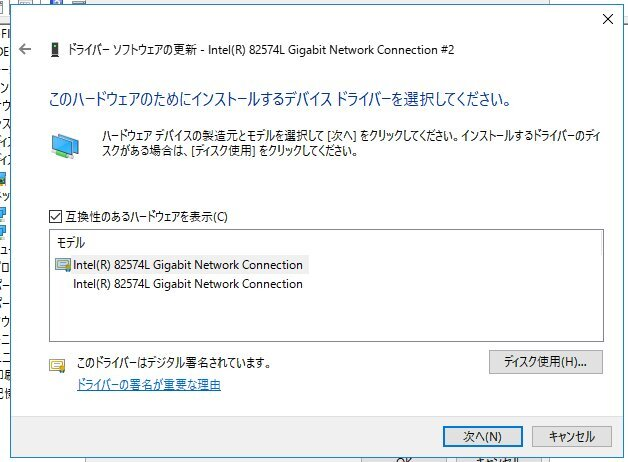 

5.  参照ボタンをクリック。  
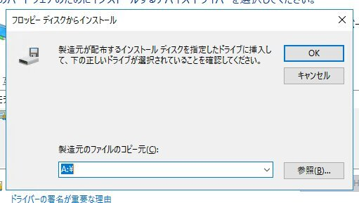 

6.  NDIS63フォルダ内の任意のINFファイルを選択して開くボタンをクリック。  
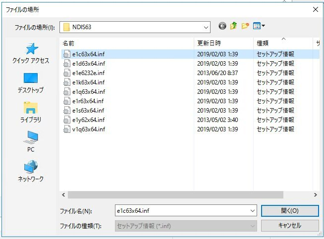 

7. OKボタンをクリック。  
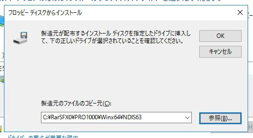 

7. このドライバーはデジタル署名されていませんとでているが気にせず次へをクリック。  
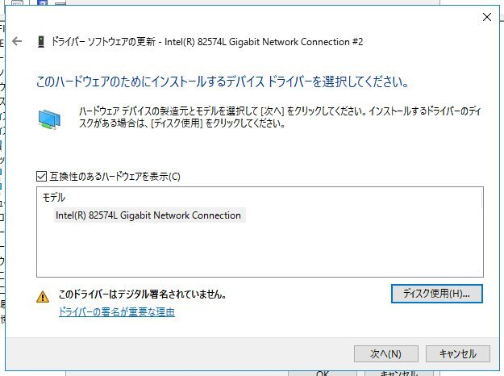 

8. インストール完了。  
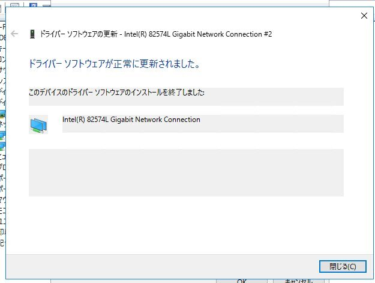 

NICが複数ある場合はそれぞれ行ってください。  

#### テストモードを終了  

1. コマンドプロンプトかPowerShellを管理者権限で起動。  

2.   下記のコマンドを実行してサーバーを再起動。  

> bcdedit /set TESTSIGNING OFF  

以上でドライバーが組み込まれました。  

#### リモートデスクトップ設定  
イーサネットドライバプロパティの詳細設定を開き、「PMEをオンにする」の項目と「Wake On Magic Packet」の項目をオンにする。  
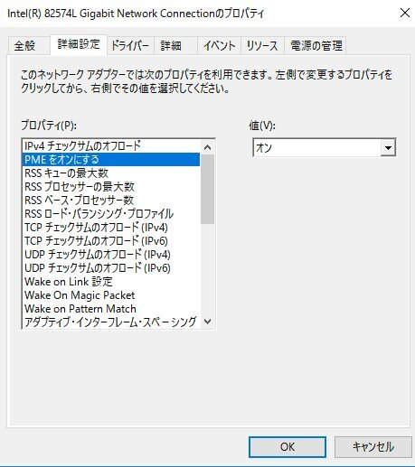 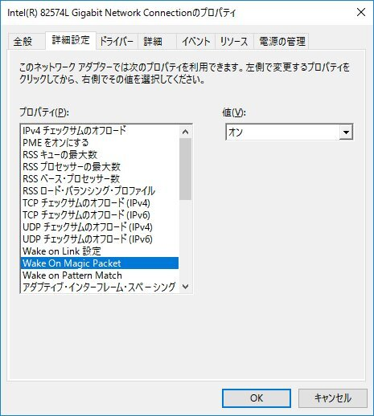 

##### 参考にしたサイト  

[oembed:"https://ameblo.jp/nanakochi123456/entry-12075902272.html"]

