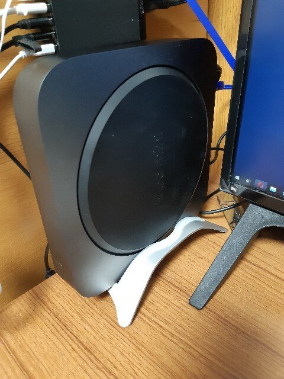

大学時代に使ったっきり全く使う機会のなかったMacを触れる環境が欲しいなと思いぽちりました。  

<?# AmazonAffiliate B00OLBDJZ2 /?>

PayPayの某20%キャッシュバックのタイミングだったので、ビックカメラに行ったところ在庫なし。  
とはいえ予約後2週間程度で在庫が復活したようで、SMSで連絡が来ていました。  

#### 開封の儀  
ビックカメラで受け取った時の箱はこれ。  
     
箱を開けたらMac miniが見えたので、Appleにしてはやたら武骨な箱を採用してるのな・・・と思ったのですが、  
   
   

そんなわけなかった。  
   

化粧箱を開けると、どーん  
   

裏っ側  
   

電源ケーブルはメガネタイプ。  
   

箱に入っていた資料。  
出力はHDMI。今回はCPU以外標準のままなので、Ethernetは1Gbpsのもの。  
   

#### 設置

今回どう設置するか考えた結果、縦置きすることにしたのでこちらを購入。  
<?# AmazonAffiliate B07KSVBMZS /?>  

壁掛けにするか悩んだんですが、取り回しが楽じゃないので止めました。  

届いた外箱と中身。  
 
 

こんな感じで設置しています。  
 

メモリーは別途購入しました。  
取り付けは別の記事にまとめます。  

