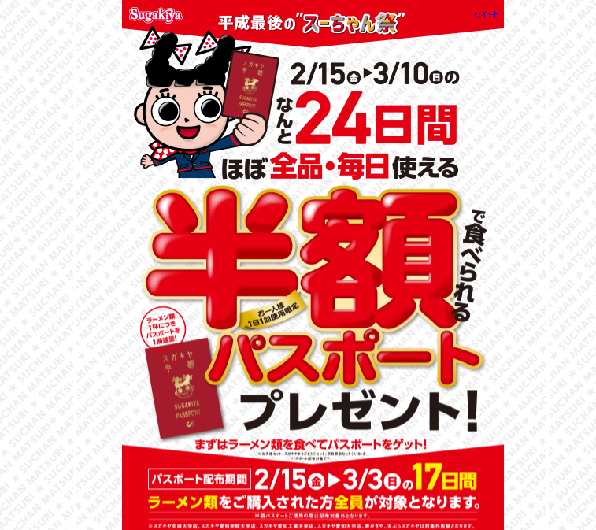
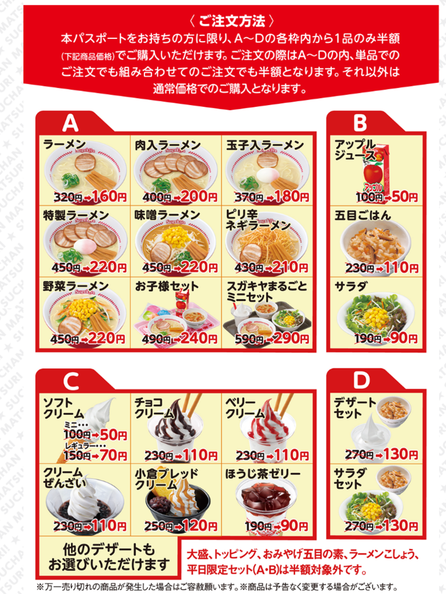

<?# Twitter 1096258123893854208 /?>

毎年3月初旬になるとスガキヤでスーちゃん祭という半額デー(土日の二日間)があるんですが、今年は平成最後ということで、例年以上の大盤振る舞いなキャンペーンが始まりました。  

<?# OEmbed "http://www.sugakico.co.jp/campaign/2019hangaku/suchanmatsuri.html" /?>

 
#### 半額パスポート  
というわけで、2/15(金)～3/10(日)の24日間、ほぼ全品が半額で食べられるパスポートがもらえます。  

パスポートがもらえる期間は2/15(金)～3/3(日)の15日間。  
つまり今日からです。  

#### もらってきました  

というわけでもらってきました。  

<?# Twitter 1096265862909124609 /?>

もらえる条件は

* ラーメン類を注文していること  
* 半額パスポートを利用して注文していないこと  

の二つ。  
ただし、おそらくですが半額対象外の店舗ではもらえないかと。  

#### パスポートの範囲  

 
  
今回は一日一回上の画像の通り、A,B,C,Dの各枠から一種類ずつ選んで利用できるようです。  
なので、一つのパスポートで複数のラーメンを注文したり、デザートを複数注文することはできません。  
あわよくば複数のデザートを注文したかったのに・・・（でぶ）。  

また、大盛やトッピングも対象外。  

平日限定のセット(500円のやつ)も対象外だそうで。  

なので家族で食べるなら早いうちに家族皆で定価でラーメンを食べて、それぞれ半額パスポートを手に入れておく必要があると。  

#### 半額対象外店舗  
また、上に書いたように半額対象外の店舗もあります。  

大学構内の店舗(名城大学店、愛知学院大学店、愛知工業大学店、愛知大学店)、寿がきや(いわゆる高級スガキヤ)、天ぷらスガキヤが対象外店舗です。  
ところでわが母校中部大学にあったスガキヤ潰れたのか・・・。  

なお、寿がきやに関しては例年通り3/2,3の土日に半額セールをやるようです。  