CPU以外標準のままの構成となっているMac mini。  
メモリーだけは別途増設可能なので、自分でメモリーを購入して増設することにしました。  

[oembed:"https://blog.hitsujin.jp/entry/2019/02/07/135437"]

動画も見ながらだとわかりやすいかも。  

[oembed:"https://www.youtube.com/watch?v=2UrSLnnMyeg"]

<!-- more -->

### 前準備  

#### メモリー  
これがなくちゃ始まらない。  

購入したメモリーは下記のもの。  

[amazon:B01BGZEVHU]

最近はメモリーが安くなってきて大変すばらしい。  

#### ドライバー  
Mac miniはトルクスねじで中のボードなどが固定されてるんですが、一般的なトルクスドライバーだと開けられない可能性があります。  
というのもねじ穴の中央に突起があり、ドライバー側にも細工がないとねじを回せないのです。(Wikipediaによるとセキュリティートルクス(TR)というらしい）    

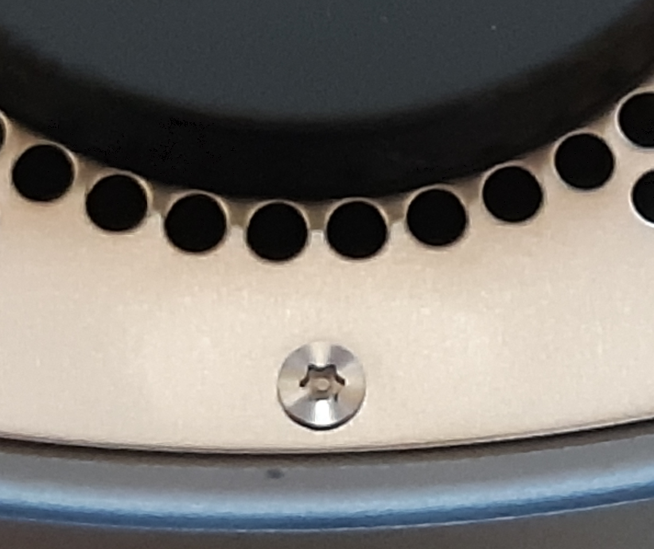 

というわけで、対応したドライバーが必要になります。  
普通のホームセンターだと見当たらないようなので、通販で買うかPCショップで買いましょう。  

こんなの。  

[amazon:B01FU0URFW]

[amazon:B077MH1D84]

トルクスドライバについて、T6タイプに関してはセキュリティトルクス（TR6)になっていて、T5、T10は普通のトルクスねじになっています。  

### 分解 

#### 黒いカバーの取り外し  

黒いカバーの隙間にへらやクレジットカードなどの硬質なものを差し込んで、ぐるっと一周させながらカバーを取り外します。  
私はちょうど机の上にもう使ってないmanacaがあったので、それを利用しました。  
 

#### 銀色のふたの取り外し  
WiFi、Bluteoothのアンテナが付いている銀色のカバーを取り外すために、TR6のドライバーでねじを外します。  
写真にある通り、大きさが異なるねじ(どちらもTR6)が交互についている形です。  
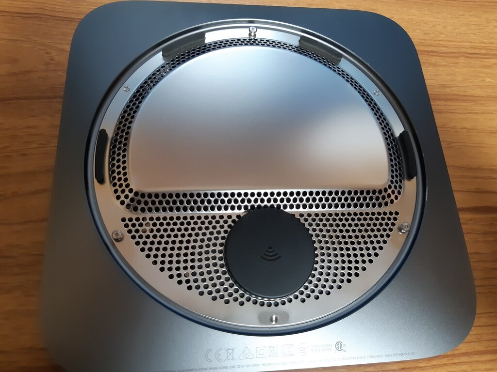 

6個のねじを外すと銀色のカバーが外せるのですが、アンテナ部分と本体側とでケーブルでつながっているため、いったん横にそっとずらして、ケーブルを本体に固定するねじ(青い枠で囲った部分)を外してから、赤い枠で囲ったケーブルの端子をケーブルを上に持ち上げるようにして取り外します。  

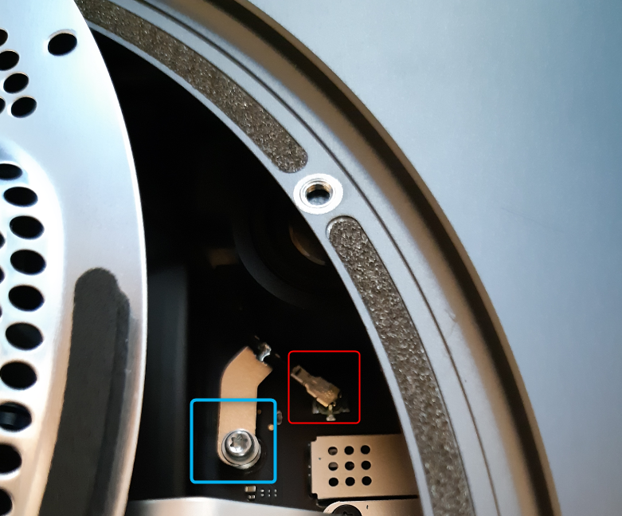 

#### 排気ファンの取り外し  
排気ファンのトルクスねじを取り外します。  
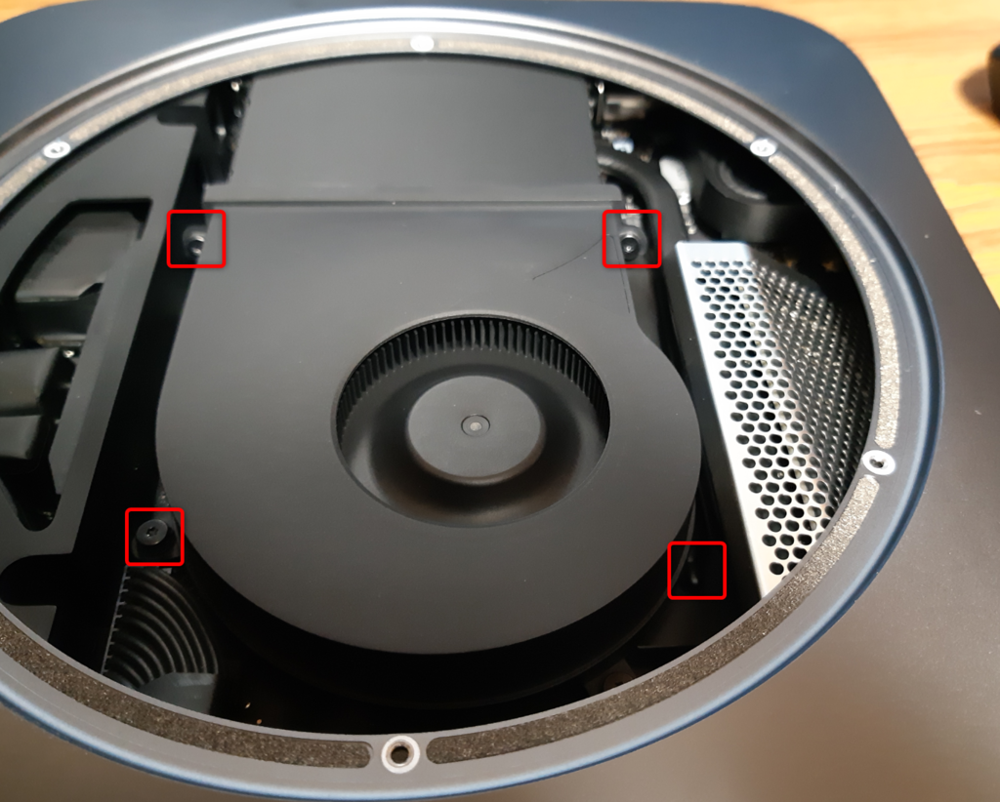 

ファンをそっと持ち上げると、本体とつながっているケーブルが見えるので、上に持ち上げるようにして取り外します。  

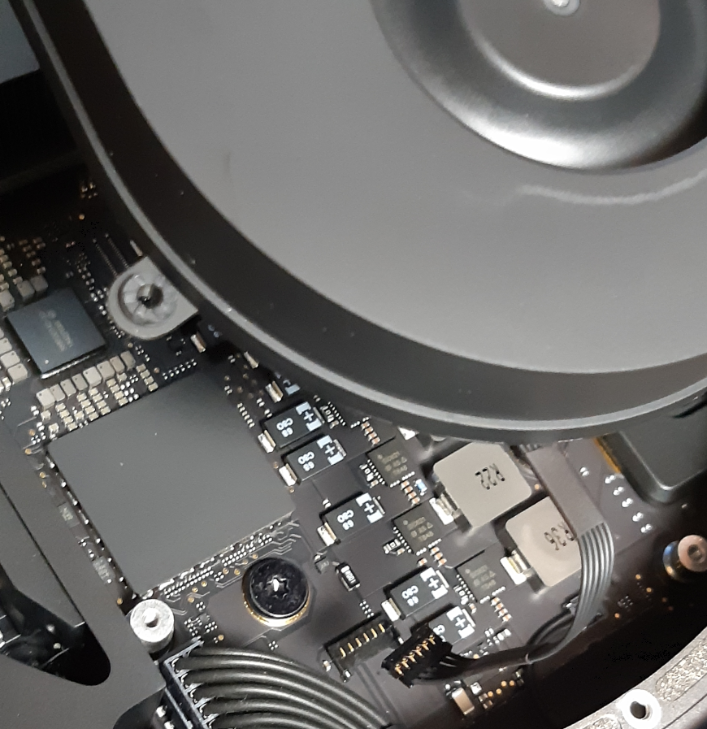 

#### 電源ケーブルの取り外し  
電源ケーブルとLEDケーブルを取り外します。どちらも上に持ち上げるようにして取り外します。  

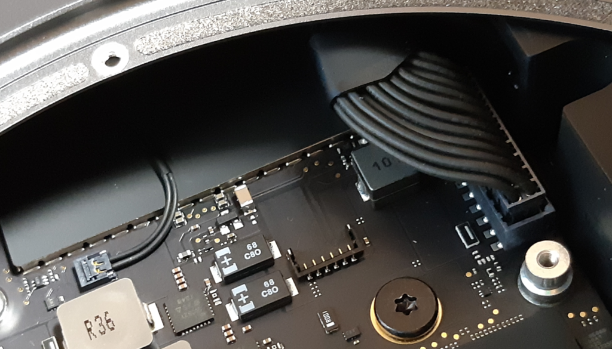 

#### ロジックボードと本体を固定するねじの取り外し  
T10のドライバーでねじを取り外します。  
これ結構固く固定されているので、細いドライバーだと力が入らなくてうまく外せないです。  
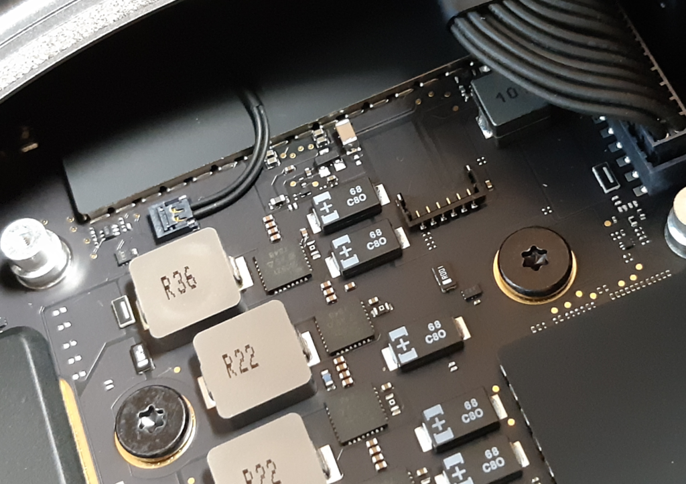 

#### ロジックボードの取り外し  
矢印の方向にロジックボードを押し出すと本体から外れます。  
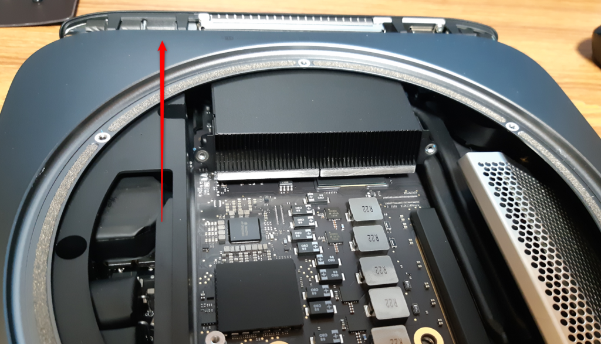 

#### 放熱シールドの取り外し  
メモリーが放熱シールドでおおわれているので、T5ドライバーでねじを外し、シールドを取り外します。  
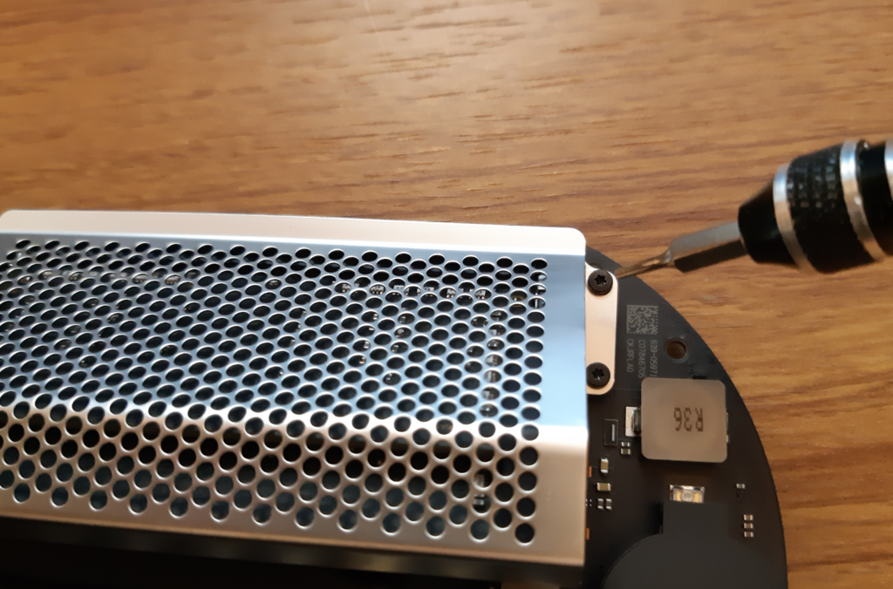 

#### メモリーの取り外し  
メモリー横のクリップを横にずらすとメモリーが外れます。  
8GBのモデルだと4GBのメモリーが2枚刺さっているようです。  
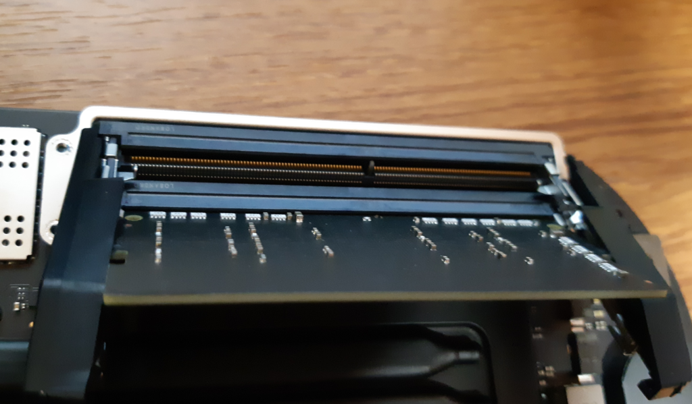 

#### メモリーの取り付け  
(写真撮り忘れた・・・）  
メモリーの溝と本体側の溝の位置があっていることを確認し、押し込みます。  
押し込んだら横のクリップが止まるはず。  

#### あとは逆の工程  
あとはシールドを取り付け、ロジックボードを本体に差し込んでねじやケーブルを取り付け、ファンのケーブルを取り付けてファンを固定して、アンテナケーブルを取り付けて銀色カバーを取り付け、黒いカバーをはめ込めば終了。  
ただ、アンテナケーブルに関してはピンセットがないとなかなか端子を本体に固定できないかと思います。  
先にねじでケーブルを固定したうえでやるとうまくいくかと。  

### 増設後  
もともとは4GBが2枚刺さった8GB搭載マシンだったのが、  
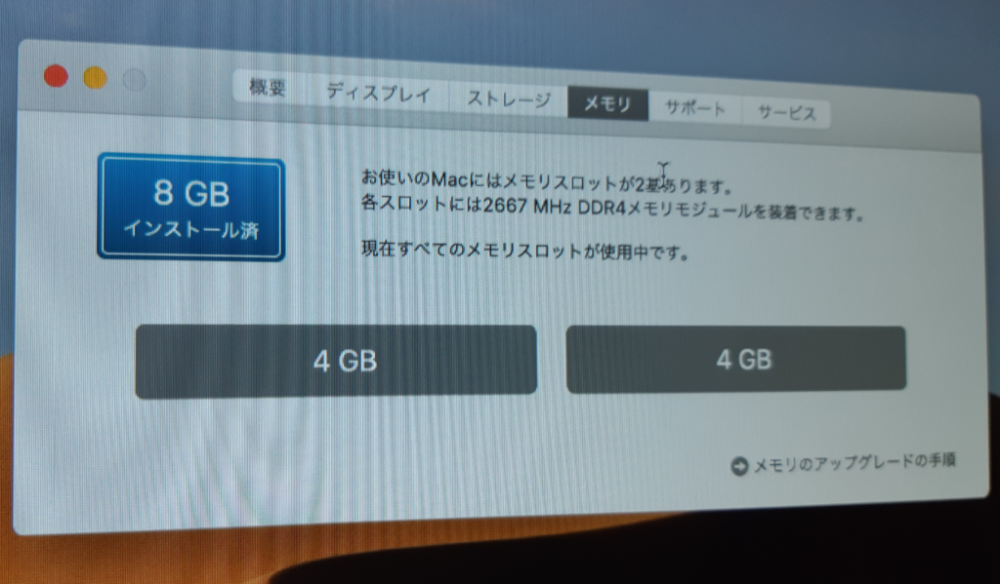 

こんな感じで16GBx2の32GB搭載マシンになりました。  
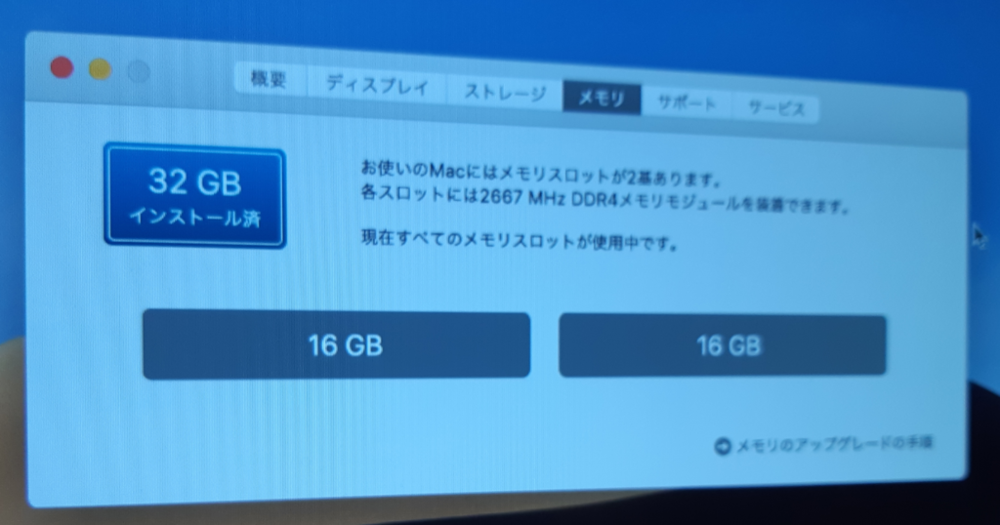 

#### 参考にしたサイト  

[oembed:"https://pcmanabu.com/mac-mini-2018-memory-replacement/"]

[oembed:"https://syobon.jp/blog/2018/11/09/how-to-upgrade-ram-mac-mini-2018/"]

