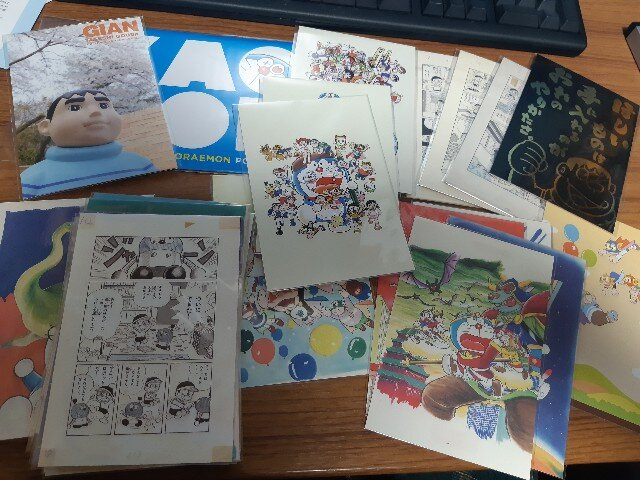

知ってる人は知っている話なんですが、私藤子・F・不二雄作品のファンです。  

小さいころからドラえもんやキテレツ大百科を見て育ち、中学時代てんとう虫コミックスを全巻揃え、「ぼく、ドラえもん」という雑誌を定期購入し、大学時代はアルバイト代の大半が藤子・F・不二雄大全集に費やされるという・・・。  

そんな私ですので、神奈川県川崎市にある藤子・F・不二雄ミュージアムには二回行っています。  
一回目はミュージアムができてから約一年後の2012年9月23日。たまたまなのですがF先生の命日の日です。  
あの日はあいにくの雨でしたが、せっかくなのでお墓参りもしてきました。  

[oembed:"https://x.com/hitsuji_no_hito/status/249784041853812736"]

 

2回目もあいにくの雨・・・。雨男か私は。  

そんな感じで毎回ミュージアムに行くたび、ミュージアム内のショップでいろいろとまとめ買いをしています。  
限定品には目がないのです。  

で、今回こんなツイートを見かけまして。  

[oembed:"https://x.com/mugengin/status/1094065113932263424"]

初のミュージアム限定編集漫画、しかもむぎわらしんたろう先生(F先生の最後の弟子、ドラベースなどでおなじみ)の書下ろし漫画もついてくると。  

[oembed:"https://x.com/hitsuji_no_hito/status/1094080882074218496"]

[oembed:"https://x.com/hitsuji_no_hito/status/1094080955860414464"]

とつぶやいていたところ、

酢酸先生から無言リプライが。  
[oembed:"https://x.com/ch3cooh/status/1094094842005577728"]

酢酸先生のお嫁さんのあきえさんからもお話をいただいたので、さっそく依頼することにしました。  

今回購入をお願いしたのは、まずさきほどの限定編集漫画。  
そしてミュージアムでしか買えないポストカードやフィギュアなど。  
特に期間限定品を中心にいろいろお願いしました。  

で、無事ミッションコンプリートということで送っていただいたグッズがこちら。  

 

ちょうどバレンタインデーの時期ということでお菓子までいただいてしまいました。  

さて、購入したのはこんなグッズたち。  

#### 藤子・F・不二雄ミュージアム限定編集 キテレツ大百科xドラえもん 江戸時代の発明と未来のひみつ道具  
これが欲しくてお使いしてもらいました。  
装丁が高級感あふれる。  

 

むぎわらしんたろう先生の漫画は2ページほど。  
F先生にまつわるエピソード漫画でした。 

 

 

#### ミュージアム限定LINEスタンプ  
LINEスタンプはほとんどF先生作品ばかり購入してるのですが(だるやなぎスタンプ、インコネコスタンプの色物系も一部・・・)、これはミュージアムに行かないと手に入らないスタンプなので、ゲットできて嬉しい。  

こんな袋に入ってます。  
 

シリアルナンバーが書かれたカードはこんなデザイン。これは捨てられない・・・。  

 

 

カード裏のQRコードを読み込むとスタンプショップが開くので、シリアルナンバーを入力すると手に入ります。  

 

 

ま、スタンプをゲットしたところで送る相手は家族しかいないのですが(吐血)  

#### フィギュア  
我が家はドラえもんのフィギュア(+石像、ぬいぐるみ)だらけです・・・。  
で今回も2つ購入をお願いしてしまいました。

 

#### 企画展「キテレツ大百科」×「ドラえもん」公式ガイドブック
行けなくてもガイドブックを見たら行った気になるかなって・・・。  
 
[oembed:"http://fujiko-museum.com/exhibition/"]

 

#### クリアファイル  
「やろうぶっ殺してやる」でおなじみ(?)、迷作と名高い「ドラえもんだらけ」のクリアファイルと、企画展のイメージクリアファイル、そしてキテレツ大百科第一作のクリアファイル。  
毎回こういうクリアファイルを買ってはもったいなくて使えずにしまい込んでしまう・・・。  

 

#### ネックレス  
前回行ったときにはなかったので買ってきてもらいました。  
「「言葉を身にまとう」をコンセプトに、アクセサリーを展開するブランド“5108/コトバ”のネックレス」なんだそうです。  
暗記パン型とどこでもドア型。  

 

#### ピンズ  
有名な帰ってきたドラえもんの最終コマの絵柄以外はどこかシュールなシーンばかりな感じ。なぜそれをチョイスした。  

 

#### ポストカード  
連載用原画のポストカードやコロコロコミックの扉絵を飾った大長編ドラえもんのカラー原画ポストカード、きれいなジャイアンからジャイアニズムあふれるポストカードなど、ミュージアムで売っていたポストカードを一通り。  
以前購入したものも混ざってるんですけども、何せ何を買ったかもうわからなくなってしまったので全部買ってきてもらいました(ｵｲ)。  

 

#### 恐怖のレシート  
そりゃこんだけ買えば結構な額になりますよね・・・。  

 

27785円・・・。  
今回複製原画買ってないのにこの金額になってしまった・・・。  
2万円あれば足りるかなと思ってたのですが（見積もりが甘い）、思っていた以上にポストカードが多かったり、ウェブサイト上に載っていない限定クリアファイルがあったのが原因。    

とはいえほしかった限定品の数々が手に入ったので万々歳です。

あきえさんも割とミュージアムを楽しんでいただけたようで何よりです。  

[oembed:"https://blog.akienote.com/entry/20190218/1550494880"]

  
あきえさん本当にありがとうございまいた。  
次回はぜひ酢酸先生と一緒にミュージアムへ！  