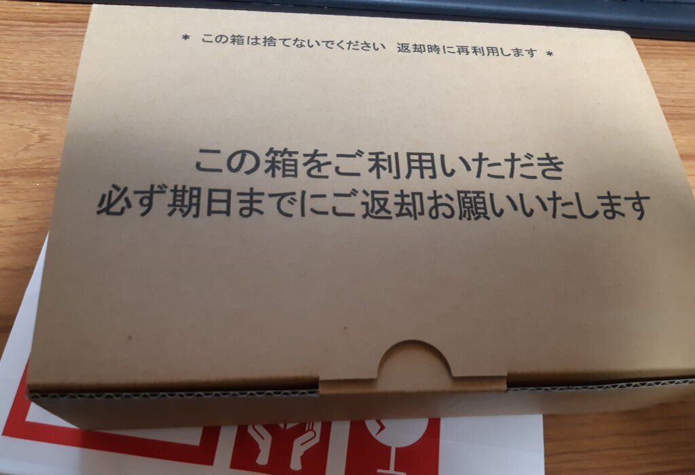
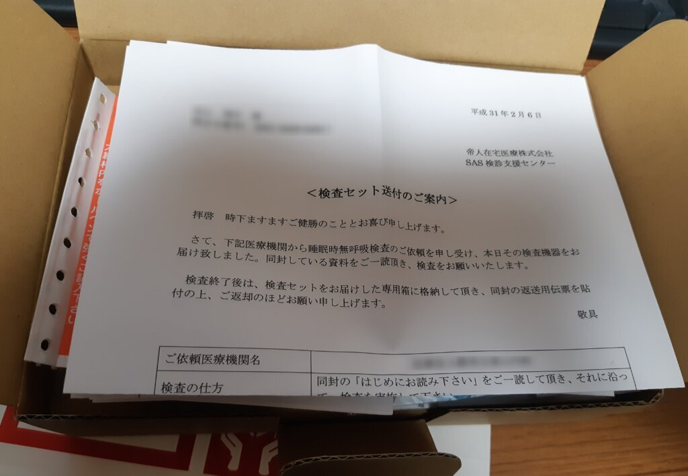
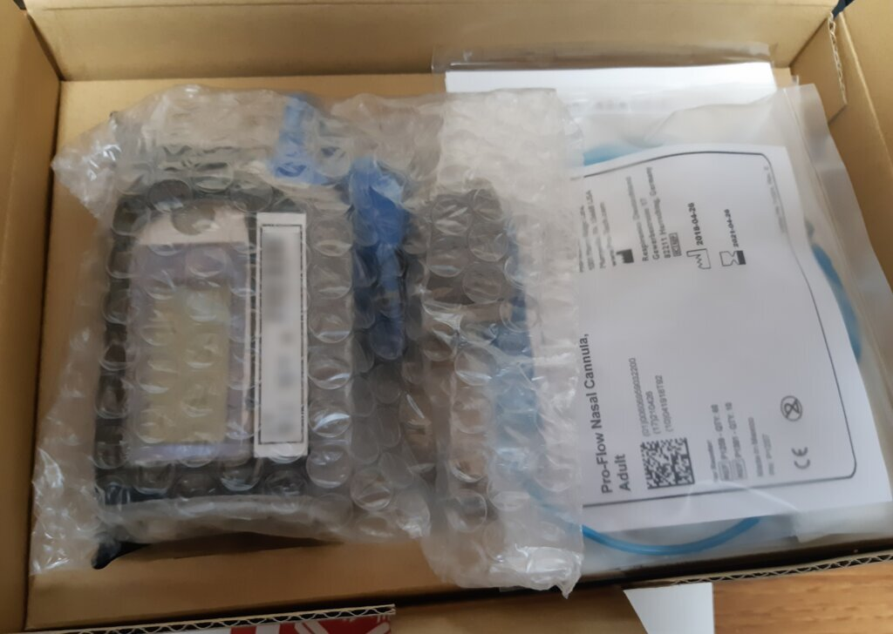
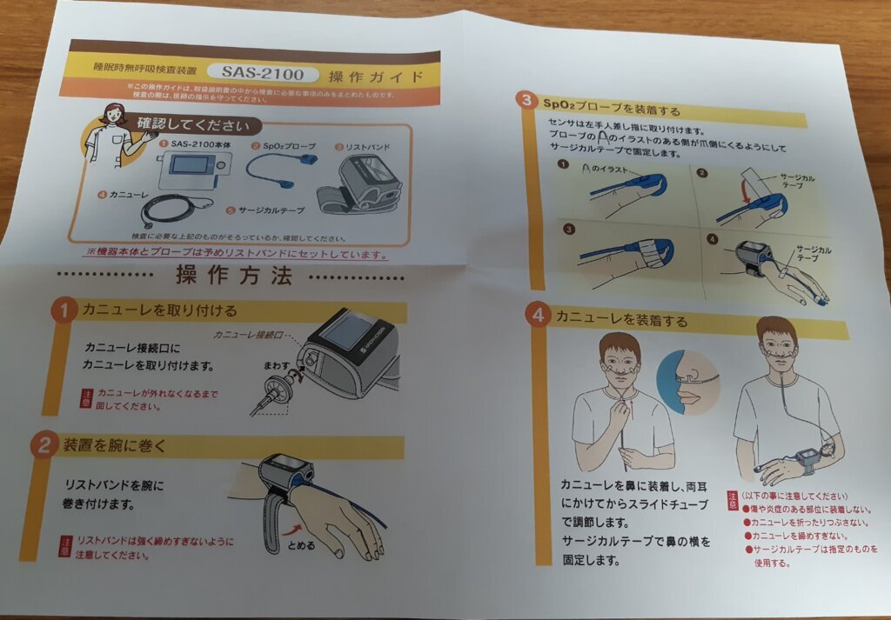
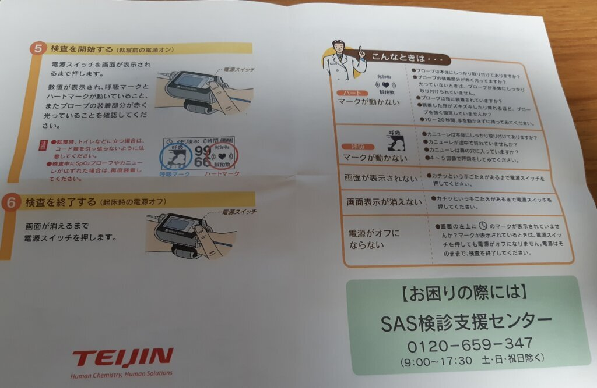
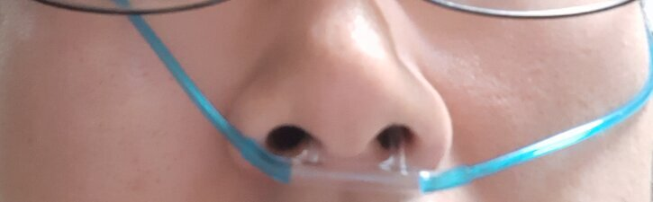
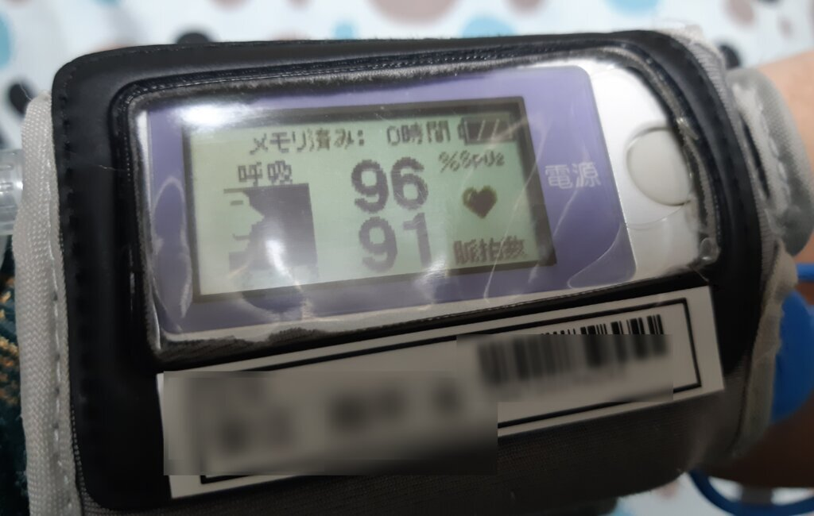

肥満外来に行ったときについでに睡眠時無呼吸症候群の検査をお願いし、自宅に検査キットが届いたので実際に使ってみました。  

<!-- more -->

ヤマトで届いた検査キットはこの箱の中に入ってます。  

 

送付案内。  

 

中身。  

 

操作ガイド。  
 

 

毛細血管内の酸素飽和度(正確にはSpO2、経皮的動脈血酸素飽和度)を測定するSpO2プローブを左手人差し指に取り付け、鼻に装着するカニューレというチューブを本体につないだうえで鼻に差し込みます。  
(汚い顔で申し訳なく)  
 

装着すると、本体にこんな感じで酸素飽和度と脈拍数が計測、保存されます。  

 

あとは普通に寝るだけ。  

二晩計測してあとは宅急便で返送すればおしまい。  

検査結果は病院に送られ、次回の診察時に教えてもらえるようです。  
次の診察は一か月後なので、結果はその時に。  

