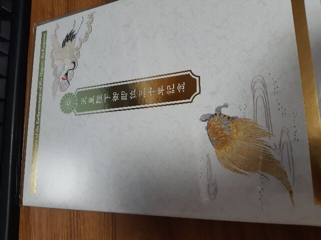
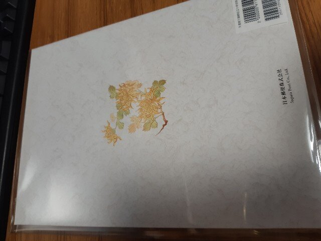
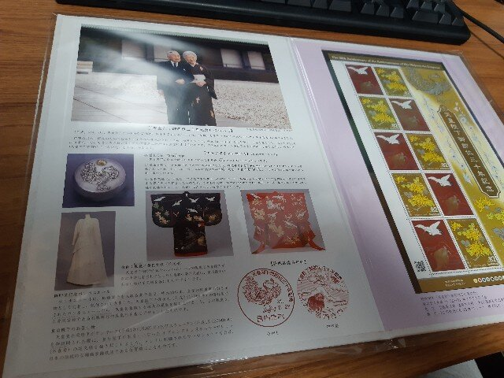
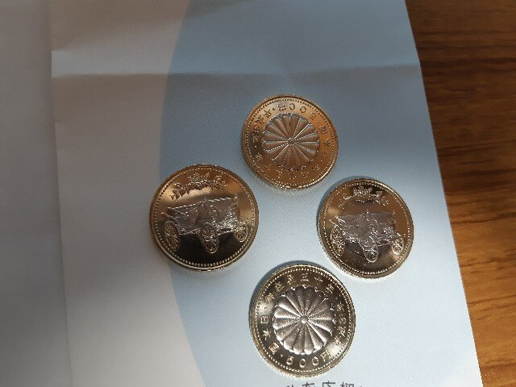

今上天皇陛下がご即位されて30年を迎えられることを記念して、日本郵便及び財務省がそれぞれ記念切手、記念硬貨を発行したので購入してきました。  

[oembed:"https://www.watch.impress.co.jp/docs/news/1158575.html"]

[oembed:"https://www.mof.go.jp/currency/coin/commemorative_coin/30th_emperors_enthronement/20180807.html"]

#### 記念切手

当初記念切手は郵便局のネットショップで購入しようかと思ったのですが、記念切手と切手帳をそれぞれ買おうとしたところ、なぜかそれぞれに送料がかかるという謎の仕様だったため、あきらめて郵便局で購入することに。  

ちなみに記念切手は1000万枚(100万シート)、切手帳は5万部発行されるそうです。  

というわけでお昼に郵便局に行って購入してきました現物がこちら。  

表  
 

裏  
 

中身

 

#### 記念硬貨  

こちらは購入というか両替、引換です(なんたってあくまで硬貨なので）。  

別のサイトで記念硬貨について見たときに十数万もすると書いてあったので(実際にはこれは1万円金貨幣のほうだった)、これは手が出せないわ・・・と思っていたのですが、  

[oembed:"https://x.com/kokubucamera/status/1098386406240481281"]

こちらの記事で500円記念硬貨が引換できることを知りました。  

引換取扱機関が決まっているのですが、だいたいの銀行、信用金庫、郵便局で交換可能な模様。  

[oembed:"https://www.mof.go.jp/currency/coin/commemorative_coin/30th_emperors_enthronement/20190118toriatsukai.html"]

こちらは2月21日から引換開始となっており、21日は一人2枚以内の枚数制限がありますが、今日から枚数制限が取っ払われています。  

私が記念切手を購入するために行った郵便局ではすでに引換が終わってしまっていたので、別の信用金庫に行ったところ、枚数制限なしで両替可能とのことだったので4枚両替してもらいました。  

 

ちなみに500万枚発行されるそうなので、割とたくさんの人が手に入れられそう。  

[oembed:"https://www.mof.go.jp/currency/coin/commemorative_coin/30th_emperors_enthronement/20180807_besshi.html"]

なお、1万円金貨幣はすでに終了しているようで。  