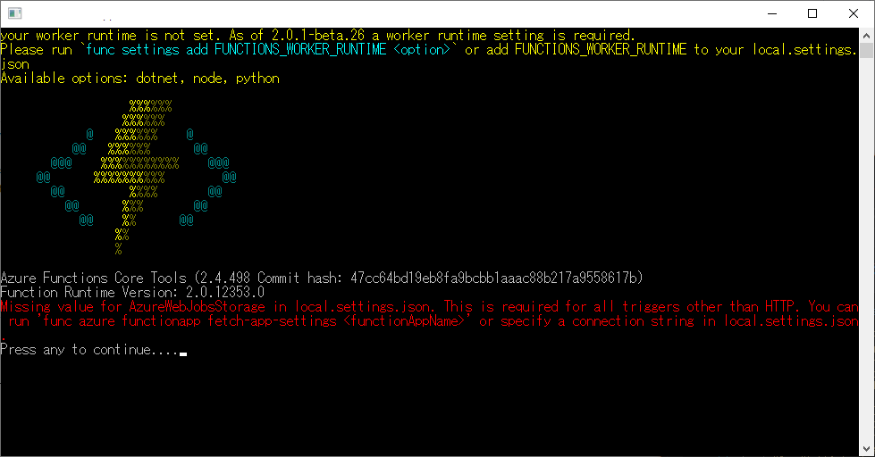

AzureFunctionsのlocal.settings.jsonファイルといえば
```json
 {  
   "IsEncrypted": false,  
   "Values": {  
     "FUNCTIONS_WORKER_RUNTIME": "<language worker>",  
     "AzureWebJobsStorage": "<connection-string>",  
     "AzureWebJobsDashboard": "<connection-string>",  
     "MyBindingConnection": "<binding-connection-string>"  
   },  
   "Host": {  
     "LocalHttpPort": 7071,  
     "CORS": "*"  
   },  
   "ConnectionStrings": {  
     "SQLConnectionString": "<sqlclient-connection-string>"  
   }  
 }  
```
[oembed:"https://docs.microsoft.com/ja-jp/azure/azure-functions/functions-run-local"]

のような感じで設定情報が保存されてます。  


今回Valuesに新たに追加する際、  
```json
   "Values": {  
     "FUNCTIONS_WORKER_RUNTIME": "<language worker>",  
     "AzureWebJobsStorage": "<connection-string>",  
     "AzureWebJobsDashboard": "<connection-string>",  
     "MyBindingConnection": "<binding-connection-string>",  
     "NewParam": {  
       "NewKey1": "NewParameter1",  
       "NewKey2": "NewParameter2",  
     }  
   },  
```
こんな感じで、階層を持たせた形で追加したのですが、これでAzure Functionsを起動すると、  
 

>Missing value for AzureWebJobsStorage in local.settings.json. This is required for all triggers other than HTTP. You can run 'func azure functionapp fetch-app-settings <functionAppName>' or specify a connection string in local.settings.json.  

こんな感じでエラーを吐いて動かない。  

Azure FunctionsのGitHubに本件についてIssueがありまして、  

[oembed:"https://github.com/Azure/azure-functions-core-tools/issues/223"]

こちらによると、
> Values collection is expected to be a Dictionary<string, string> and it's failing to parse it and returning an empty dictionary. I think parsing it as a JObject and displaying an error for any non-string values would be more correct here.
> 
> I know it's a bit confusing with the .NET Core appsettings.json, but this file local.settings.json is meant to just be a local equivalent to the Azure App Settings which are just key-value pairs.  

ということで、 Dictionary<string, string>として保持する関係で、階層的に値を持たせることができないらしい。  
なんてこったい。  

なので上記のようなJSONだと、  
```json
  "Values": {  
    "FUNCTIONS_WORKER_RUNTIME": "<language worker>",  
    "AzureWebJobsStorage": "<connection-string>",  
    "AzureWebJobsDashboard": "<connection-string>",  
    "MyBindingConnection": "<binding-connection-string>",  
    "NewParam:NewKey1": "NewParameter1"  
    "NewParam:NewKey2": "NewParameter2"  
  },  
```
として持たせる方法をとるくらいしかなさそうです。  

まぁ確かにAzureポータル上では結局こういう風に値をセットすることになりますし、階層で持たせるようなことはあまりしないのかも・・・？  

ただ、エラーメッセージが分かりにくい。
>Missing value for AzureWebJobsStorage in local.settings.json.    

これだとAzureWebJobsStorage のKeyが登録されてないという風にしか読めないです。上記の仕様でパースができなかった結果Valueが取得できなかったためのエラーなんでしょうけども。  

以上、JSONの規格上は正しくても、Azure Functionsでは動かないという罠でした。
