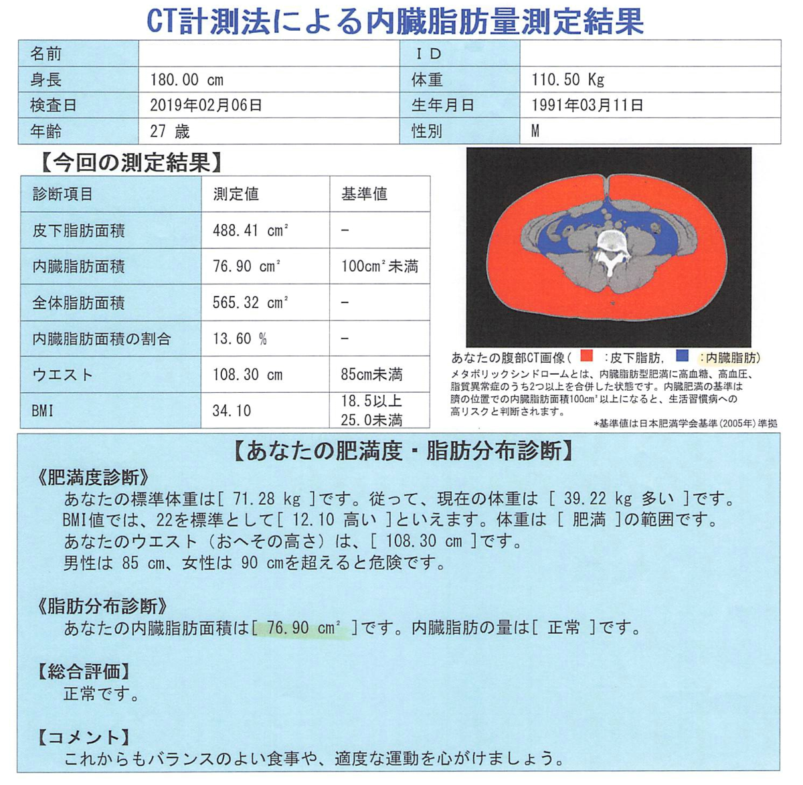
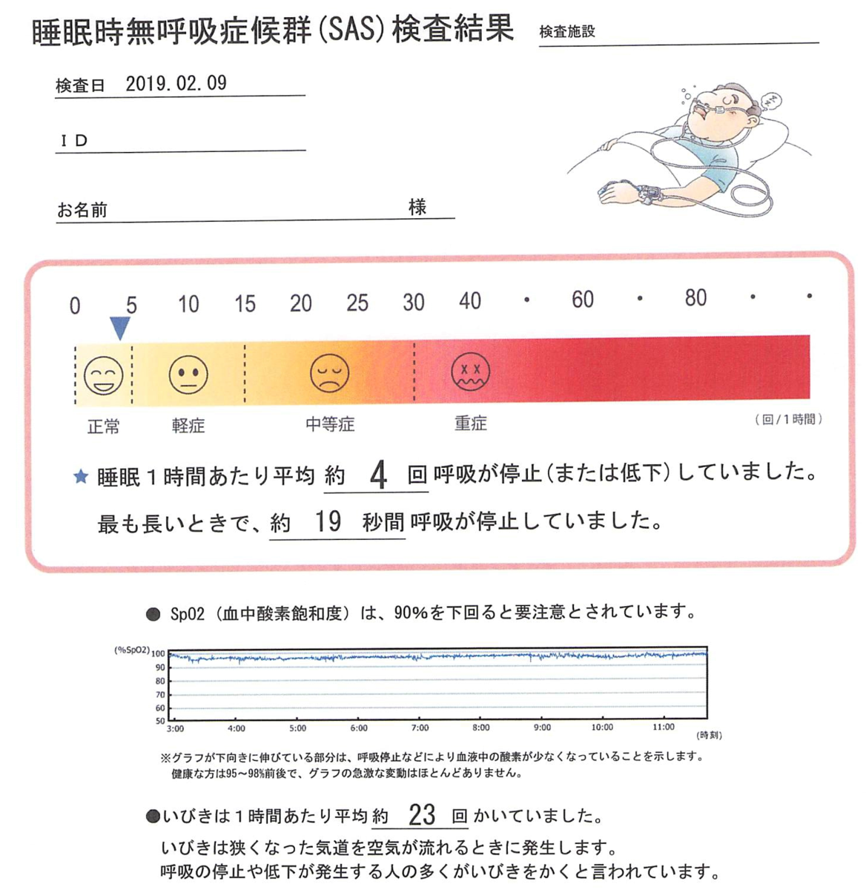
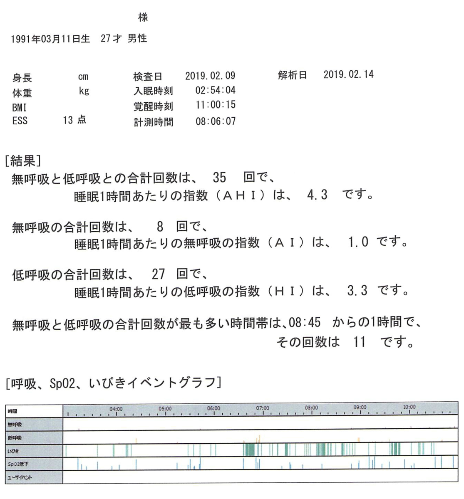
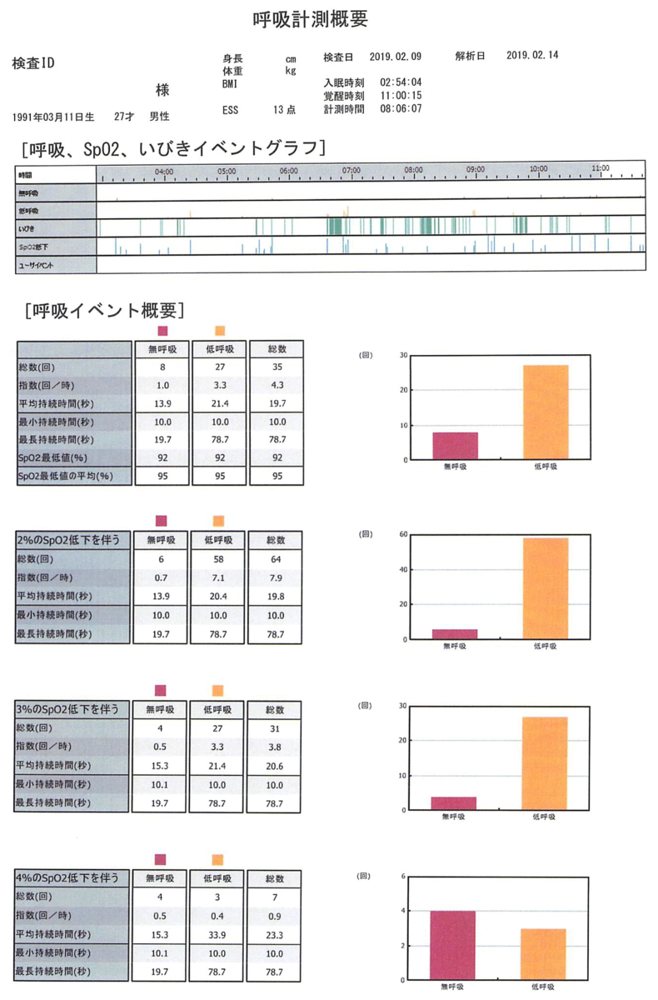
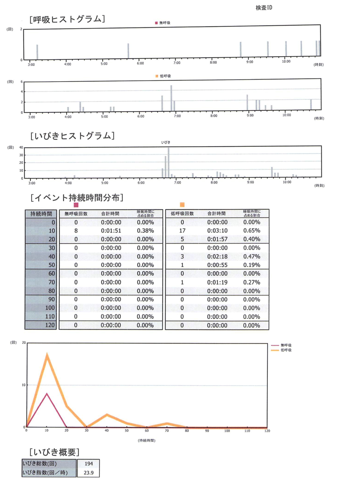
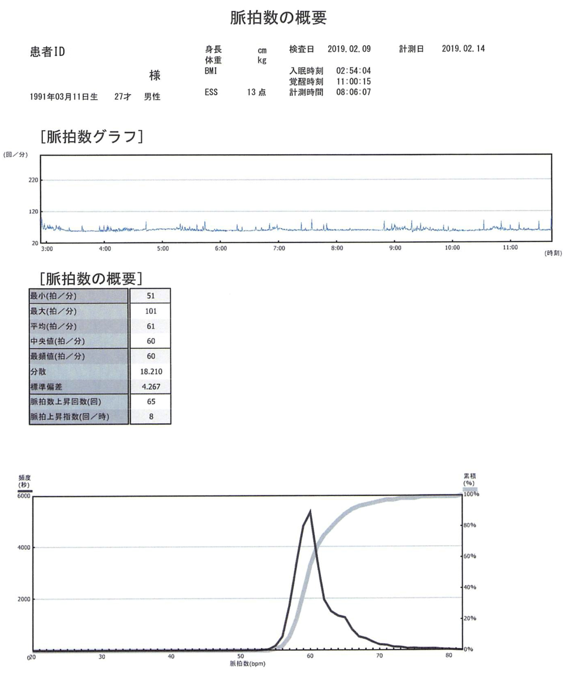

すっかり書き忘れてた。  

前回、二月に肥満外来に行きまして、一か月経過したので改めて診察を受けました。  

[oembed:"https://blog.hitsujin.jp/entry/2019/02/06/233800"]

<!-- more -->

まず体重が落ちたか否かなのですが、<b>ほとんど落ちてません！！</b>  

2月6日の初回計測で110.5kgで、110.2kgと、0.3kgのマイナスということで、誤差の範疇。  

ダメじゃん、って話ではあるのですが、首回りとかの贅肉が落ちてるらしく、家族からは痩せてきてるといわれてるので、体型としては若干変動がある模様。  

経過を見る形で新しい薬が処方されました。  

前回処方された薬とほとんど変わりませんが、コレバイン錠500mgの代わりにコレバインミニ83%という薬に代わりました。  
同じコレバインなので特に違いはなさそう。  

そして前回測定したCTの結果がこちら。  

 

幸いにも、内臓脂肪値は正常で、皮下脂肪が多いという状態でした。  
内臓脂肪が多いと大きな病気になりやすいですが、皮下脂肪は比較的安全ということなので、一安心。  

もちろん痩せなければならないことには変わりないのですが。  

次に、睡眠時無呼吸症候群について。  

[oembed:"https://blog.hitsujin.jp/entry/2019/02/19/120000"]

結論としては問題なし。  
いびきは多いものの、睡眠時無呼吸症候群ではないようです。  
まぁ首周りの肉のせいでいびきが多いってことなので、どちらにしても痩せないと・・・。  

なお、前回測定した結果はこんな感じでもらえました。  

 

 

 

 

 