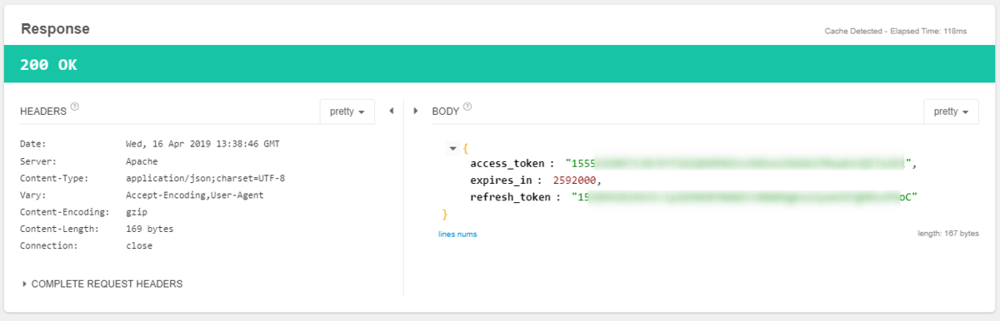

デブな現状を改善するべく、毎日体重を測っています。  

以前作った、タニタの体重計のデータを取得してDiscordに投稿するAzure Functionsについて、私の実装が悪かったのか単に設定がおかしかったのかわかりませんが、Azureの課金額が結構な額になってしまい、現在GCEに.NET Coreなコンソールアプリを配置して、定期実行させるようにしています。  

[oembed:"https://blog.hitsujin.jp/entry/2018/10/14/154344"]

現時点でのソースはこちら。  

[oembed:"https://github.com/Ovis/PostDietProgress"]

<!-- more -->

初めて実装した当初よくわかってなかった（←おい）非同期処理などをasync,awaitを利用したモダンな書き方にしたりするなどして、当初よりはきれいなソースにしています。  
が、一点いまだにひどい実装がありまして、どうするか悩んでました。  

それはログインIDとパスワードを保持していること。  
HealthPlanetのAPIはOAuth 2.0で認証が行われています。  
当然最初はログインIDとパスワードを利用してトークンを取得する必要がありますが、それ以降はトークンで認証されるので、本来だったら一度だけ使ったらそれ以降は不要のため、保持してはいけないはず。  

が、今のところ保持した実装になってます。  
というのも、APIの仕様を見た限り、リクエストトークンを取得した際にRefreshTokenももらえるものの、仕様書上にRefreshTokenを利用したリクエストトークン再発行について言及がないため。  
現時点での仕様書の記載はこんな感じ。  

> /oauth/token  
> リクエストトークンを取得する。/oauth/auth を完了してから10分以内に完了させる必要がある  
> URL :  
>   https://www.healthplanet.jp/oauth/token  
> 引数 :  
> client_id (必須)  
> アプリケーションの client_id  
> client_secret (必須)  
> アプリケーションの client_secret  
> redirect_uri (必須)  
> 処理完了時、もしくはエラー発生時のリターンURL。アプリケーション登録にて指定したドメインのURLもしくは  
> https://www.healthplanet.jp/success.html が指定可能  
> code (必須)  
> /oauth/auth にて取得したコード  
> grant_type (必須)  
> APIの付与タイプを指定する。現仕様では authorization_code のみ指定可能  

一般的なOAuthの実装だと、grant_typeにrefreshtokenを指定して、あらかじめ取得したRefreshTokenを渡してやればリクエストトークンが取得できるはず。  
なのに、
> authorization_code のみ指定可能  

と書かれているので、RefreshTokenでリクエストトークンを取得できなさそう・・・。  

というわけで仕方がなくIDとパスワードを保持していました。  

で、本題。  
最近ちょっと機能追加をしたくてソースをいじっている際、ふと仕様書が単に古いだけで、実は実装されてるってことはないよな・・・？と思い、grant_typeにrefreshtokenを指定し、codeにリフレッシュトークンを指定してやったところ、  

 

あ、いけた。  

というわけで、実は行ける模様・・・？  
懸念としては、取得されたリクエストトークンが元のリクエストトークンと同じだったこと。  
まだ元のリクエストトークンが切れてないからなのか、やっぱり使えないのかは不明。有効期間が30日なので、30日後に判明します。  

・・・。一度タニタに念のため聞いておいたほうがいいだろうか・・・。
でも、こちらの記事によるとあまりAPIに関してはサポートで教えてくれないらしいしうーむ・・・。  

[oembed:"https://muziyoshiz.hatenablog.com/entry/2016/01/11/234921"]

#### 追記(2019/07/13)  
リクエストトークンの有効期限が切れた後にリフレッシュトークンを用いて正常に新しいリクエストトークンが発行されたことを確認しました。