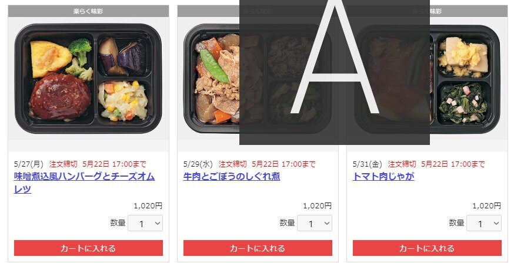
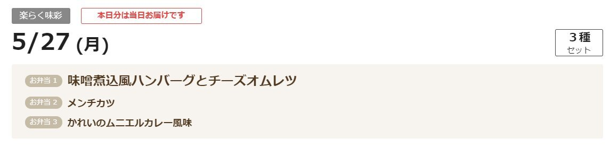
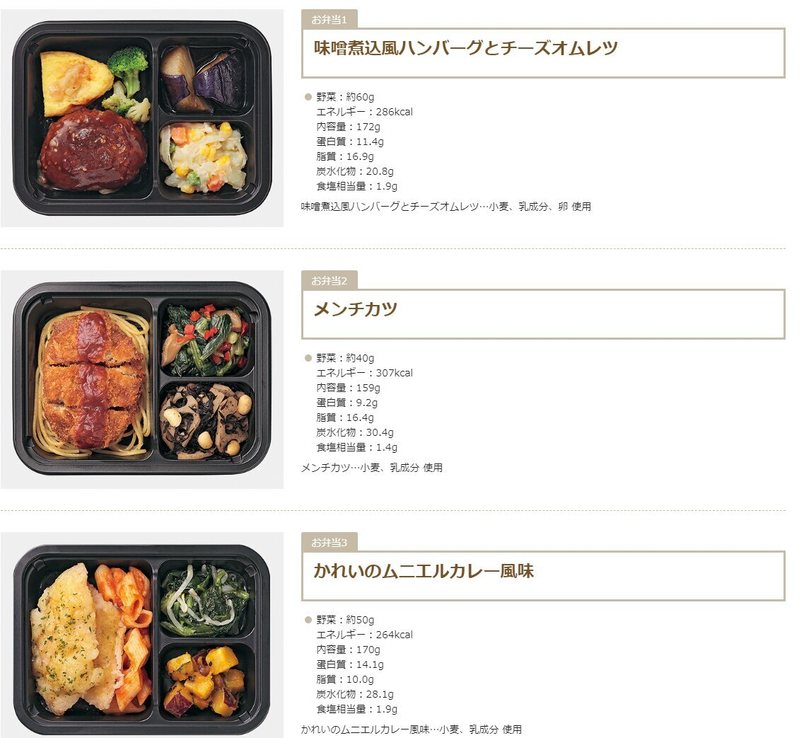
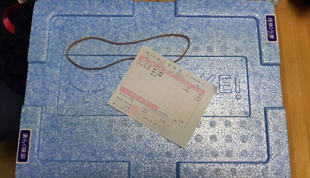
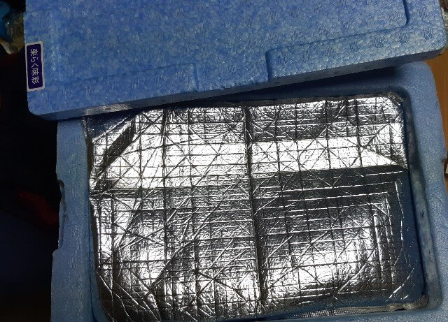
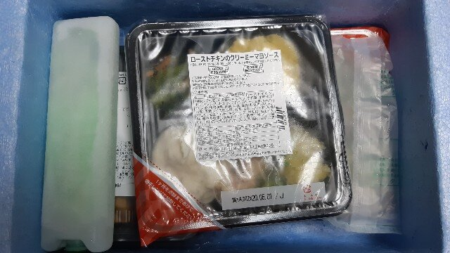
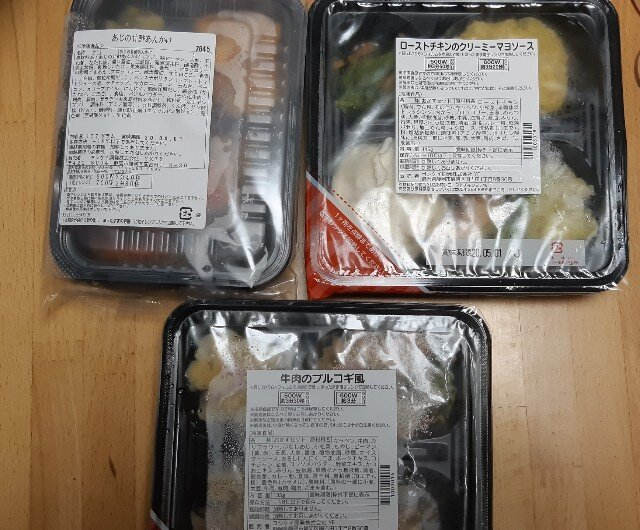
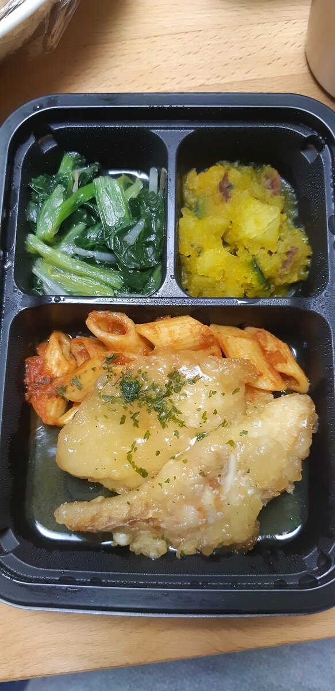

以前、ワタミの宅食を使い始めたとブログ記事を書いたことがあるのですが、3か月ほど前から注文しなくなりました。  

[oembed:"https://blog.hitsujin.jp/entry/2018/11/05/193233"]

<!-- more -->

理由としては、

1. だんだん飽きてくる  
本来お年寄り向けということで、出汁の味を利かせた味付けです。最初は体にいい味だなぁと割とおいしくいただいてたんですが、だんだん飽きてきました。副菜が大体いつも同じような味付けなような。    

2. 必ず一週間届く  
ワタミの宅食は一週間契約です。  
なので家にいない時だって届きます。また、毎日一食届くので、あまり食べたくない日は冷蔵庫にしまっておくものの、日持ちしないので結局食べることなく捨ててしまうということがありました。  

平均250kcalで健康にもいいねと思って始めたものの、ご飯はおいしく楽しく食べたいのに、食べ物がある意味強制されてしまうというのがだんだんストレスになってしまって、結局定期購入を止めることに。  

### ヨシケイの惣菜宅配サービス  
で、つい最近知ったんですが、ヨシケイという静岡に本社を構える食材宅配サービスが、食材宅配(料理そのものでなく、料理に使う食材を配達)だけでなく、惣菜の宅配サービスも行っていることを知りました。  

[oembed:"http://www.you-shoku.net/lpo32rakuraku/"]

こちらは、  
##### 冷凍で届く  
前回のワタミの宅食を頼んだ時に、冷凍で届かないことをメリットとして挙げた(冷凍室を圧迫しない)んですが、後述のとおりヨシケイだと一週間連続で届くわけではなく、3食分で届くので、必要数分だけ注文できるため、冷凍庫を圧迫することがないのでデメリットでなくなりました。  
また、これによって数か月間(6か月らしい)ストックしておけるため、食べたい時に食べられるのはとてもありがたい。
##### 注文単位が小さく、安い  
ワタミの宅食のまごころ手鞠は1週間(平日のみ)単位の契約で、平日毎日一食分届いて合計5食分、税込2450円でした。一食当たり490円です。  
それに対してこちらの楽らく味彩は注文単位が1セット3食分となっていて、お値段が1020円。一食あたり320円と、まごころ手鞠と比べて170円も差があります。 
なお、どちらのサービスも送料無料です。   

### 注文  
物は試しにということで早速注文しました。  
[oembed:"https://www2.yoshikei-dvlp.co.jp/webodr/apl/10/100301_D.asp"]

拡張子がASPなのがものすごく気になる・・・。  

メニューが毎週違ってます。  
次週分を注文する場合、当週の火曜日の午後5時までに注文が必要らしい。  

 

上記画像のとおり、月曜、水曜、金曜とメニューが分かれてるんですが、さらにその曜日のメニューをクリックすると、下記の通り、その曜日に届くすべての惣菜が表示されます。
   

 

それぞれの曜日の惣菜を見て、好きなものが多い曜日のものをチョイスして注文することにしました。  

### 配達のおばちゃん  
注文が完了して数日すると、配達のおばさんがパンフレットなどをもって訪ねてきます。  
不在がちな場合は鍵付きのボックスに入れておいてくれるらしいですが、今は家で仕事をしているので、毎回受け取ることに。  
いただいたパンフレットと一緒に、口座振替の申込書も入っていました。  
このサービス、ちょっと残念なことに、毎回配達のおばさんに現金で払うか、口座振替をするか、指定のクレジットカード決済しか選択できないみたいです。(少なくともヨシケイ愛知では）  
自分が持っているカードで決済できないのはマイナスポイントですね。  
まぁワタミの宅食より安く、振替手数料もヨシケイ持ちなのでまぁいいのですが。  

#### 届いた  
注文したお惣菜が届きました。  

ワタミの宅食と同じく、発泡スチロールの淡い青色のケースに入っています。  

 

冷凍食品なので、ワタミの宅食よりもがっちり冷却処理がされている模様。  

 

 

これが今回注文したお惣菜。  

 

500Wで3分50秒、600Wで3分20秒温めればいいようです。  
 

ワタミの宅食よりちょっと味が濃い印象。  
量はあまり変わらないので、安いこちらのほうがお得感があってとても良いです。  

しばらくはこれで行こうと思います。  
