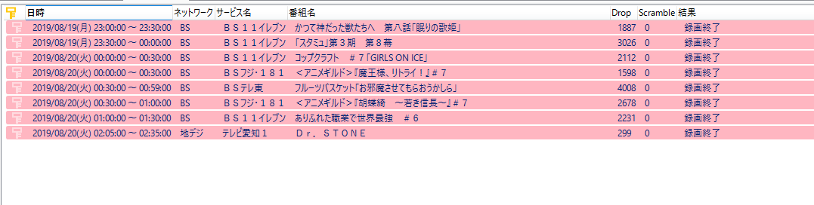

謎。  

録画マシンを別のマシンに移行して、一日たったので録画一覧を見たところ、

 

こんな感じでものの見事にドロップの嵐が発生していました。  

最初はチューナーとの接続が不安定か、アンテナケーブルとの接続が緩んでいるあたりかと思ったのですが、そのあたりを確認しても全く問題なし。  

TVTestで視聴すると確かに数秒ごとに10程度のドロップが発生しています。  
しかも不思議なことに、TVTestで再生している状態で録画マシンにリモートデスクトップ接続しようとすると、「ログインしています」の画面でフリーズ。TVTestも写らなくなってしまうという。  

一度マシンを再起動したところドロップが発生しなくなったのですが、原因を探るためにリモートデスクトップで接続してタスクマネージャーなどを開いて、TVTestを起動したらまたドロップが・・・。  

何度か繰り返してるうちに、発生する原因自体はつかめなかったのですが(イベントビューアにも特段怪しいものがない)、発生する条件と発生時の対応はつかめました。  

結局のところ、リモートデスクトップ自体が悪さをしているようで、マシンを再起動後、リモートデスクトップを行っていない状態ではドロップが発生しません。  
リモートデスクトップを行うと、一旦切断してもドロップが発生し続けるのですが、直接録画マシンでログインしなおす(普段モニタマウスキーボードは外してる)と、ドロップが発生しなくなりました。  

MS純正のリモートデスクトップを使わなくとも、TeamViewerをインストールしたのでなんとかなるはず。うっかりリモートデスクトップで接続しても、TeamViewerで接続し、ログインしなおせば現象は収まるようです。  

しかし原因がつかめないというのは本当にのどに骨が引っ掛かっているようで気持ちが悪い・・・。  
B-CASカードをスマートカードとして接続しているので、そのあたりかとも思ったものの、それならスクランブル解除のほうが失敗するはずで・・・。
