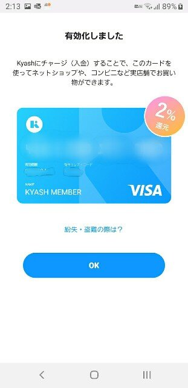

先日利用総額90万円を突破して、カードとしての限度額である100万円が間近に迫り、リアルカードの再発行申込をしました。  
[oembed:"https://blog.hitsujin.jp/entry/2019/08/02/000610"]

当月の15日までに再発行依頼をした場合は当月末、それ以降の場合は次の月の中旬ごろに届くという記載だったのですが、2日に申し込んで17日に手元に届きました。  
まぁ早く届く分には何ら問題ないですね。  

届いた封筒。  
 

中に入っている書類から新しいリアルカードをはがして、裏に署名しておきます。  
 

Kyashのアプリを開くと再発行カード有効化の項目があるので、そちらをタップし、  
 

届いたカードの番号、有効期限、セキュリティコードを入力。  
 

有効化後、ネットショップ等に登録しているカード番号変更が必要であるという注意事項が表示されるのでOKボタン。   
 

これで有効化完了。  
 

さて、Kyashは月に12万円までしか利用できないという制約があります。  
新しいカードが届く前にすでに12万円ぴったり利用していたので(というかAmazonギフトコードを購入してぴったりにあわせた）、この状態で新しいカードを使った場合どうなるか確認してみたのですが、  
 

なんか普通にオーソリ通って決済完了してしまいました。  
リアルカードに限度額が紐づいていて、新しいカードになったことでクリアされたんでしょうか・・・。  

これは正しい挙動なのかどうか気になる・・・。