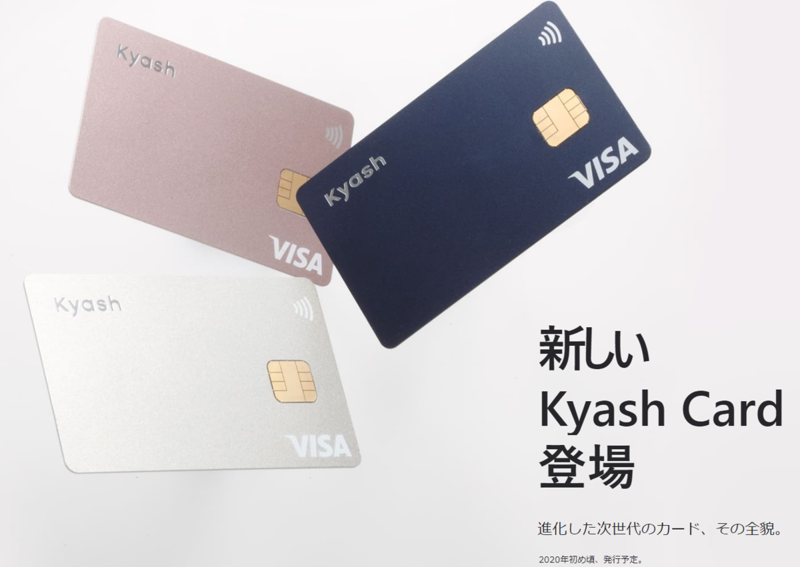
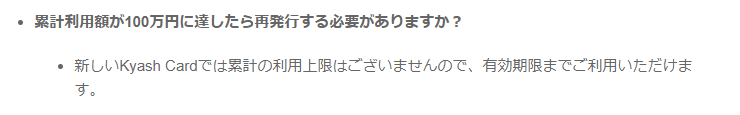

だいたい毎月12万円の制限に引っかかる程度にはヘビーにKyashを使ってるひつじです。  

さて、先日新しいKyash Cardについてアナウンスがありました。  
 

[oembed:"https://kyash.co/kyashcard/"]

<!-- more -->

前回のイメージ画像から、VISAのタッチ決済に対応することと、ICチップを搭載することはわかってました。  

今回の発表で、1回あたりの決済上限が30万円、月あたりの決済上限が100万になったということで、これまで困っていた大きめの買い物の時に使えないという制限がなくなったのはありがたいです。  

残念ながら還元対象決済上限は12万円までということで、そこは何とかならないのか・・・！と思ってるのですが、多分どうにもならなさそう。  

#### 100万円使ったら再発行が必要なのか否か  

本題。  
これまでKyashのリアルカードは100万円までの累計利用額制限があり、これを超えると利用できなくなりました。  
そのため、90万円利用した段階で新しいリアルカードを発行しなおすという手間がかかっていました。  
これにより、チケットや予約商品など、注文時でなく発送時に決済されるものを購入する際はKyashを使いにくい(限度額オーバーでキャンセルを食らうことがある)という問題がありました。  

で、今回の新しいKyash Cardはどうなのか。  

ちゃんとQ&Aに載ってました。  

[oembed:"https://support.kyash.co/hc/ja/articles/360037981951"]

 

やったぜ。  
今回のカードは発行時に900円かかりますが、この仕様ならまぁ問題ないかと。既存のリアルカードは四月から還元率が0.5%に改悪されるので、どちらにしても切り替えないといけなかったわけで。  

そのほかQ&Aでは気になっていた3Dセキュアについても記載がありました。残念ながら非対応だそうです。不正を防ぐためのサービスなので、いつか対応してほしいところ。そもそもKyashは不正系の対応が弱い印象があるので、どうにかならないかな、と。ここがネックで家族にお勧めし辛いんですよね。  

#### 新しいKyash Cardについて気になったこと  
今回の新しいKyash Card、表面にカード番号が記載されていないすっきりとしたデザインになってます。  
セキュリティ面からもあまり表示させておきたくないものではあるので大賛成なのですが、Q&Aによると裏面には記載されるようです。  
VISAの規約もあるので厳しいのかもしれないですが、裏面にも記載せず、アプリから参照するような形にできないかな、と。  
さらにいえば、バーチャルカードのように番号を変更できるようになれば最高なのですが、まぁこれはICチップや磁気情報をどうするんだって話になるのでさすがに無理か・・・。  

