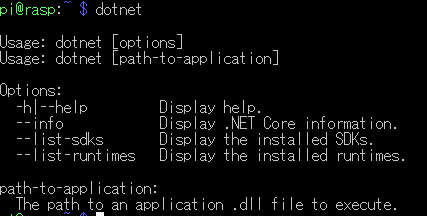

以前GCE上で.NET Coreアプリを定期実行する記事を書いたのですが、

<?# OEmbed "https://blog.hitsujin.jp/entry/2019/01/29/165247" /?>

無料枠で動かしたはずなのに課金の通知が飛んできたので、いったん撤退して手持ちのRaspberryPi上で動かすことにしました。  

#### .NET Core 3.1ライブラリのダウンロード  
Ubuntuはパッケージマネージャからインストール可能。Raspbianについては残念ながら提供されておらず。  
そのため今回はダウンロードして展開、パスを通す形で実行できるように変更する。  

<?# OEmbed "https://dotnet.microsoft.com/download/dotnet-core/3.1" /?>

対象のライブラリはLinuxのARM32向け。RaspbianがARM32向けであるため。  
本記事執筆時点では下記のファイルが最新。  

https://download.visualstudio.microsoft.com/download/pr/67766a96-eb8c-4cd2-bca4-ea63d2cc115c/7bf13840aa2ed88793b7315d5e0d74e6/dotnet-sdk-3.1.100-linux-arm.tar.gz

wgetでPi上にダウンロード。  

> wget https://download.visualstudio.microsoft.com/download/pr/67766a96-eb8c-4cd2-bca4-ea63d2cc115c/7bf13840aa2ed88793b7315d5e0d74e6/dotnet-sdk-3.1.100-linux-arm.tar.gz  

#### 展開
ホームディレクトリ配下にディレクトリを作成して、その中に展開。  

> mkdir -p $HOME/dotnet && tar zxf dotnet-sdk-3.1.100-linux-arm.tar.gz   -C $HOME/dotnet  

Raspberry Piだと展開に時間がかかるのでしばし待つ。  

展開が完了したら、 `.bashrc` ファイルに下記のコマンドを追加。  

コマンド： `nano ~/.bashrc`  

> export DOTNET_ROOT=$HOME/dotnet  
> export PATH=$PATH:$HOME/dotnet

#### コマンド実行確認  

一旦ログアウトしてから(.bashrcの変更を適用させるため)、下記のコマンドを実行。  

コマンド： ‘dotnet‘  

 

こんな感じで表示されればOK。  

#### Cron実行時  
GCEで動かしていた時同様、Cronで定期実行したいのですが、上記のインストール方法だと、Cron実行時動きません。  
bashに対してパスを通しているので、Cron実行時のshに通ってないため。  

Cronの場合、
Cronファイルの `PATH` の項目に `/home/pi/dotnet` という形でパスを追加してやればOK。  

<?# OEmbed "https://gist.github.com/Ovis/fa702997613f3f1893eec535e1054397" /?>

.NET CoreのDLLに対しては絶対パス指定です。  
また、シェルスクリプトではないので、 `$HOME` のような変数が使えないことにも注意。  