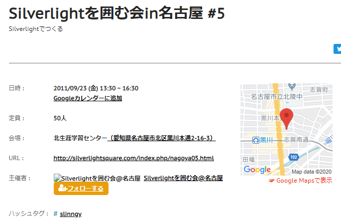
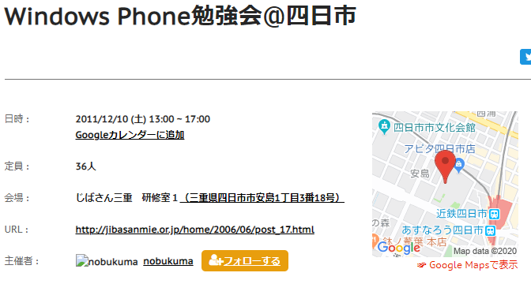
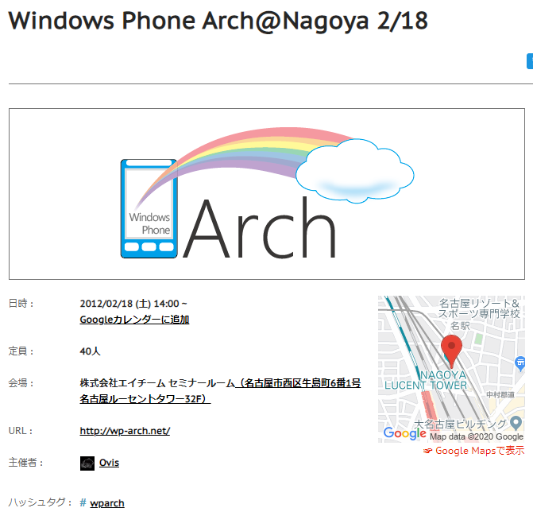
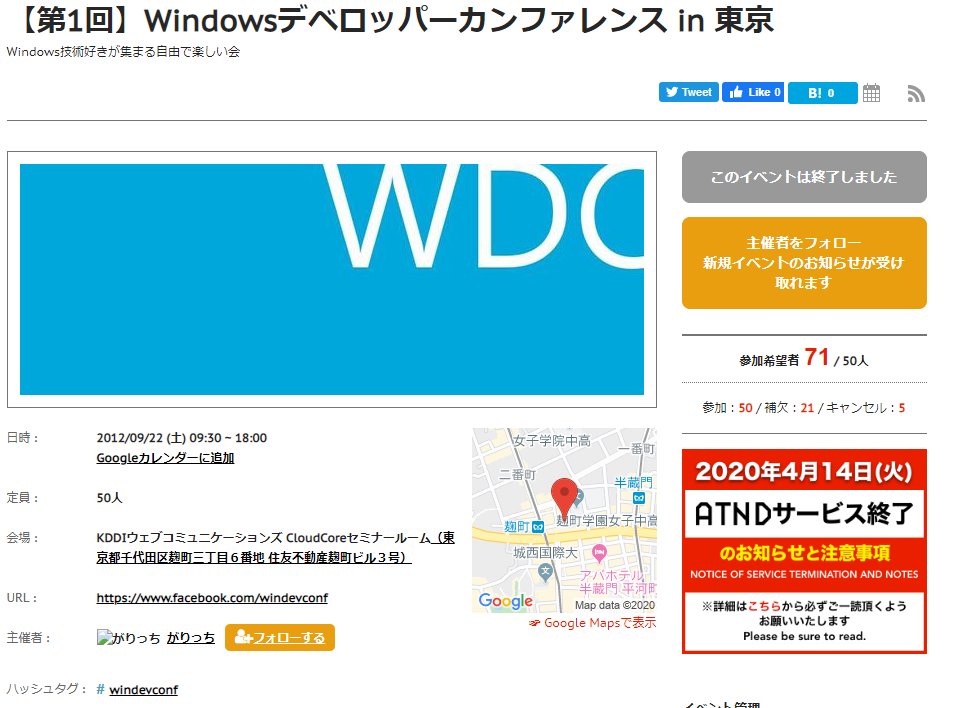
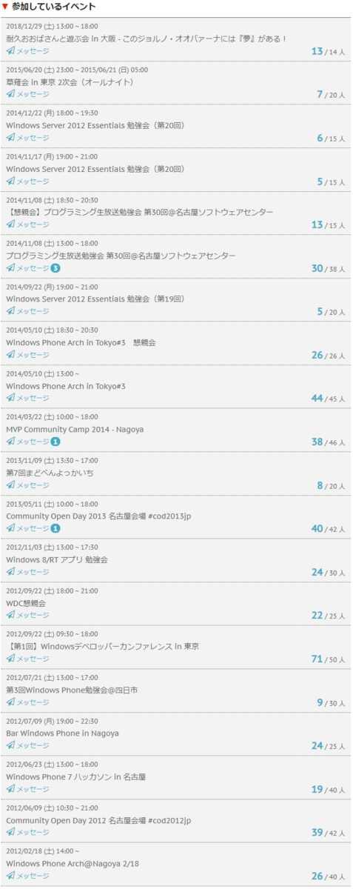
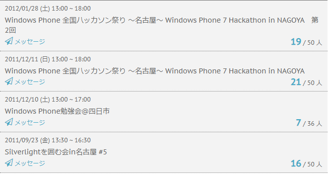

イベント開催支援ツールのATNDが終了するらしい。  

<?# Twitter 1216971766209417216 /?>

https://atnd.org/

ATNDはイベントに参加する人を管理するサービスの先駆け的存在(確か)で、私も何度も利用してました。  

サービス終了後はこれまで参加した勉強会の一覧も見えなくなりそうなので、思い出を書きながらちょっと整理。  

#### Silverlightを囲む会 in 名古屋 #5
初めて参加した勉強会はATNDで申し込みました。  
これです。  

   

https://atnd.org/events/19746

Silverlightってところが時代を感じる。完全にWindows Phone関係かつ名古屋で開催される勉強会ということで参加した記憶。  

思えばこの勉強会に参加したことで、みつばたん(id:c-mitsuba)やつもりん(id:tmyt)、てつじんさん、おおばさん(id:tworks)と知り合いになったような記憶が。  

#### Windows Phone勉強会＠四日市  

 

https://atnd.org/events/21546

初めて参加した勉強会の次に参加したのが三重県四日市で開かれた「Windows Phone勉強会＠四日市」。  
その後勉強会の名前が「まどべんよっかいち」となり、何度か参加しました。  
この勉強会の主催ののぶくまさんとはその後、Microsoftが開催したコンテストに一緒に参加して、賞をもらった思い出。ところであの時もらってのぶくまさんが所有することになったXbox、今どうなってるのでしょう（  

#### Windows Phone Arch@Nagoya 2/18  

 

https://atnd.org/events/22938

初めてにして唯一の主催。  
そして主催といいつつたくさんの皆様に助けていただき、しかも自分ではセッションを持たないというなんちゃって主催感・・・。その節は皆さま本当にありがとうございました。  

この時に初めてオデさんやいっちゅうさん他、今もTwitterで仲良くさせていただいている方とお近づきになった記憶。  
この時MSからノベルティを頂戴し、配布したのですが、余ったものがいまだに家に残っています。  
くーまん可愛いよくーまん。  

#### 【第1回】Windowsデベロッパーカンファレンス in 東京  

 

https://atnd.org/events/32054

第一回といいつつ一回しか開催されなかったような気がする、そのころ学生だったがりっち(id:garicchi)主催の勉強会。  
Microsoftが主宰してるようなタイトルだけど個人の勉強会。  
初めての東京での勉強会だったんですが、地方勉強会とは雲泥の差の集客ぶりに驚いた記憶があります。  
名古屋だと補欠者がでるほどの勉強会ってあまり見かけず。  

#### 振り返って  

ATNDで参加した勉強会は主催分含めて24件でした。  
最近ではconnpassばかり利用していますが、初めて使ったサービスだっただけに終了はさみしくも感じます。  

以下ATND経由で参加した勉強会一覧  
 
 