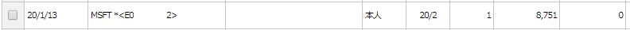
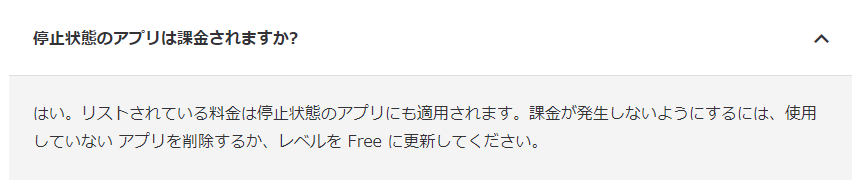
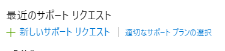
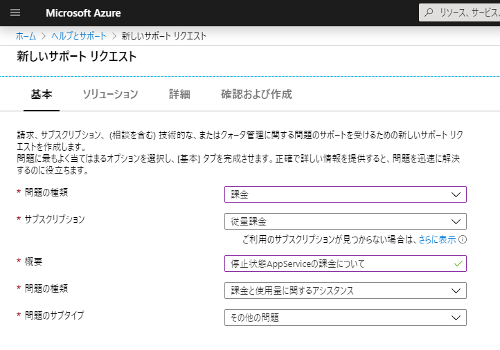
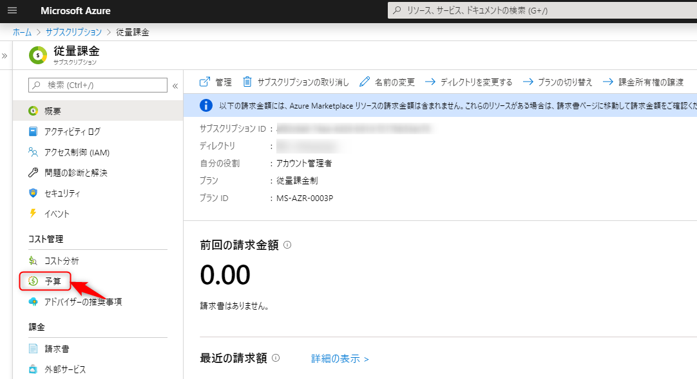
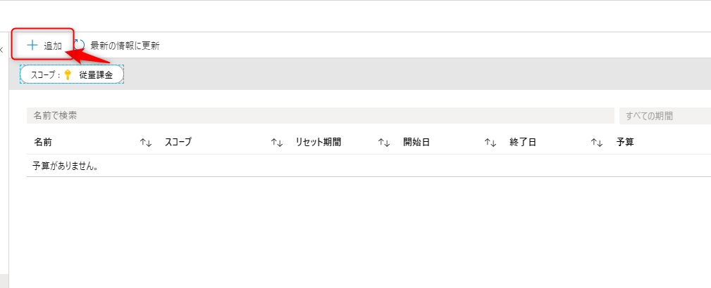
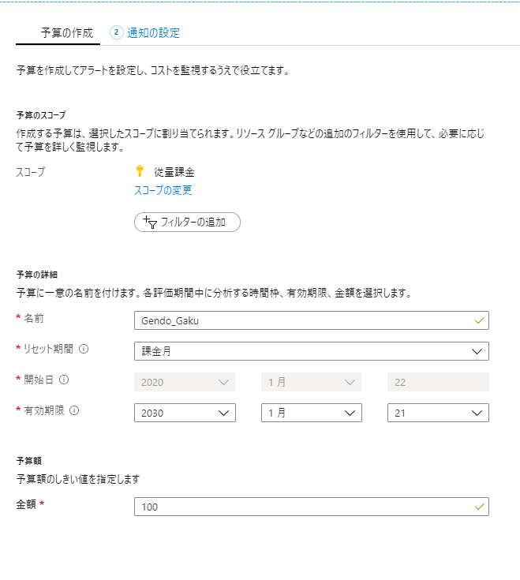
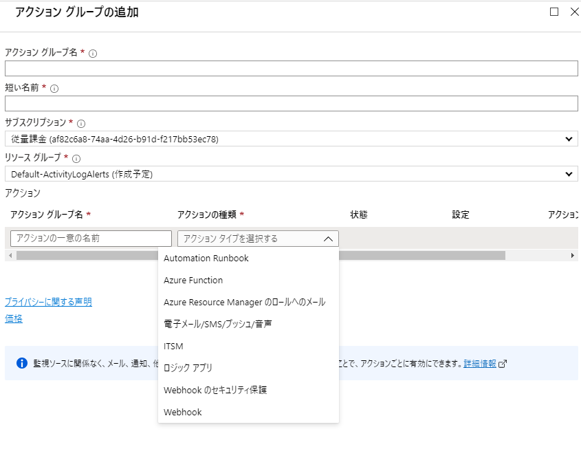
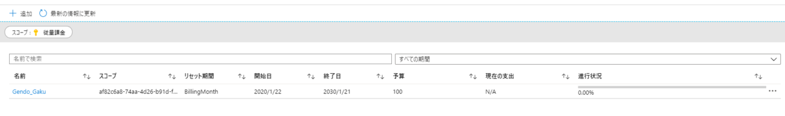
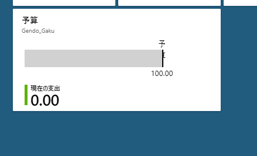

初めに書いておきますが完全に私の失態で、Azure、Microsoft側に何ら瑕疵はありません。  

昨年Microsoft Learn もくもく会という勉強会に参加した際、そのもくもく会で使うためのサブスクリプションとApp Serviceを作成しました。  
その日やりたかったことはできたので、そのままAppServiceを停止させて終了していたのですが、1月も下旬になって確定申告の時期ということでクレジットカードの明細を見ていたら、こんな明細が。  

 

私はOffice 365も契約しているため、最初はそちらかと思ったものの、よく考えたらそれは別のクレジットカードで決済している。となるとこちらはAzureしか考えられず。  
いや確かに11月に使ったけど、あの一日にやったことだけでこんなに課金されないよな・・・？と思ってAzureポータルを確認。  
思いっきり課金されている・・・。  

停止させていたのになんで課金されてるんだろうと思って調べたところ、  
   

あー、うん、AppServiceのページにしっかり掲載されてました。  
AppServiceは、停止させただけではリソースが残っているため、課金されてしまうわけです。Freeプランにしておけばよかったのですが(というかもくもく会で試した内容ならFreeプランで事足りる)、その時は1日分の課金くらいなら別に数十円だからいいやと、Standardプランにしてしまってたはず・・・。  

11月から1月までの課金累計額は約2万円。  

当初は完全に私の落ち度なので、痛い勉強料として支払うしかないなこれはと考えていたのですが、知り合いの方から、一度サポートに聞いてみてはどうかとアドバイスをいただいたので、ダメもとで聞いてみることに。  

AzureのサポートはAzureポータルのヘルプとサポート画面から、新しいサポートリクエスト を開き、

<?# OEmbed "https://portal.azure.com/#blade/Microsoft_Azure_Support/HelpAndSupportBlade/overview" /?>

 

必要事項を記載して送信すればOK。  

 

夜のうちに送信したところ、次の日の午前中にサポートから連絡をいただきました。(重要度を「C-最低限の影響」にしておいたのでもっとかかると思ってました。早い。)  
ありがたいことに、状況を考慮し、返金対応をいただけることに。  
サブスクリプションを削除し、改めてサポートに連絡したところ、電話をいただき、今後の対応について丁寧に教えていただきました。  

メールにはこういう対応は1回のみであるということが記載されています。当然これはご厚意によるものなので、あてにしてはいけません。  

#### 再発防止策  
AppServiceは停止しても課金される、という基本事項がすぽんと抜けていたことから始まるわけですが、こういうのはちゃんと課金金額を把握できていれば防げるわけです。  
毎月課金金額を通知してくれるわけですが、それだけでは唐突なアクセス増加等による課金額高騰に気づくこともできないため、別途一定の課金金額に到達した際にアラートを出してくれるサービスが存在しています。  

<?# OEmbed "https://weblabo.oscasierra.net/microsoft-azure-billing-alert-service/" /?>

上記記事は少々古いので、現時点での設定方法をまとめます。  

Azureポータルより設定したいサブスクリプションを開いて、予算を開く。  

 

追加をクリック。
 

予算の情報を入力。  
名前には英数字、アンダースコア、ハイフンの未入力可能。  
リセット期間は請求書単位の月、四半期、年のほか、暦単位の月、四半期、年があります。  
有効期限はめいっぱいにしておきましょう。  

予算額は自分が出せる額を指定。  
 

次に通知設定。  

予算の割合は先ほど決めた予算額に対するパーセント指定。  
メール通知だけでよければ下の「アラートの受信者（メール）」に入力しておけばOK。  

 

なおアクショングループのほうで設定を行うと、Azure Functionを呼び出したり、WebHookを使ってSlackに流すなんてこともできるみたいです。  
 

登録するとこんな感じで登録されていることがわかります。  

 

ダッシュボードにピン止めも可能。  
 

これを設定しておけば、たとえ課金が発生しても最低限で済むはず。