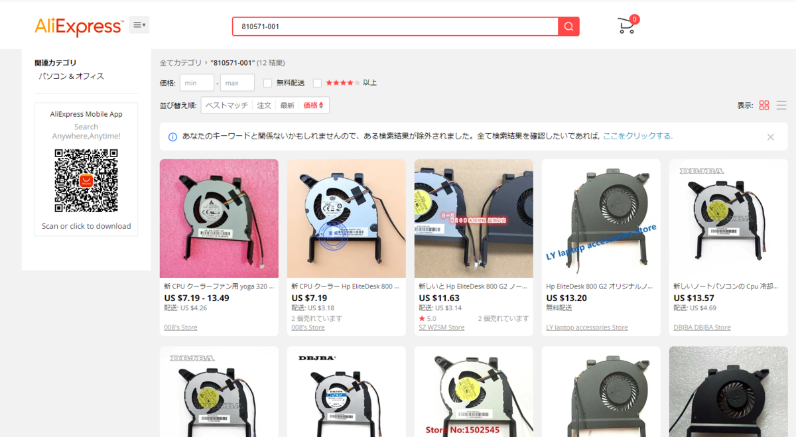
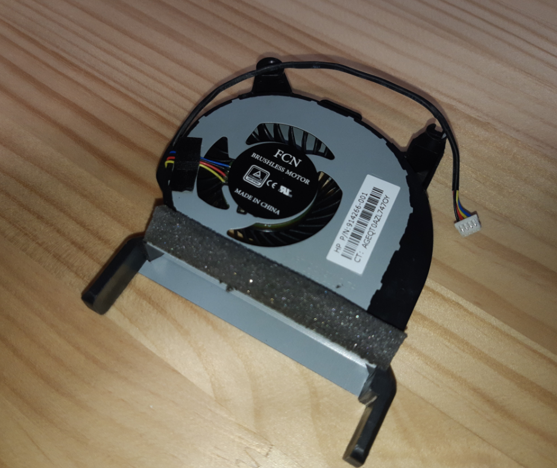
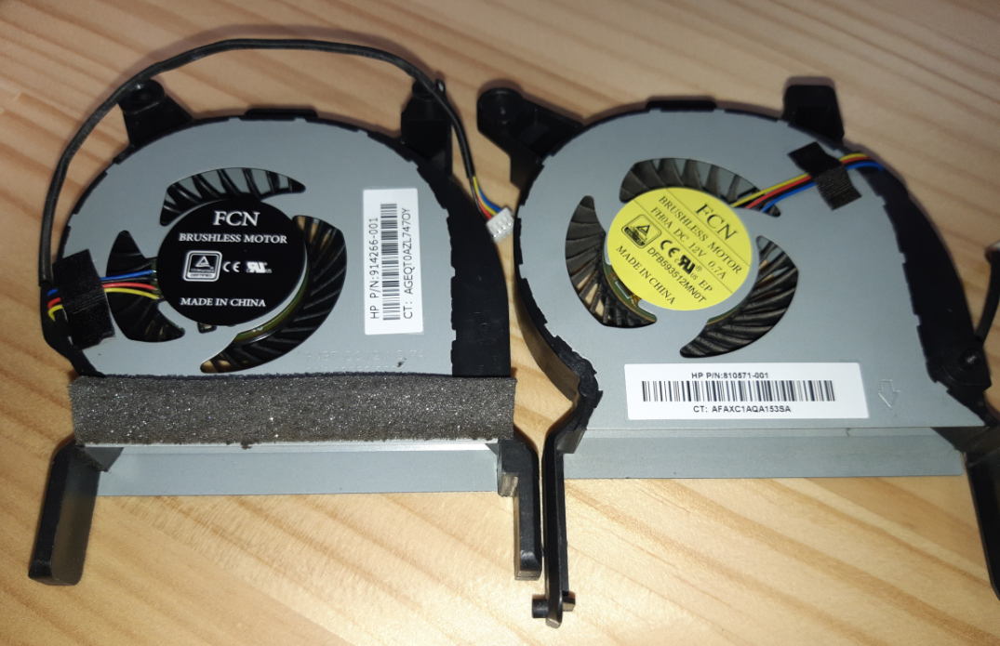
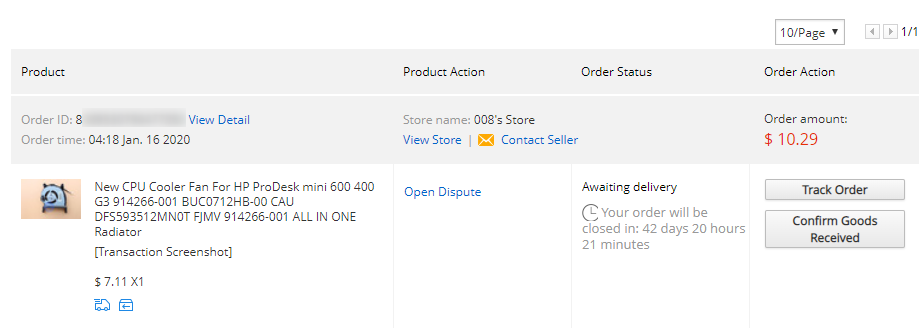

録画用パソコンの設置場所の都合、大きなパソコンを置くことができないため、最近はHPのProDesk 400 G2を録画用パソコンとして利用しています。  

ヤフオクで1万円ほどで購入し、半年ほど利用していたのですが、最近PCファンから異音が聞こえるようになってしまいました。  
蓋を外して確認してみたところ、埃は全くないものの、軸がゆがんだか何かしてしまった模様。  
中古だから仕方がないのですが、設置場所が仕事部屋でもあるため、常時煩いのは作業に集中できなくて困る・・・。  
が、困ったことに超ミニサイズのPCであるため、ファンが特殊形状。  

ファンに記載されていた番号を確認した限り、このファンの方式は「810571-001」 らしい。  

Amazonで調べたところ、一応ヒット。  

<?# AmazonAffiliate B07JB7C1FZ /?>

最安値で5929円。いくら何でもそんなお金をかけたくない。  

だいたいこういうパーツは中国のほうで組み立てているのだから、中国系の通販サイトなら売っているのでは？と考えて、AliExpressで検索。  

<?# OEmbed "https://ja.aliexpress.com/" /?>

結果複数の商品がリストアップされました。  

 

＄7.19～で送料が$4程度ということで、大体1230円程度になる模様。お安い。  
到着まで13日～20日程度かかるらしいんですが、海外からなのでそこは仕方がないと割り切り。もっと送料を払えば早く届くんですが、そこまで払いたくないな・・・と。  
いくつかリストアップした商品から送料を含めて一番安いものを選択。  
中国のアリババグループなので、まぁある程度大丈夫だろうとクレジットカード情報を入力しぽちっ。  

購入したのが1月16日で、実際に届いたのは1月30日。14日でとどいたならまぁ早いほうなのではないでしょうか。  

で、実際に届いたものがこちら。  

 

あれ・・・？なんか形状が微妙に違う・・・？  

並べたところ一目瞭然。というか型番が違う。  

 

初めての利用でいきなりダメな業者を引いたか・・・？と思いつつ注文履歴を参照したところ、  

 

・・・。単に私が買い間違えただけでした。たぶん一番安く買えるのはどれかと見ていた時に間違えたのかと・・・。  

私のミスであること、送り返して再度正しいものを送ってもらうのも面倒ということで、届いたファンで何とかすることに。  

幸いといいますか、ほぼ同じ形状。  
パソコン本体と固定するための部分の長さが足りないので、固定する爪部分をニッパーでぱちんと削ることで対応。どうせ縦置きしないので、ずれてしまうこともなし。  

どうにかはめ込んで電源を入れたところ、あれほどうるさかったのがウソのように静かに起動しました(そりゃそうだ）。  

とりあえず、商品を購入するときは注文確定前にすべての情報を再度見直すようにしないと・・・。