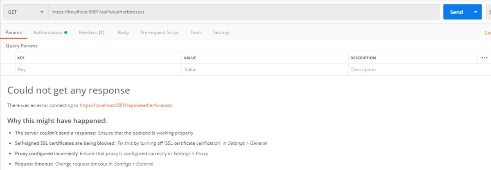
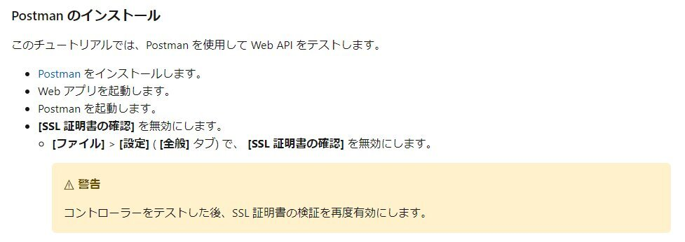

以前使っていたAPIをたたくツールが公開終了してしまい、最近はPowerShellで下記のように叩いていたんですが、  

```powershell
$body = @{hoge="fuga"; foo="bart"} | ConvertTo-Json -Compress  
Invoke-RestMethod -Uri "https://localhost:5001/api/RESTfulApi" -Method POST -Body $body -ContentType application/json  
```

やっぱり専用のクライアントを使ったほうが楽だなと思い直してPostmanを使い始めました。  

[oembed:"https://www.postman.com/"]

乗り換えた際に躓いた点の備忘録。  

<!-- more -->


#### ローカルデバッグ中のASP.NET Core APIを叩けない  

ASP.NET CoreのAPIテンプレートをそのまま動かしていてブラウザでは表示されるのに、

> Could not get any response

 

とはじかれる事案。  

なんやこれ、と思って調べたところ、下記のサイトを発見。  

[oembed:"https://knkomko.hatenablog.com/entry/2019/10/02/001032"]

ローカル実行中のASP.NET CoreのAPIは自己署名のSSL証明書を利用しているため、PostmanがSSL証明書の検証を行った際に失敗してしまうのが原因の模様。  

Postmanのツールバーより「File」→「Settings」 から設定を開き、「SSL certificate verification」 のチェックをオフにすることで問題は解消。  

 

[Microsoft Docs](https://docs.microsoft.com/ja-jp/aspnet/core/tutorials/first-web-api?view=aspnetcore-3.0&tabs=visual-studio)にもちゃんと書いてありました。よく読めって話ですね。はい。  

 

#### Bearer トークンを指定したい  

JWTを利用した認証を行う際、発行されたBearer トークンをセットする必要があります。  

最初Headerタブに設定すると思ってたんですが、普通にAuthorizationタブがありますね・・・。  
Typeに「BearerToken」があるので、そちらを選択し、Tokenにセットしたいトークンを入力するだけです。  

 