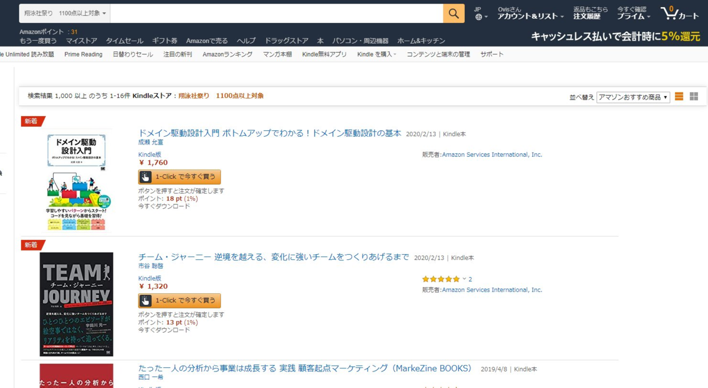
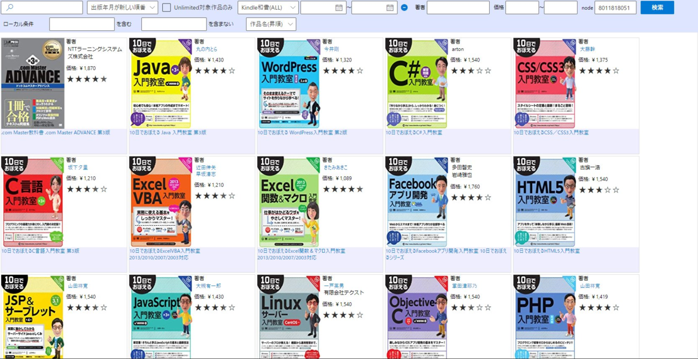
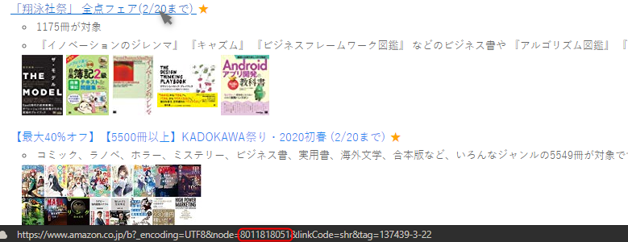

[oembed:"https://x.com/hitsuji_no_hito/status/1229069614211973120"]

投稿したものがすべてを語ってるんですが、しんじさん(id:Shinji_Japan)が公開されているChrome拡張の「Kindle Search」にBrowseNode(以下node)検索機能を実装していただきました。  

<!-- more -->

[oembed:"https://chrome.google.com/webstore/detail/kindle-search/bckpnmiaedmiohplnmmeleogkifnmkfk"]

[oembed:"http://shinji-japan.hatenadiary.jp/entry/2019/11/23/114458"]

これによって、特定のnodeに紐づくKindle本のみを抽出することができるようになります。  

nodeとはAmazonの商品カテゴリのことです。  
例えば日用品なら「[170563011](https://www.amazon.co.jp/b/ref=as_li_ss_tl?node=170563011)」となります。  

これ、何がうれしいかというと、Kindleがたまに行っているキャンペーン・セールは(例外もありますが)nodeを発行して、対象本を紐づけて表示しているので、このnodeさえわかればキャンペーン中の本だけが表示、並び替えできるんです。  

例えば今(2020/02/17)行われている翔泳社のKindle本セール。  

[oembed:"https://www.amazon.co.jp/b/ref=as_li_ss_tl?node=8011818051"]

このセールはnodeとして「8011818051」が発行されています。  

 

Amazonで普通に検索すると、Amazonお勧め順、価格の安い(高い)順、出版年月順では検索できるものの、タイトル順が存在しません。  
これが曲者で、シリーズものを探すときに本当に苦労します。  

で、このChrome拡張を使うと、
 

こんな感じ。   
タイトル順なので、10日でおぼえるシリーズがまとまっているのがわかるでしょうか。  
なぜAmazonで実装されていないのか理解に苦しむのですが、ABテストとかで実装しないほうが売れる結果が出たとかなんでしょうか・・・。  

さて、このnodeなんですが、普通はAPI(Amazon Product Advertising API)を叩かないと判明しません。  

[oembed:"https://qiita.com/kobake@github/items/88001f62983211027f63"]

[oembed:"http://blog.livedoor.jp/underzonez/archives/6618861.html"]

さすがに面倒なので、きんどうさんやキンセリさんのサイト、ツイートをチェックして、そのURLからnodeを探しましょう。  
(nodeだけ拝借するとタダ乗りになってしまうので、URL開いてアフィリエイトタグだけ反映させておくのがよいかと)  

[oembed:"https://kindou.info/"]
[oembed:"https://yapi.ta2o.net/kndlsl/"]

特にキンセリさんのサイトは上記APIを叩いて自動更新しているだけあって、使いやすいです。  
 

[oembed:"https://x.com/kinselist/status/1228514303927472128"]

