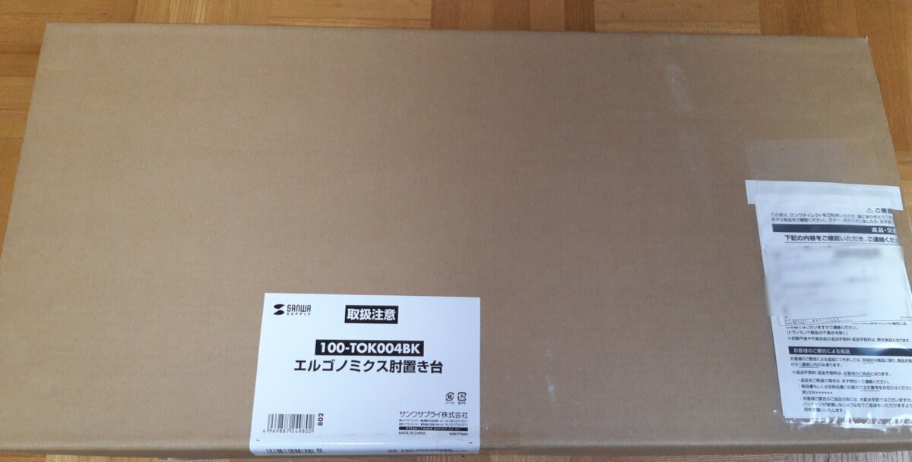
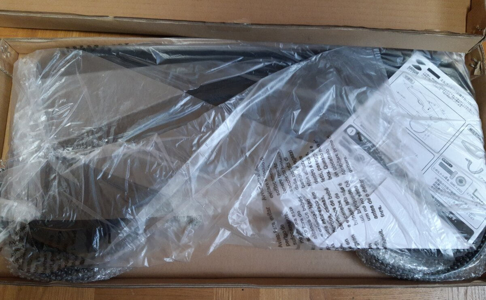
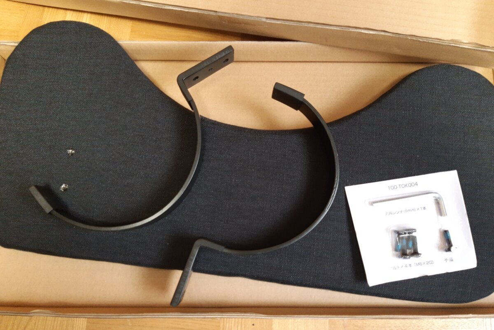
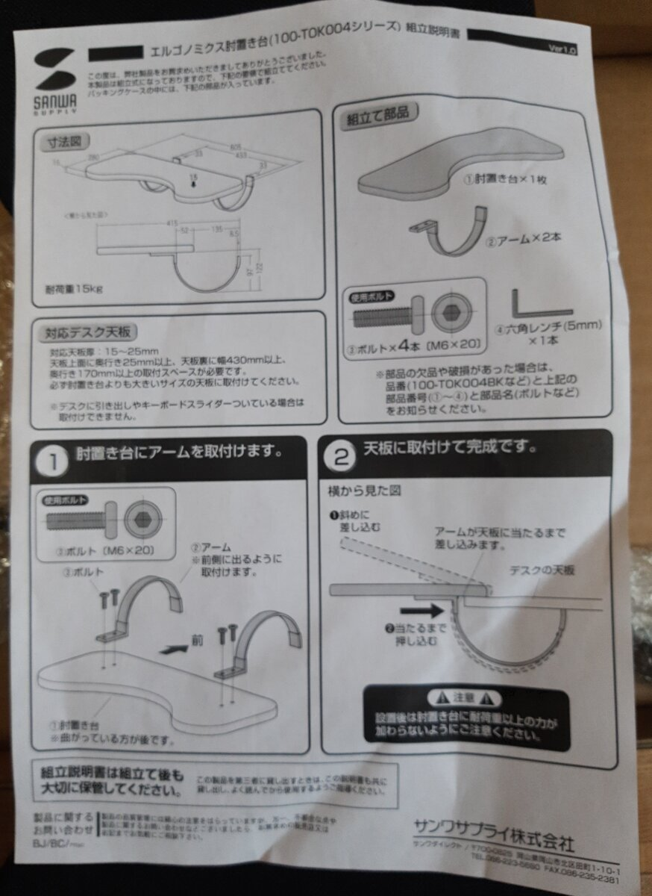
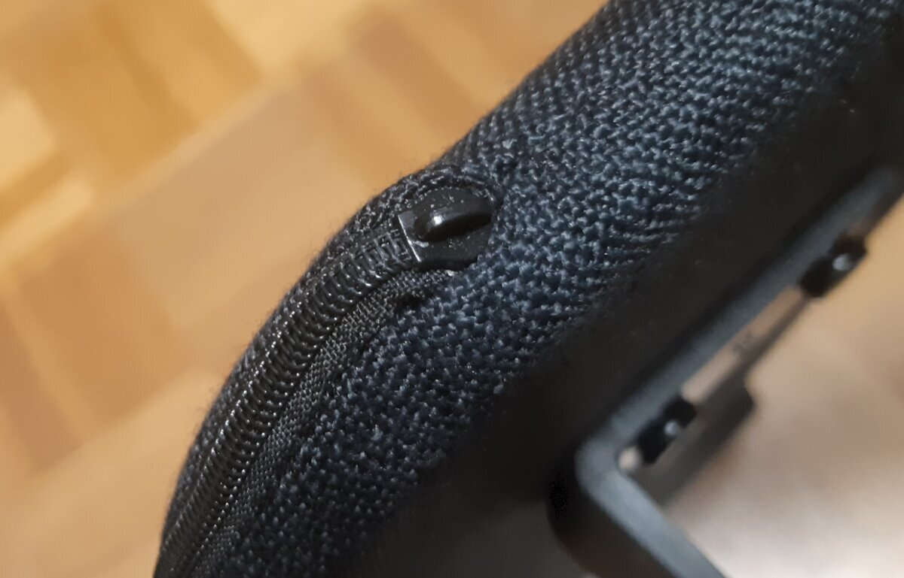
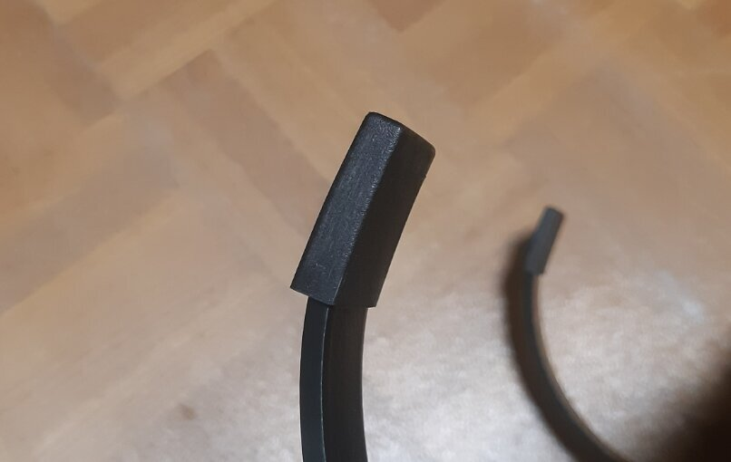
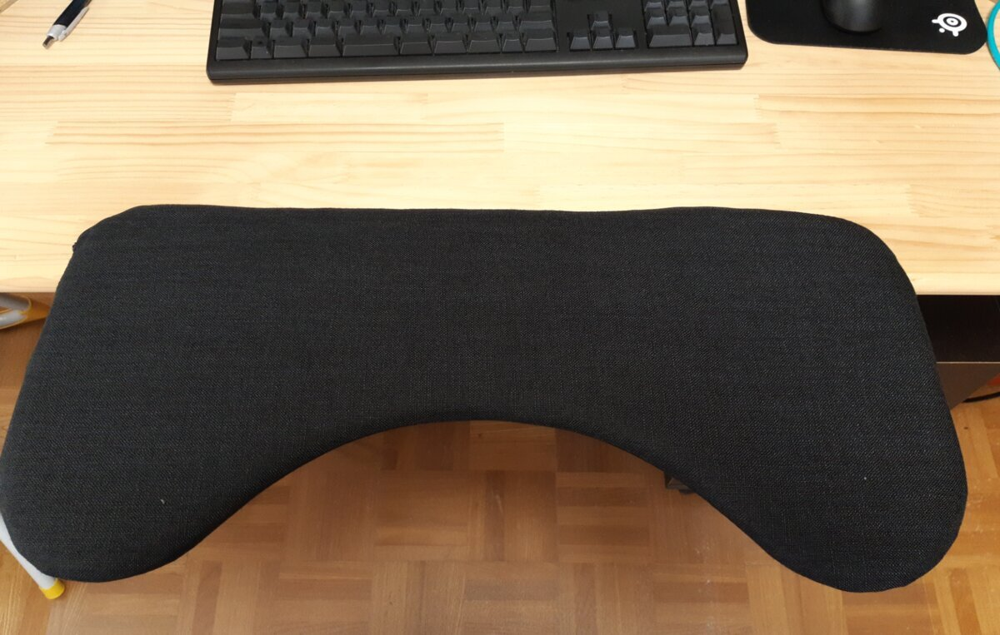

たまたま見かけた下記のツイートを見て衝動買いしました。  

[oembed:"https://x.com/pc_watch/status/1237604178454691840"]

<!-- more -->

[http://direct.sanwa.co.jp/ItemPage/100-TOK004BK](http://direct.sanwa.co.jp/ItemPage/100-TOK004BK)

---

購入をした理由は、今の座り方だとモニターとの焦点距離が短すぎるから。  
昨年作ったスタンディングデスクは天板の奥行きが約75cmあるのですが、普段天板の端におなかがくっつくように座って作業をしているため、4Kの43インチモニターを使っているとどうも顔とモニターが近づきすぎて、目が疲れる・・・。

その点これを使えば物理的にモニターとの距離が離れるので、目に優しいだろうな、と。  

#### 開封の儀

届いた物はこちら。  
 
箱を開けるとこんな感じで各パーツが格納されています。  
 
 
ボルトを締めるための六角レンチも入っているので工具は不要。ただぶっちゃけこういう商品を買うたびに六角レンチが増えていくので、いい加減資源の無駄感が・・・。  

 

本体部はファスナーがついていたんですが、持ち手がなく、開けられないようになっている模様。  
 

アームそのものは金属製なんですが、先の部分はプラスチック製のカバーがついているので、よほど柔らかい素材の天板でない限り傷がつくことはなさそう。  
 

#### 取付

実際にテーブルの天板につけたところ。  

 

単に引っ掛けるだけなので取り付けるのも取り外すのも楽。
横からぶつけたりすると机から落下する可能性があるので注意。1.86kgあるので。    

#### 使った感想

これまではひじを天板に置くためにどうしても体がテーブル天板に近づき、モニターと顔の距離が近くなってしまったわけですが、25cmほどこれまでよりもモニターから物理的に離れるようになったことで完全解消。  
クッション付きの肘置き台なので肘をおいてて気持ちが良いです。  

ひじ置台の高さ分天板より高くなったことで、　キーボードが打ちやすくなったのも良し。  

耐荷重が15kgとなってますが、腕を置くくらいしかしないので問題なし。
お値段も3480円と高くもないので、なかなか良い買い物をしたかな、と思います。

[amazon:B084H5FW6X]