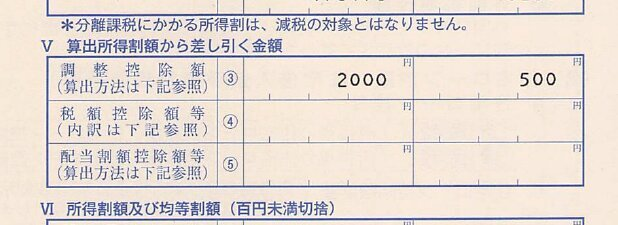
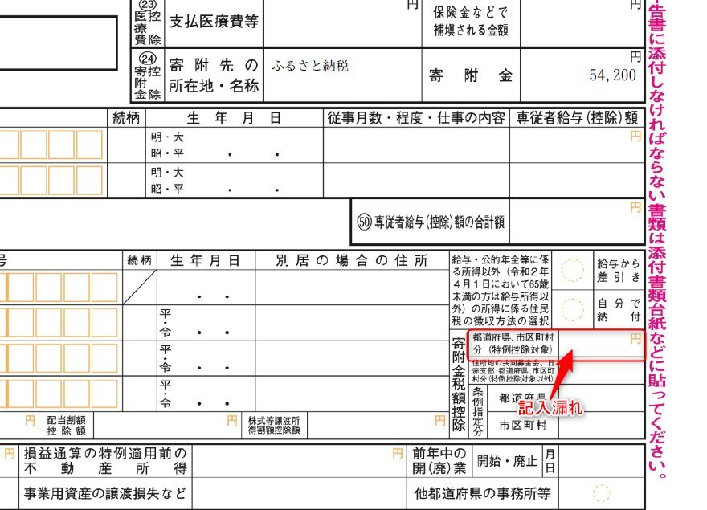
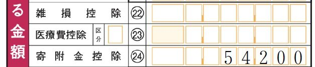

コロナウイルスのせいで確定申告の期限が延長される中、e-Taxを使ってさくっと当初期限内に申告したぞー！って思っていたのに、今になって不備が発覚したひつじです。  

<!-- more -->

#### 経緯

6月中旬ごろに名古屋市から市民税県民全の納税通知書が届きました。  

[oembed:"https://x.com/hitsuji_no_hito/status/1272063848200065025"]

227100円と大変懐が冷える金額ですが、国民の義務なので一括納付。  
その後机に通知書を置きっぱなしにしてまして、いい加減片付けようとしている中でふと目に留まったのがここ。  

 

`税額控除額等`の欄が空っぽ・・・。  

昨年もふるさと納税をしていたので、本来ならここにふるさと納税分の控除額が記載されるはず・・・。  

確定申告を行ったときに寄付金控除をキチンと記載したはずなのになぜ？と確定申告書を見たところ。

 

住民税・事業税に関する事項欄に寄附金税額控除欄があるのですが、そちらにふるさと納税を記載し忘れている・・・。  

完全に私のミスです。  

さらによく調べてみると、第一表の寄付金控除も間違えていることが発覚しました。  

 

今回ふるさと納税で54200円納税しているのですが、ふるさと納税による寄付金控除は「寄付をした金額-2000円」が控除額となるため、ふるさと納税した金額そのままでなく、2000円引いた金額を記載しなければなりませんでした。  
この段階で修正申告しないといけないことに。  

#### 修正申告  

今回すでに住民税を納付した後だったので、対応方法がわからずまず市税事務所に電話をすることに。  
かくかくしかじかお話ししたところ、区役所の税務窓口に市町村からもらった寄付証明書と本人確認書類を持参することで訂正ができると。  
また修正申告も必要なので税務署に電話して確認。こちらは修正申告書と寄付証明書、そして今回寄付金控除の記載が誤っていたことで所得税の金額も変わってしまうため、お金を持ってくるよう指示されました。

さて、寄付証明書はちゃんと残してあるので修正申告書を作る必要があります。  
もともとMoneyForwardのクラウド確定申告サービスを用いて確定申告をしていたのですが、こちらは修正申告のデータを発行できないようなので、国税庁のサイトから改めて修正申告書を作成します。  
今更ですが、MoneyForwardの申告書発行を行ってから国税局のサイトで申請をすればよかったな、と。そうすればデータの使いまわしがきいたので。今回は一からの作成です。  

手元の確定申告書を参照しながら修正申告書を作成、印刷したのでまずは区役所に行ってきました。  

税務窓口で状況説明したところ、税務署側で修正申告を行うことで正しい住民税額が区役所側に通知されるため、実は区役所に行く必要はなかったという説明を受けました。  
どうやら区役所側に通知されたら支払いすぎている分の還付のお知らせを家に送ってくれるようです。  
結局区役所では寄付証明書を提出することもなく、修正申告書を提出しに税務署へ。  

税務署にいったら窓口に修正申告書を提出。  
最初e-Taxで提出してから誤りに気付いて修正を行いたい旨説明したところ、寄付証明書は提出しなくてもよい（自宅で保管）ことになったので、修正申告書と足りなかった所得税200円を支払って終了。  

#### 終わりに  
やはりフリーランス最初の確定申告くらいはe-Taxでなく税務署に行ってきちんと内容を見てもらうべきだったかなぁと反省。  
来年確定申告を行う際は、国税庁ホームページから申請用のデータを作成することにします。