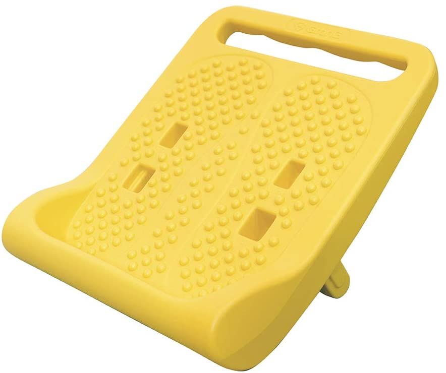

2020年ももう終わりということで、今年買ってよかったもの。  

お題「#買って良かった2020 」

## ハード系  
### HP ProBook x360 435 G7
かずきさん(id:okazuki)に3年ほど前に安く譲ってもらったSurface Bookもだいぶバッテリーの持ちが悪くなってきたこともあり、今回仕事の打ち合わせに持っていくために新調しました。  
HPのノートパソコンはキーボードのエンターキーの右側にもキーがある変態構成だったので長らく調達先から外してきたのですが、これは普通のキーボードでした。  
つい最近の構成からキーボードが変わったみたいですね。  

<?# OEmbed "https://pc.watch.impress.co.jp/docs/news/1293731.html" /?>

メモリー16GB、Ryzen 5、SSD512GB、Windows 10 Proの構成で10万円を普通に切ってるあたり最近はパソコンも安くなったものだなぁと。  
ちょっとした開発ならこのマシンだけで事足りそうです。  

<?# AmazonAffiliate B08LD4V8NM /?>

### Marantz Professional MPM-2000U

コロナもあって音声会議などもあるだろうと思い購入。  
これまではSONYの安いマイクを利用していたのですが、雑音が入ったり音がやけに小さいなど不満があり・・・。  

こちらはホワイトノイズもなく、音もしっかり拾えて好印象。  

<?# AmazonAffiliate B01GJ9IUNY /?>

### AVLT PC モニターアーム

<?# AmazonAffiliate B083QGXMXZ /?>

一昨年購入したLG電子の43インチ4Kモニタ用モニターアームが欲しいなと思っていたところ、

<?# Twitter 1332553243302379522 /?>

というツイートを見かけて購入。  

なお私が使ってるLGのモニターは200mmx200mmのVESA規格なので、変換用パーツが必要でした。  

<?# AmazonAffiliate B00AAHOYXM /?>

### Nature Remo 3

<?# AmazonAffiliate B08BLSLWH4 /?>

LS miniからの乗り換え。  
買って早々にシステムトラブルで使えないタイミングがあって乗り換えに失敗したか・・・？と思ったものの、それ以降は特段問題なく。  
リモコンのプリセットも数揃えられているあたりはさすが。  
Nature Remo E liteもついでに購入し、Wi-SANでリアルタイムに電力消費状況も確認できるようにしたものの、今のところは見るだけ状態。APIが提供されているので暇を見て遊びたい。

<?# AmazonAffiliate B086WGR1TZ /?>

## 調理
### 和平フレイズ ワイドになった ホットサンドパン あつほかダイニング MB-1772

<?# AmazonAffiliate B08CR5KD5V /?>

リロ氏の投稿動画を見て衝動買い。  
もともと小さめのホットサンドメーカーとしてi-WANOのホットサンドメーカーを使ってました。  

<?# AmazonAffiliate B07PF8M23R /?>

ただ、単純にホットサンドを作るだけならこれで十分なものの、肉を一気に焼くなど、ほかの料理をしようと思うとパンのサイズでしかないこのホットサンドメーカーだとちょっと小さく。  

こちらはでかいだけあって胸肉を二つ同時に焼いたり、大きなお好み焼きを焼いたりと大活躍。  
欠点は二つに分解できないこと。洗う時には外れたほうが楽なんですが、こちらは分解できず。和平フレイズのTwitterによると、二つに分離できるつくりにしようと思うとさらに重くなってしまうことから断念したらしい。確かにすでに重たいので、これ以上重たくなると使いにくくはなりそう。  

<?# Twitter 1299262250679635968 /?>

### VPCOK ノンフライヤー

<?# AmazonAffiliate B07JFYQ4V1 /?>

揚げ物好きなものの、家で揚げ物するのは油の管理が非常に面倒なので、Amazonセールで安かったこちらを購入。  
中国製なので日本語説明書も微妙ではあったものの、それほどややこしい作りではないのですぐ慣れました。  
大量に作るのには向いてないものの(ムラが発生するので)、一人分を作るには十分。  

## ストレッチ  

### GronG ストレッチボード
私はとにかく体が硬く、特に足首の可動域がめちゃくちゃ狭いので、ふとした時にストレッチできるといいなと思い購入。  

 

角度を調整して上に乗るだけで足首とふくらはぎが伸びて心地よい・・・。  

<?# AmazonAffiliate B07NCWQS7W /?>