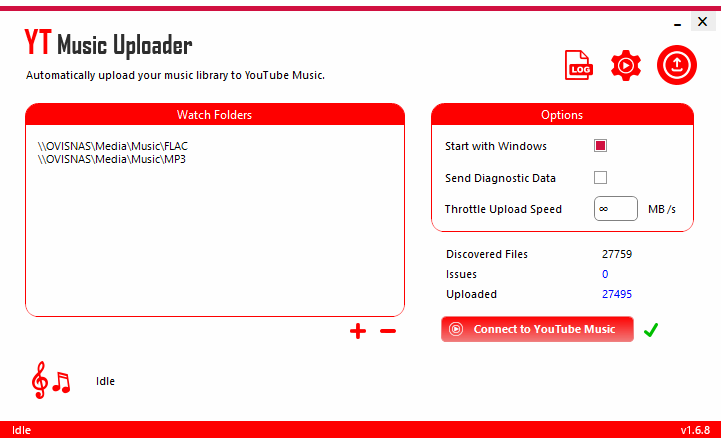

Google Play MusicのころはGoogle Play Music Managerを利用してローカルの音楽ファイルをアップロード可能でした。  

<?# OEmbed "https://support.google.com/googleplaymusic/answer/1075570?hl=ja" /?>

しかしYouTube Musicに移行してからは現時点でアップロードソフトウェアが公開されておらず、ブラウザから手動でアップロードするしかありません。  

ブラウザでやれるなら非公式APIなりでやれるだろうし、同じようなことを考えている人はいるだろうと思って調べたところ、ytmusicapi なるものを発見。  

<?# OEmbed "https://github.com/sigma67/ytmusicapi" /?>

<?# OEmbed "https://eieito.hatenablog.com/entry/2020/11/16/100000" /?>

これはこれで要件を満たせそうではあるものの、Pythonを使い慣れてないこと、自動アップロードもしてほしいこともありほかのソフトウェアを探したところ、こちらを発見。  

<?# OEmbed "https://github.com/jamesbrindle/YTMusicUploader/" /?>

 

Windows向けアプリなのでLinuxやMacでは(Wineでも使わない限り)使えませんが、私はWindows環境なので問題なし。  
`Watch Folders` に音楽ファイルがあるフォルダを指定しておけば、あとは勝手にアップロードしてくれます。  

