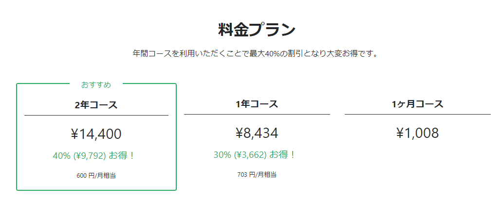
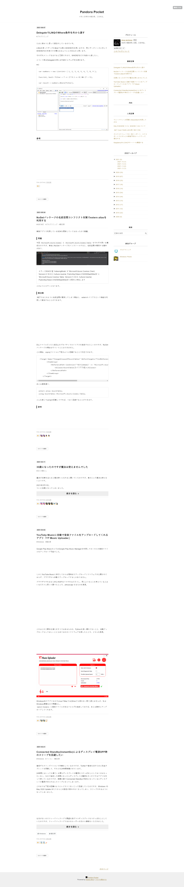
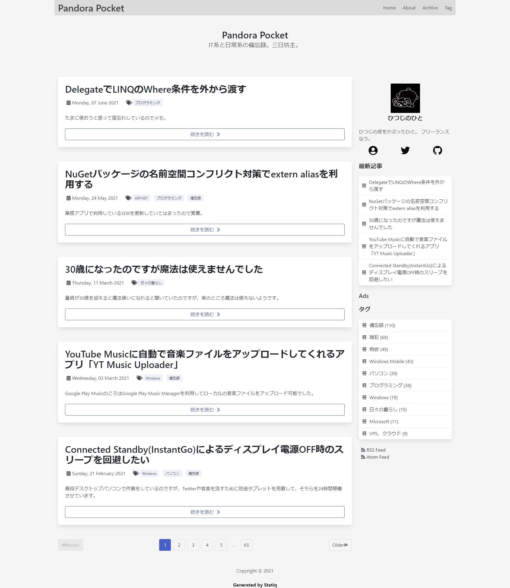
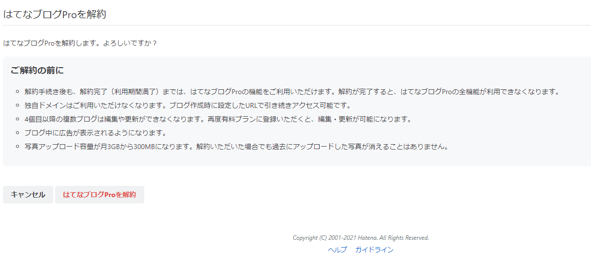
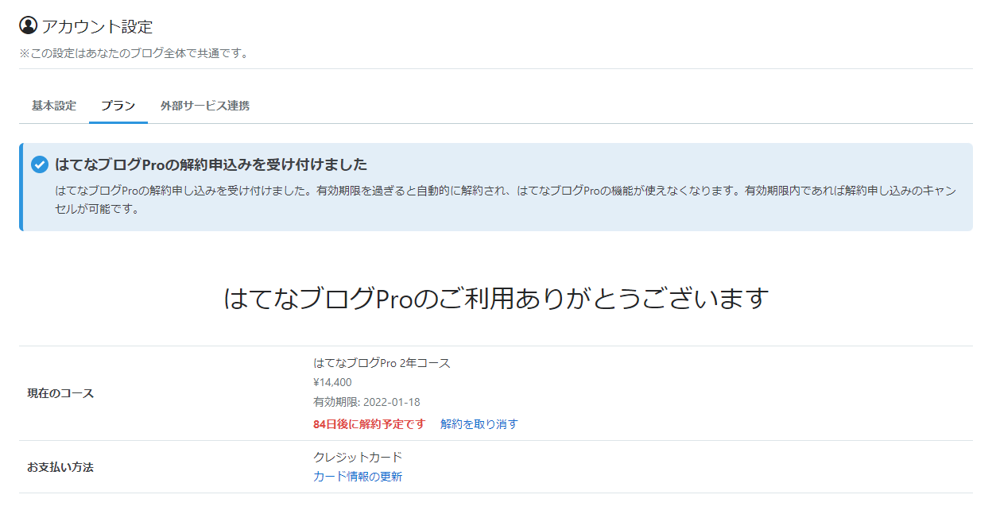

はてなブログ Pro、機能的には申し分なくて便利に利用していたのですが、月額利用料金がそれなりのお値段。  

 

<!-- more -->

毎月の支払だと1008円、年間だと8434円で月703円相当、2年コースでも14400円で月600円相当。  
ずっと2年コースで使ってきましたが、そこまでブログをかけていないので、ちょっともったいない。  
広告載せてますがそんなに閲覧数があるわけでもないので賄えるわけでもなく。

そもそもはてなブログ Proを利用することにした理由が

- 前身は自分で管理していたVPS上でWordPressを使っていた
  - 社会人になってVPSの管理が少々大変になってきた
- 独自ドメインで管理していたので、極力URLを変更したくなかった
  - 結局途中でドメインを thty.net からhitsujin.jp に切り替えたので連続性はなくなりましたが

だったので、管理コストを思えば600円は安いのかもしれませんがとはいえ、うん。  

2020年に更新を行う前から、最近はやりの静的サイトジェネレーターを使ってブログを刷新することを考えていたのですが、完全に更新の時期を忘れてしまって2年更新されてしまったこともあり、ずるずるとここまで来てしまい。  
来年の1月に次の更新時期が来ることもあり、ゆるゆると刷新準備を行って、ようやく切り替えることに。  

### 静的サイトジェネレーターの選定  
当初は[だるさん](https://daruyanagi.jp/)のブログと同じようにHugoを使うか、[NGK2020S](https://ngk2020s.netlify.app)でhppさんがLTしていたGatsby.jsを使うことを考えて、勉強がてらGatsby.jsを使おうとしてました。  

単純に表示させるだけならさくっとできるもののいくつか機能を追加しようと思うと、既存のプラグインだとうまくいかず、現時点でのスキルだとちょっと対応が難しかったり、時間がかかってしまって遅々としてブログ切り替えが進まず。  

で、ずるずると2021年夏まで放置してたのですが、たまたまStatiqという静的サイトジェネレーターを発見。  

Wyamというジェネレーターのリブランド版のようです。  

これはC#で書かれているので、普段C#でお仕事している私としてはすでに持ってる知識で対応できるはず。  

[oembed:"https://twitter.com/hitsuji_no_hito/status/1422225904793571328"]

というわけでStatiqを使ってブログを構築することにしました。  

### ブログデータのMarkdown化  

まずははてなブログからブログのデータをダウンロードして、Markdown化するところから。  

はてなブログはMovable Type形式で記事をエクスポートすることが可能。  
これを個々のファイルに分けるのに、だるさんが作ったHatena2Hugoを多少修正して使わせてもらいました。  

[oembed:"https://blog.daruyanagi.jp/entry/2020/05/04/0251/"]

これを使うとはてなフォトライフに保管されている画像データを各記事データごとにフォルダ分けして保存してくれるので大変便利。  

もとからMarkdownで書いていた記事はそのままMarkdownのコードで出力されるんですが、残念ながらWordPress時代のHTML形式の記事はそのままHTMLのコードで出力されるので、こちらに関してはちまちま手作業で調整。  

MarkdownからHTMLに変換するのにはjz5さんとこの[# HTML - Markdown 変換](https://pronama.jp/md/)を使わせてもらいました。  
結構量があったので、Hatena2Hugoで変換かますようにしたほうがよかったなと思ったのは作業初めてそこそこ経ってから。後悔先に立たず。

### Statiq構築
ブログ記事のMarkdownファイル化が終わったので、Statiqを利用したブログ構築へ。  
Statiqはテーマ機能があり、Razorのcshtmlファイルを使ってレンダリングしてくれます。  
今回はCSSフレームワークとしてBulmaを利用し、いろんな人のブログデザインを見ながらデザインしてみました。  

[oembed:"https://twitter.com/hitsuji_no_hito/status/1445061850521948161"]

ベースとなるテーマは公式が提供している [CleanBlog](https://github.com/statiqdev/CleanBlog)。  
これでテーマの構成を学びながら自分好みのデザインに書き直し。  
ページネーションのデザインもBulmaが提供するバーに書き換えたりしてみました。コードはちょっと（ちょっとどころじゃない）汚いものの、まぁとりあえず公開優先で。  

作成したテーマは下記のリポジトリで公開してます。  
[oembed:"https://github.com/Ovis/HitsujinBlogTheme"]


### ショートコードの作成  
StatiqにはoEmbedのショートコードが標準で存在するのですが、挙動が個人的に好きでなかったので、自分で作りました。  

oEmbed Providerリストに載っているサイトの場合はその情報を優先して利用しつつ、なければサイトがMETAタグで定義しているoEmbedエンドポイントを利用、エンドポイントの記載もない場合はOGPを利用してリンクを埋め込むようにしています。  

```
<?# OEmbed "URL" /?>
```

[oembed:"https://github.com/Ovis/blog.hitsujin.jp/blob/ed9d18896fee4c775b3931e0e08daee409e8b1ff/BlogGenerator/ShortCodes/OEmbedShortCodes.cs"]

また、Amazonアソシエイトの広告タグもショートコードで吐き出すようにしました。  
Markdown記法の中に極力HTMLを記載したくなかったので。コードを変えるときに面倒ですし。  

[oembed:"https://github.com/Ovis/blog.hitsujin.jp/blob/ed9d18896fee4c775b3931e0e08daee409e8b1ff/BlogGenerator/ShortCodes/OEmbedShortCodes.cs"]

### Azure Static Web Appsへの展開
静的サイトジェネレーターを用いる場合、GitHub PagesやNetlifyにデプロイされる方が多いようですが、せっかくなのでAzure Static Web Appsを利用することにしました。  

Azure Static Web Appsを作成する際にGitHubと連携すると、自動的にGitHub Actions用のワークフローファイルとシークレットの設定をしてくれるのは気が利いててとても良いです。

残念ながらAzure Static Web Appsでは標準ではStatiq向けの設定を出力してくれないので（Gatsbyとかはいける）、一部自分でワークフローファイルを書き換えてやる必要があります。  

この辺りは別の記事でまとめようかと。  

Azure Static Web Appsならではの機能とかも使えてないので、少しずつ使っていきたい。  

### 切り替え完了  

Azure Static Web Apps上に展開が完了したら、独自ドメインの向き先を変えてしまえば引っ越しはおしまい。  

以前のデザイン  
   

新デザイン  
   

引っ越しも終わったので、はてなブログProを解約しました。  

   
   


[oembed:"https://pandora.hateblo.jp/entry/2014/01/28/232151"]
2014年1月28日にはてなブログに引っ越してから約7年と9か月。  
はてなさんには大変お世話になりました。戻ってくることがあるかもしれないのでその時にはよろしくお願いいたします。

### 参考

[oembed:"https://qiita.com/MeilCli/items/425a5436aced08ba7062"]

[oembed:"https://blog.raysostyle.com/posts/2021-01-01-00.html"]

[oembed:"https://aadojo.alterbooth.com/entry/2020/12/02/090000"]