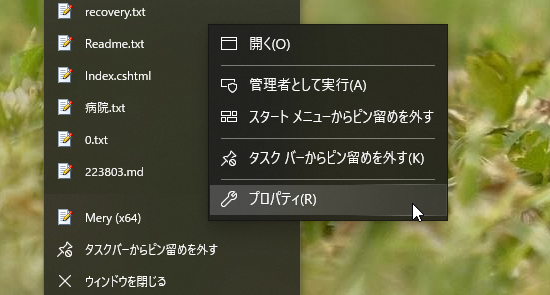
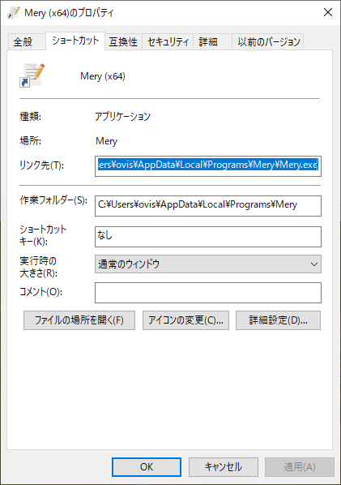

Windows 7以降から利用できる、タスクバーへのソフトのピン止め。  

今回は起動時のオプションを設定する方法が知りたかったのでその備忘録。  

#### 方法1

タスクバーにピン止めしたショートカットは下記の位置に保管されている模様。  

``` 
%APPDATA%\Microsoft\Internet Explorer\Quick Launch\User Pinned\TaskBar 
```

ここに保存されているショートカットのプロパティで引数を設定すれば引数付き起動が可能。  


#### 方法2
個別のショートカットの設定を変更する場合。  

該当のアイコンを右クリックして、そのソフトの名前の部分をさらに右クリックすると出てくるメニューの「プロパティ」を押下すると、ショートカットのプロパティが開く。  

   
 

#### 参考

[oembed:"https://qwerty.work/blog/2019/10/windows10-pinned-taskbar-folder.php"]

[oembed:"https://atmarkit.itmedia.co.jp/ait/articles/1004/09/news094.html"]