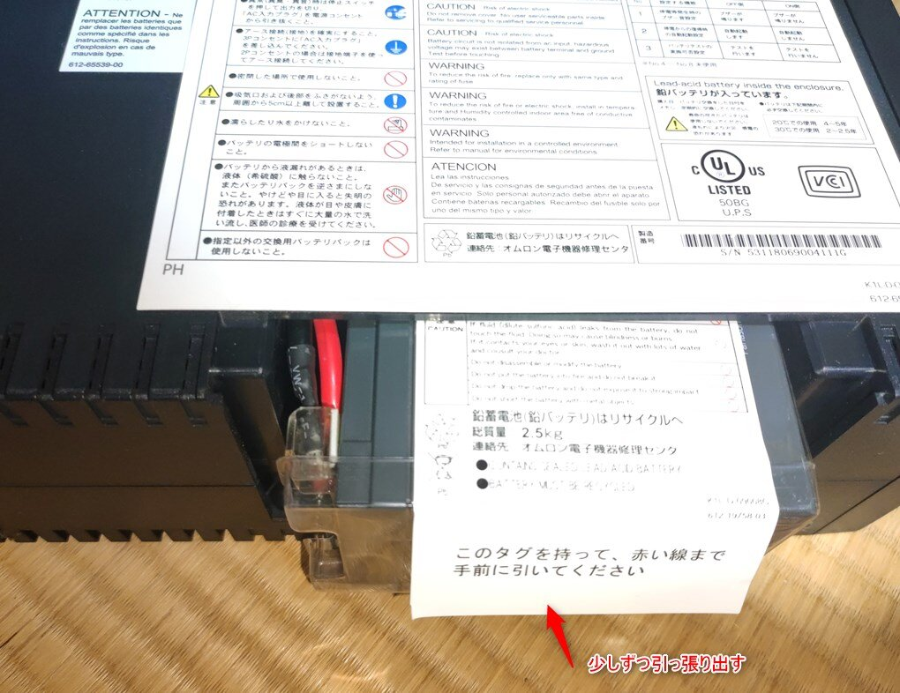
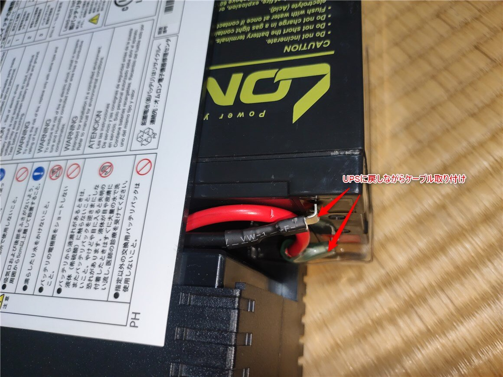
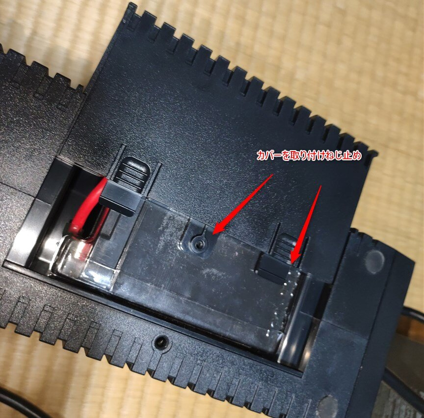

コロナの緊急事態宣言と蔓延防止期間が明け、所要のため実家に一週間ほど帰省。  

用事も終わって家に帰ると何やらピーピーと嫌な音が。  

<!-- more -->

### UPSのバッテリー寿命  
音の出所を探したところ、NASへ電力を供給しているオムロン製UPS、BY50Sからなってました。  

[amazon:B07S1LRJ63]

また、バッテリー交換ランプが点灯していることから、どうやらバッテリーがお陀仏の模様。  
 
 バッテリーの寿命の目安は
- 室温20度の場合4〜5年
- 室温30度の場合2〜2.5年
 とのこと。  
 
古い家で夏は暑く冬は寒い状況下で暖房も冷房もない劣悪な環境に置いていたので劣化するのも仕方がない・・・。  

バッテリーが交換時期を迎えていても電力供給されている限りは問題ないですが、当然停電時にその機能を果たすことはないので、交換が必要。  

購入時にお客様登録をしている場合、バッテリーの無料提供サービスが利用できるのですが、残念ながら購入したのが2018年9月6日。  
UPS本体購入日から3年間のみなので、ぎりぎり対象外・・・。  

[oembed:"https://socialsolution.omron.com/jp/ja/products_service/ups/support/mushou.html"]

とりあえずブザーだけ止めて、バッテリー交換することにしました。  

### 代替バッテリーの購入  

このUPSに搭載されているバッテリーはパナソニック製の `LT-P127R2NA1` というものの模様。  

   

BY50S専用の交換バッテリー(型番：BYB50S)は手に入れにくくかつお高いので、今回は代替バッテリーを利用することにしました。  

本体のサイズ、端子の形状（ファストン端子No.250らしい）が同じで、サイクルバッテリーのものであればとりあえず問題ないそうで、調べた限り割合値段がお安く、かつ実績のあるLONG社の `WP1236W` を購入。  

[amazon:B01KQ5BQHE]

### バッテリー交換作業  

Amazonから無事に代替バッテリーが届いたので交換作業。  

#### UPSのシャットダウン  

BY50Sは通電状態での交換ができるらしいんですが、感電したりとかしたら嫌なので一旦NASの電源を切り、UPSもシャットダウンしたうえで作業を実施。  

#### 裏ブタを外す  

電源を落としたUPSの裏側にバッテリーを取り外すためのフタがあるので、プラスドライバーでねじを外し、裏蓋を外します。  

   

#### 古いバッテリーの取り出し  
白いタグがあるので、これを少しずつ引っ張り、バッテリーを取り出します。  
この時タグに書いてある通り、赤いケーブルが見えるくらいまでで引っ張るのを止めます。  
   

#### ケーブルの取り外し  
UPS本体とつながる赤と黒のケーブルが見えてくるので、これを引っこ抜きます。  
この時絶対ケーブル同士を接触させないこと。  
   

#### 透明なプラカバーの取付  
古いバッテリー（上）と新しいバッテリー（下）。
   

この古いバッテリーから透明なプラカバーをはがします。  
正規のバッテリーの場合はもともとついてるんですが、当然ながら互換バッテリーを使う以上ついてないので使いまわし。    
テープで止めるかしておいたほうがいいかも。  

#### ケーブルの取付、裏蓋のとりつけ  

   

取り外しとは逆の手順でUPSにバッテリーを差し込んでケーブルを取り付け。  
例によってケーブルを接触させないこと。  

後は裏蓋を取り付けるだけ。  

   

#### バッテリーのテスト  
交換が終わったらコンセントにつないで、テストボタンを押してバッテリーのテスト。  
完了してエラーとならなければ交換は完了。  

   

さて、この古いバッテリーはどう処分したものか。

#### 参考

[oembed:"https://voltechno.com/blog/omron-upsbattery/"]

[oembed:"https://kixi.jp/5493"]