これまでSoftEtherを利用したVPNを利用して来ましたが、最近Wireguardという新しいVPNが話題になっているので自分も使ってみました。  
正確にはWireguardベースのTailscaleを利用したのですが、SoftEtherよりも簡単に構築できて便利でした。  


### Wireguardとは

WireguardはUDPベースのVPNプロトコルで、最近Linuxカーネルで標準サポートされるようになったことで話題を集めました。  
高速かつ設計がシンプルで、なんとコードベースは約4000行。  
VPNのPeer間がUDP通信となっていて認証情報が正しくない限り応答しないため、ステルス性が高くアタックしづらいのが特徴。  
サーバーとクライアントという概念がなく、いわゆるPeer-to-Peer、メッシュ的な構成。
OpenVPNよりも高速で信頼性が高いVPNとして注目を集めている模様。  

### Tailscaleとは  
もともとWireguard自体設定等が簡単にできるらしいんですが、接続する端末が増えれば増えるほど構成管理が複雑になるところを解決する管理サービスとして提供されているのがTailscale。
ウェブから管理が可能で、アプリケーションをインストールしてOAuth認証すればさくっと接続できてしまいます。  
NATを超えられるのでポート開放しなくてもいいというのも大きなポイント。

有料サービスですが無料プランで20端末までは利用可能。

### Windows へのインストール  
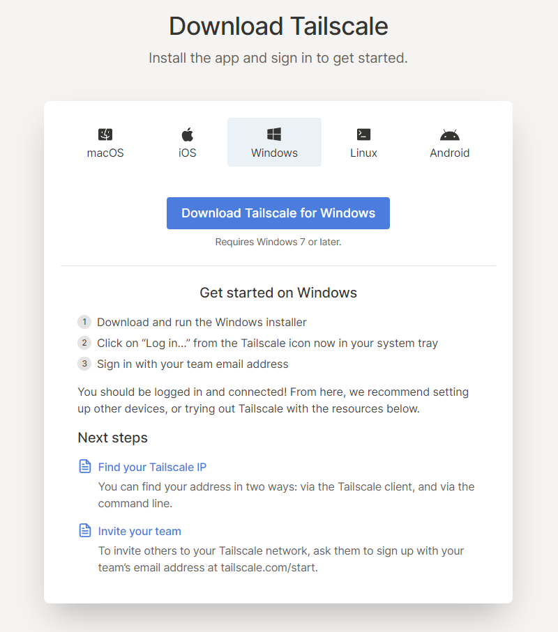

まずTailscaleのサイトからインストーラーをダウンロード。  

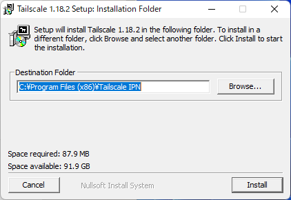

インストール先を指定してインストールすると、
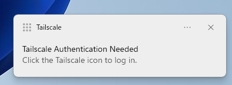

こんな感じで通知が表示されるのでタップすると、

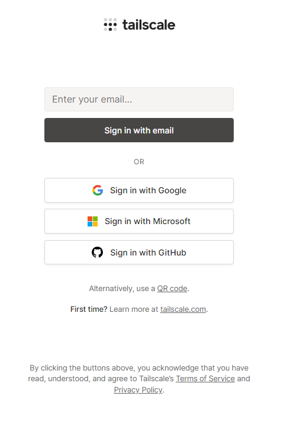

ブラウザが開き、ログイン画面が表示される。  
ログインには
- E-mail
- Googleアカウント
- Microsoftアカウント
- GitHubアカウント
- QRコード

を利用可能。  
私はMicrosoftアカウントを利用。 
これまでにTailscaleを利用していなくとも、普通にログインするだけ。  

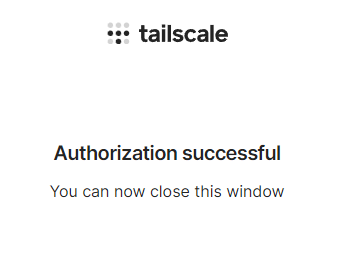

この画面になったらブラウザを閉じてOK。  

この段階でアカウントも開設されて、ウェブ管理画面から管理が可能になります。  

[https://login.tailscale.com/admin](https://login.tailscale.com/admin)


タスクトレイにもTailscaleアイコンが。  
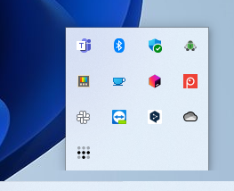

ここから管理コンソールに飛べます。  
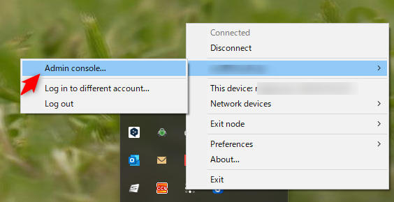

### Linux へのインストール

一番手っ取り早いのは[https://tailscale.com/download/linux](https://tailscale.com/download/linux) に記載のある下記のコマンドをsudoで実行すること。  

```bash
curl -fsSL https://tailscale.com/install.sh | sh
```

パッケージ管理システムにリポジトリを追加してインストールする方法も記載されているので、どちらかで。  

インストールが完了したら、

```bash
sudo tailscale up
```
を実行すると、
```bash
To authenticate, visit:
    
        https://login.tailscale.com/a/111111aaa11a

```
このようなメッセージが表示されるので、URLをブラウザで開くと、Windowsと同じくログイン画面が表示されるのでログイン。 
ログインさえ終わってしまえばセットアップ完了。  

### Android へのインストール
お次にAndroid端末へのインストール。  

Google Play Storeに公開されているのでさくっとインストール可能です。  

[oembed:"https://play.google.com/store/apps/details?id=com.tailscale.ipn&hl=ja&gl=US"]


Get Started をタップ。
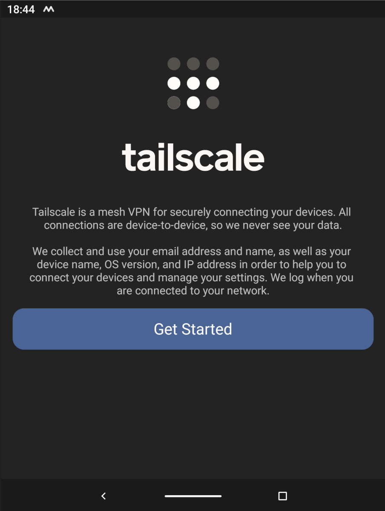

Googleアカウントでログインするなら `Sign in with Google`、それ以外のアカウントでログインする場合は`Sign in with other`をタップ。  
私はMicrosoftアカウントアカウントなので`Sign in with other`。  
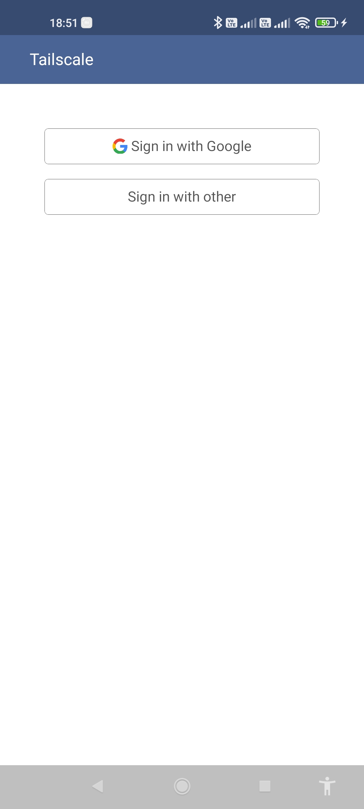

Windowsの時と同様のアカウント選択画面になるので、利用するアカウントのボタンをタップして、ログイン実施。  

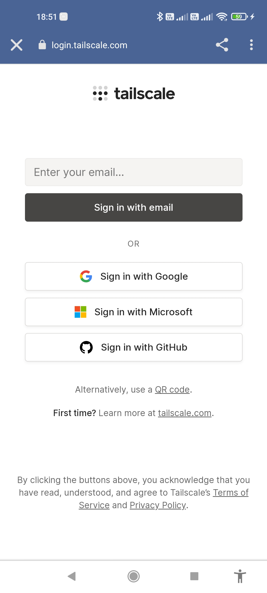

ログインが完了するとこんな画面が開くので OKをタップ。  
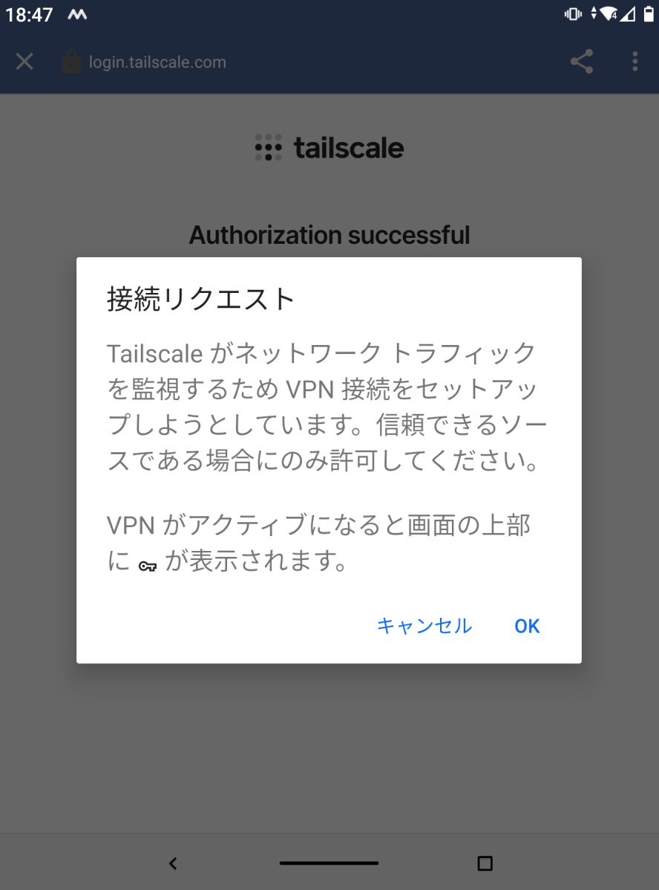

左上の×をタップ。  
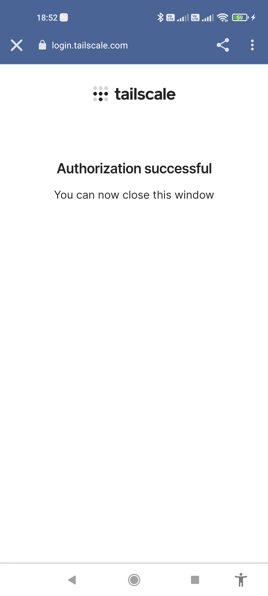

これで接続完了。  
VPN接続を解除したい場合は
左上のActiveトグルをタップ。  

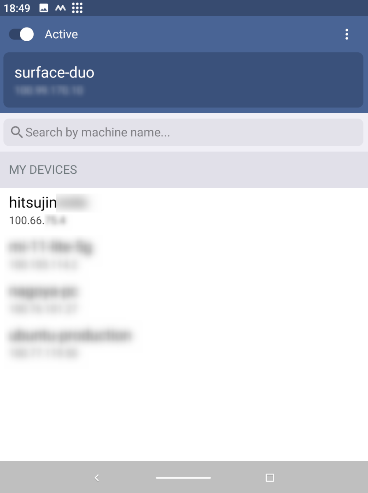


### NASへのインストール  
QNAPについては非公式なQPKGビルドパッケージ、Qynologは公式でインストールパッケージが提供されてます。


#### Synology NASへのインストール  
管理コンソールにログインしてからパッケージセンターから、Tailscaleをインストール。  

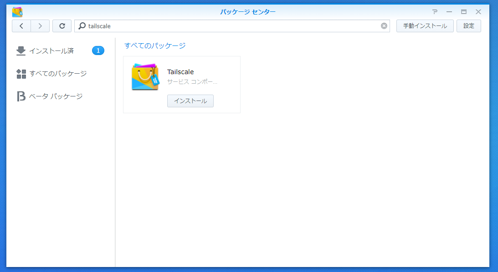

ファイアーウォールがブロックしたと通知が表示されるので、アクセス許可。  
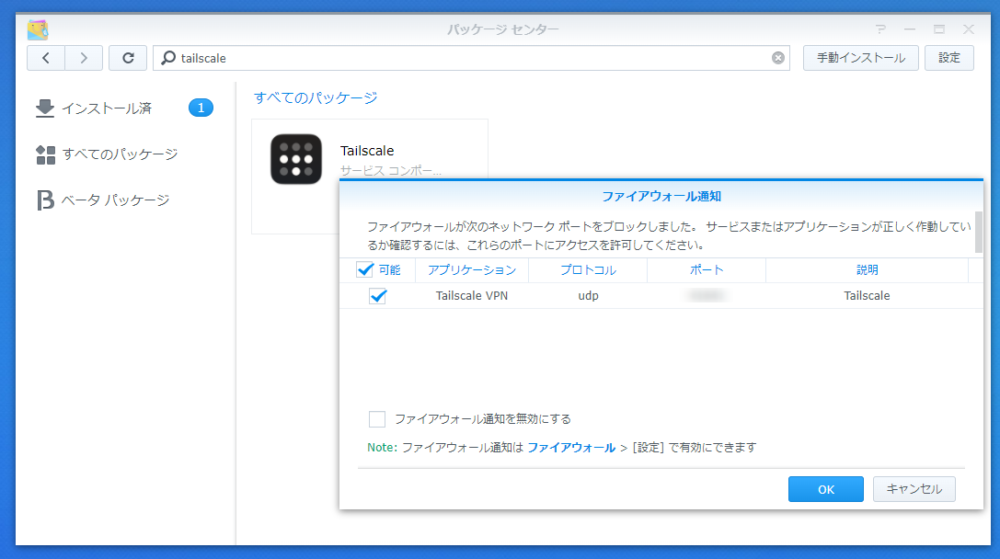

「開く」ボタンを押すとブラウザが開いてこの画面に。  

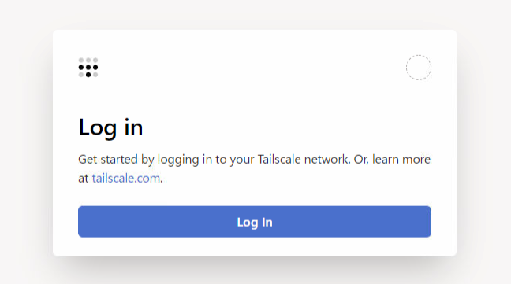

あとはほかと同じようにログインするだけ。


すでに認証が終わっている場合はこんな画面がブラウザで開きます。  
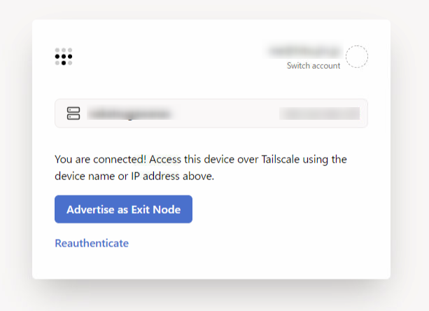

#### QNAP NASへのインストール  
QNAPは少々面倒です。  
QNAPのAppCenterになく、QPKGファイルも自分で作る必要があります。  

Dockerが利用可能なLinux環境（WSL2でもOK）で、https://github.com/ivokub/tailscale-qpkg.git をクローン。  
`make out/pkg` コマンドを実行して、パッケージを作成。  

私はDocker Desktop for WindowsとWSL2で作成しました。  
WSLのインストール後、ストアからUbuntuをインストール。  
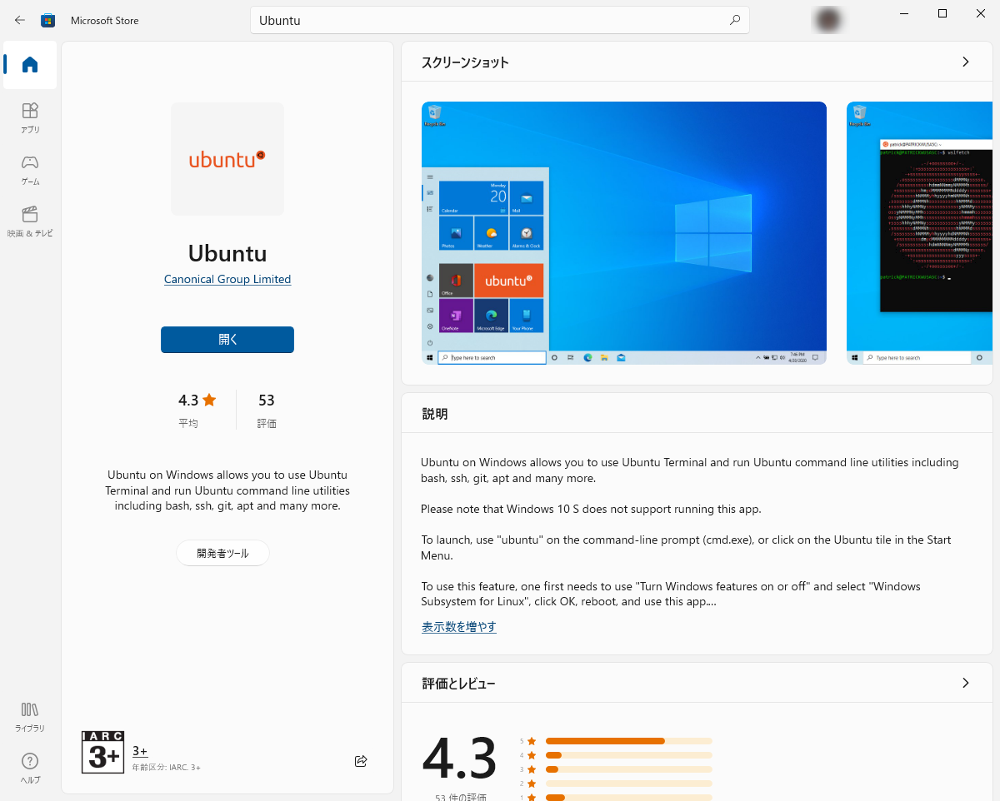

Docker Desktopをインストールしたら設定でWSL2との連携設定。  
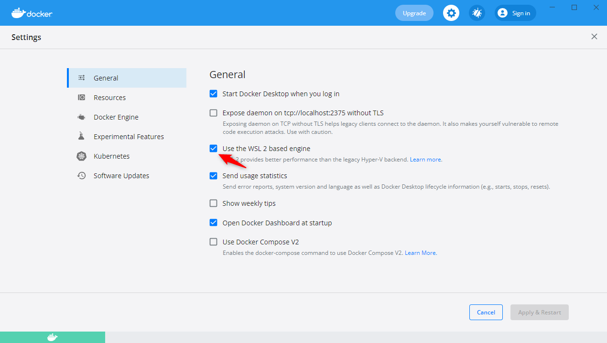

DockerとWSL2Ubuntuが連携できるよう設定。  


あとはWSL2Ubuntuを起動して、
```bash
git clone https://github.com/ivokub/tailscale-qpkg.git
sudo apt install build-essential
cd tailscale-qpkg
make out/pkg
```

これでOK。  
あとはビルドが完了するのを待ちましょう。  

作成したパッケージファイルは

```
\\wsl$\ディストリビューション名(Ubuntu)\home\(user-name)\tailscale-qpkg\out\pkg
```
をエクスプローラーで開けば簡単に取れます。  

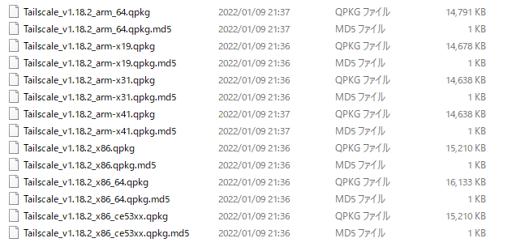

NASによって必要なファイルが変わります。  
私はTS-431Pなので、arm-x41になります。  
ここは下記のサイトを見るとわかりやすい。  

[oembed:"https://www.oliospec.com/blog/?p=1091"]

もしくはSSHログインをしてから、
```
getcfg "" Platform -f /etc/platform.conf
```
を実行。  
これでARM_MSが帰ってきた場合はx31。ARM_ALだった場合はx41らしい。  
https://github.com/qnap-dev/QDK/issues/21

QNAPのApp CenterからQPKGファイルを手動インストール。  

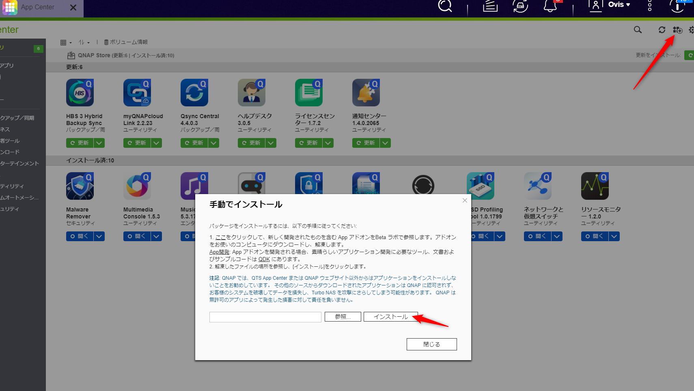

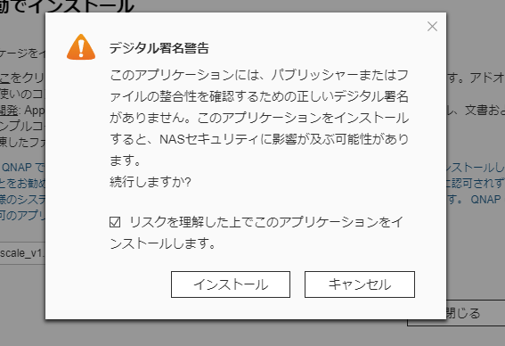

が、インストールが途中まで進んでから失敗のメッセージ。  
ログを見てもエラーメッセージが出ない。  

仕方がないのでもう一台のQNAP NASにインストールすることに。こちらはx86 CPUだったので `tailscale_v1.18.2_x86.qpkg` をインストール。  

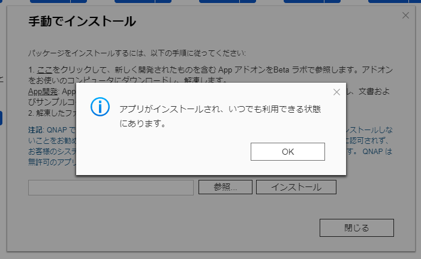

インストール完了。  

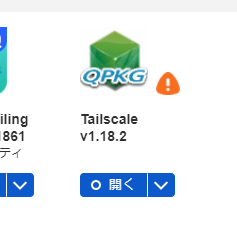

インストールが終わったらSSHでNASにログインし、下記のコマンドを実行。  

```ssh  
getcfg SHARE_DEF defVolMP -f /etc/config/def_share.info
cd (上で取得したパス)/.qpkg/tailscale
sudo ./tailscale -socket var/run/tailscale/tailscaled.sock up
```

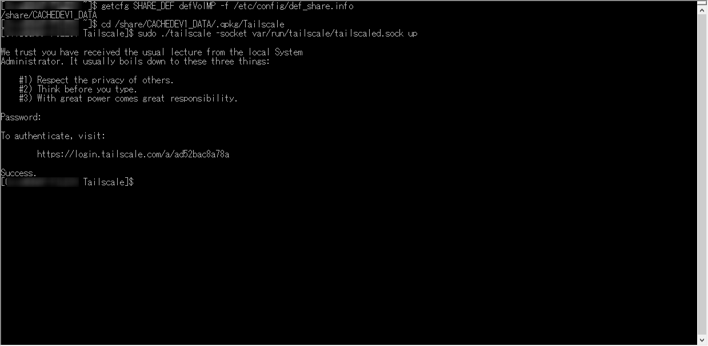

実行するとURLが掲示されるので、そのURLを開いて認証を実施すればセットアップ完了。  

## 参考

[oembed:"https://mstshiwasaki.hatenablog.com/entry/2020/06/15/101239"]

[oembed:"https://internet.watch.impress.co.jp/docs/column/shimizu/1303751.html"]
