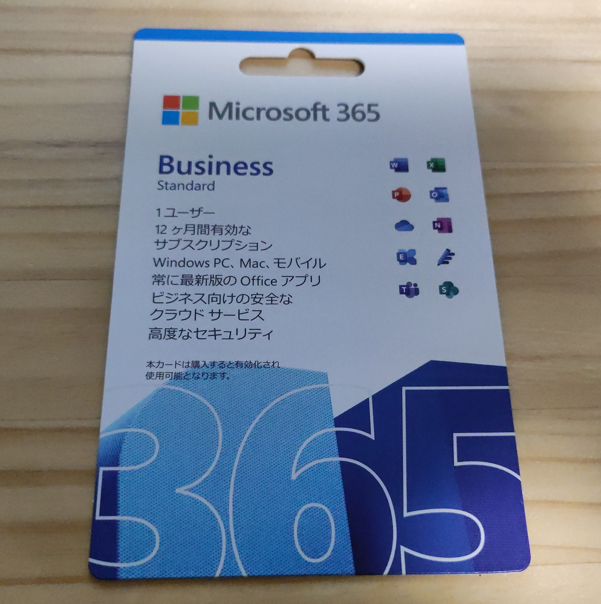
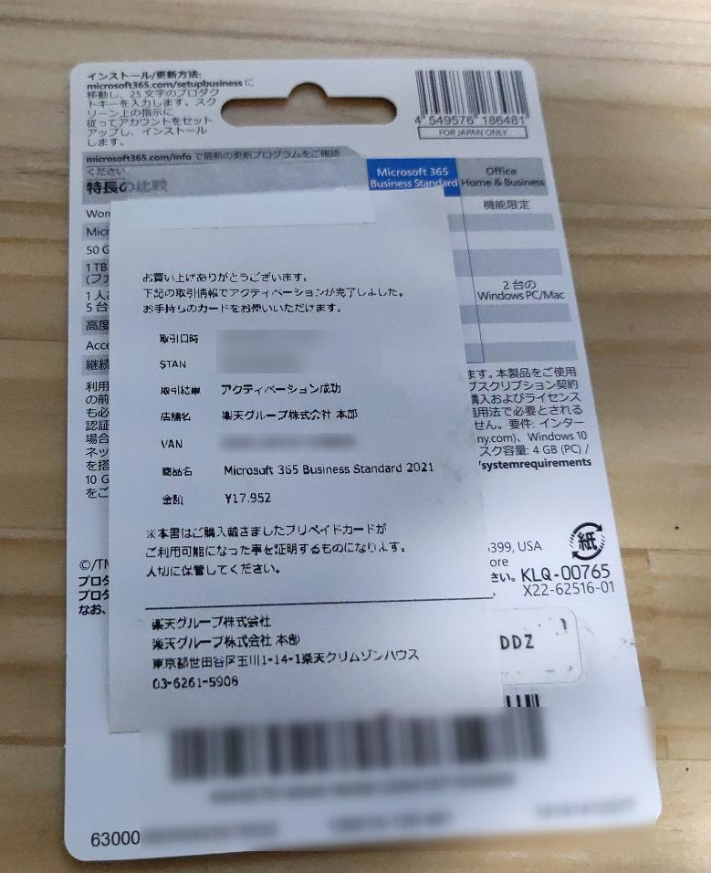
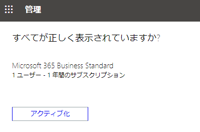
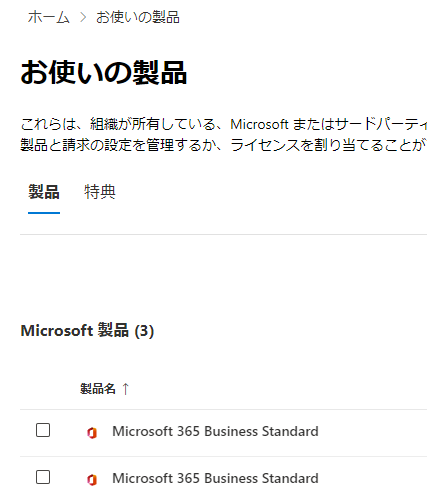
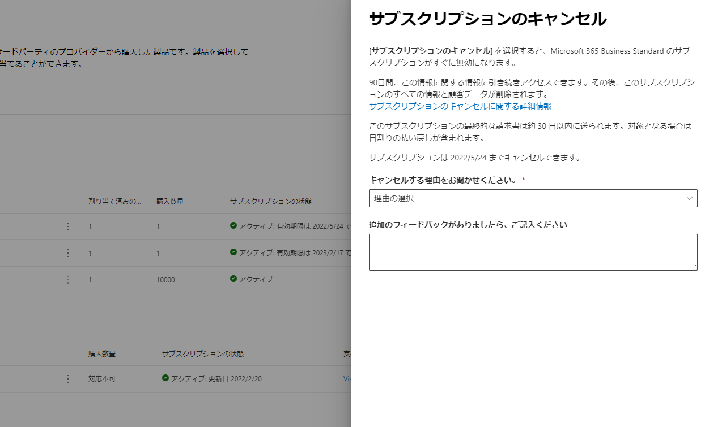

普段利用しているメールやOffice製品の利用のため、Microsoft 365 Business Standardを契約して利用しています。 
これまで支払いをカードで行っていたのですが、つい最近Microsoft 365が値上げするというニュースを発見。  
実はBusiness Standardに関しては値上げ対象外だったものの、今後値上げする可能性は高いですし、Amazonなどで売っているPOSAカードやオンラインコードを利用したほうが多少なりと安くつくということでカード決済から切り替えることにしました。  

### POSAカード

ちょうど楽天のスーパーディールショップでポイント還元していたこともあり、今回は楽天でPOSAカードを購入。  
Amazonもたまにセールで安く売っているので、そういう時に買っておくとよさそう。  

裏にコインで削る場所があるので、そこを削るとプロダクトキーがわかります。  

### プロダクトキーの登録

右上にインストール/更新方法の欄があるので、その記載を参考にセットアップを進めます。  

まず https://microsoft365.com/setupbusiness に遷移し、プロダクトキーを入力、次へを押下。  

アクティブ化を押下。  

これだけで登録できたと思ったのですが、お使いの製品ページを見ると、なぜか製品が二つ。  

既存のサブスクリプションと新しいサブスクリプションが同居する形になってしまいました。  

既存サブスクリプションを更新するつもりだったのでこれは困る。  

### サポートとやり取り  

ページ右下にヘルプとサポートがあったので、こちらからサポートに問い合わせ。  

メールでやり取りする予定だったのですが、電話がかかってきました。

いろいろ確認したところ、カード決済でのサブスクリプションと、オンラインコードやPOSAカードによるサブスクリプションでは契約が完全に異なっているとのこと。  
そのため、別のサブスクリプション契約を追加する形になってしまったそう。  

この場合どうしたらいいかについても確認しました。  
結論としては既存のサブスクリプションをキャンセルし、アカウントに新しいほうのサブスクリプションを割り当てるだけでOK。  

サブスクリプションをキャンセルした場合、残り日数分は日割りで返金されます。  
なので、金銭的に損をすることはないのだそう。  

ということで今回は既存サブスクリプションをキャンセルしました。  

次回更新する際は通常通りプロダクトキーを入力すればサブスクリプションが更新される模様。  
ただ、サポートの方によるとたまにサブスクリプションが更新されず新規登録されたという問い合わせがあるようで、サブスクリプションの有効期限が切れてからプロダクトキーを入力することをお勧めするとのこと。  
有効期限が切れても1か月程度猶予期間があり、その間機能が使えなくなるわけではないというのは知りませんでした。今後はこれで対応しようと思います。

