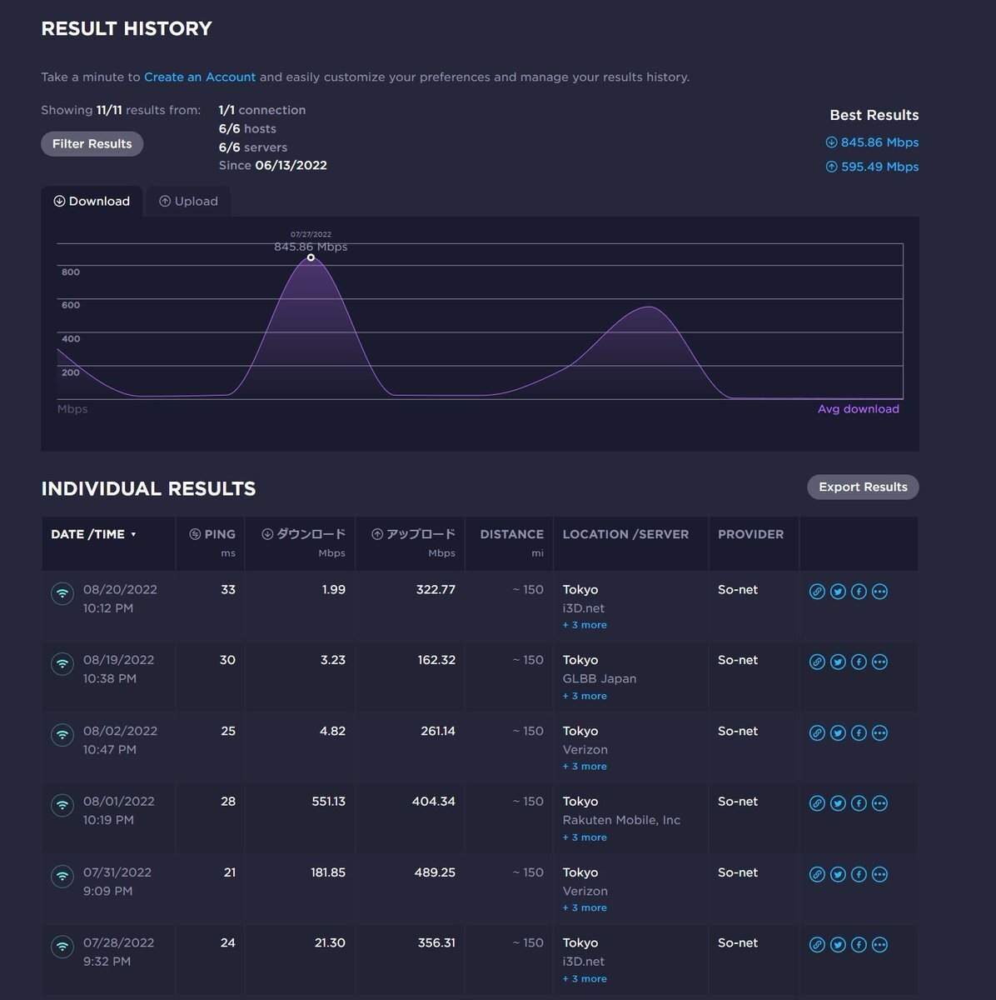

今の一軒家に引っ越した2017年当初はフレッツ光で契約していたのですが、もう少し速度でないかなぁと思っていたところ、NURO光が名古屋でも利用できるようになり、値段もこれまでのフレッツでの契約よりお手頃だったことから、2018年の3月にNUROに乗り換えてました。  

<!-- more -->

ちょうどそのころの記事がこちら。  

[oembed:"https://blog.hitsujin.jp/entry/2018/03/03/114027"]

導入当日は速度があまり出なかったものの、翌日から良い感じに速度がでるようになってほっとした記憶。  

当初ローソンチケットにNUROからだとログインできない問題があったりしたものの、おおむね満足していました。  

[oembed:"https://blog.hitsujin.jp/entry/2018/04/07/193306"]

### 2022年3月 2.5Gbps対応ONUに交換

ONUの2.4GHzのWiFiが調子悪く、NUROスマートライフを契約する（そしてすぐに解約）すると2.5GbE対応ONUに交換できることを知って、試したころのつぶやき。  

[oembed:"https://twitter.com/hitsuji_no_hito/status/1507016760406736896"]

1400Mbpsとかでて喜んでいたころ。  

### 2022年5月 夜に不調  

[oembed:"https://twitter.com/hitsuji_no_hito/status/1527645889958793217"]

5月に入ったあたりから、18時～24時の間あたりで極端に速度が低下するようになってきました。  
とはいえ16Mbpsとかくらいは出ていた。  

[oembed:"https://twitter.com/hitsuji_no_hito/status/1539591694819422208"]

### 2022年8月 回線メンテ後も改善せず、切り替えを決意  

[oembed:"https://twitter.com/hitsuji_no_hito/status/1552271047827005440"]

[oembed:"https://twitter.com/hitsuji_no_hito/status/1553715013340524544"]

ゴールデンタイム中回線速度がひどく落ちることに業を煮やし、サポートに問い合わせ。  
数日後に居住地域の回線メンテナンスがあると案内されるので様子見。  

[oembed:"https://twitter.com/hitsuji_no_hito/status/1554463955544064004"]

メンテナンス後もやっぱり遅い。  
このあたりでNUROをやめることに。  

8月ごろ計測したときのSpeedTestの結果はこんな感じ。  

### 2022年8月 コミュファ光に申し込むも、工事が12月といわれる

NUROから乗り換えるにあたり、できるだけ回線速度が速く、そしてできるだけ安いところがいいな、ということでいくつか検討し、電力系のコミュファ光に申し込み。  
ここはキャッシュバックのほか、NURO光の違約金等も負担してくれるのがよかった。  
が、契約し書類等も到着したあたりでコミュファ側から工事日程が12月ごろになりそうだという連絡が。  

[oembed:"https://twitter.com/hitsuji_no_hito/status/1564625844471037957"]

なんでも我が家に光ケーブルを引っ張るための電柱の強度問題があるらしく、その工事をしてからでないといけないために普段より時間がかかるとか。まじか。  

### 2022年9月 enひかり契約

工事日については保留としてもらったものの、12月はちょっと遅すぎる。  
電柱の強度問題は新規にFTTH網を引っ張ってくる都合とのことなので、であればフレッツであれば問題ないはず。  
ということで改めてフレッツで契約を考えることに。  

ちょうどこのころにフレッツ光クロスが自宅でも利用可能であることを知り、できれば今後のことを踏まえて光クロスで行きたいなと考えていたところ、enひかりというプロバイダの存在を知りました。  

[oembed:"https://enhikari.jp"]

ここ、やたら安い。なんと光クロスで税込5445円。  
そして当然ながらフレッツ網なので回線品質自体は他と同等。Xpassでの接続なのでPPPoEでの速度問題もなし。  

評判も調べたうえで、ここにお願いすることに。  
工事日は11月と、契約時点は9月だったので結構先ではあったものの、12月よりはマシなので許容。  
特にこのころはパケロスもひどくストレスフルだったので、よくなるなら何でもいいやくらいのお気持ち。  

[oembed:"https://twitter.com/hitsuji_no_hito/status/1571825635726852096"]

### 2022年10月 NUROの速度チェック  

どれくらい変わるのかを検証するためにときたまSpeedtestで計測していました。  
PC版のSpeedtestだとパケロス情報が見えないようだったので、AndroidアプリをWindowsで動かす形で確認。  
なお計測サーバーは基本的にIPA CyberLab。  

[oembed:"https://twitter.com/hitsuji_no_hito/status/1580909141593587717"]

[oembed:"https://twitter.com/hitsuji_no_hito/status/1582342907302117378"]

[oembed:"https://twitter.com/hitsuji_no_hito/status/1587429880199016455"]

[oembed:"https://twitter.com/hitsuji_no_hito/status/1587790178822885377"]

NUROの回線トラブルがネットニュース等で大きく取り上げられるなどした結果、愛知県エリアでも9月27日にメンテナンスをしたらしく、たまに早くなることがあるものの、アップロード速度は極端に遅かったりと不安定。  

### 2022年11月 enひかり開通  

11月15日、施工業者がやってくる。午後開始の予定だったのが午前10時からとなったものの、早く終わる分には助かるのでOK。  

工事の方に聞いてみたところ、やはりというかなんというか、NUROからフレッツに乗り換える人が多いそう。  
人が減った結果NUROが快適になるかもしれないなぁとは思うものの、NTTのダークファイバーを利用する形で提供していた以上何かあった時に対応が後手後手になるNUROに居続けるのはリスキーそう。  

工事は1時間もせず終わり、ルーターの設定へ。  
3月に2.5GbEのONUに切り替えたタイミングでアクセスポイントとしての利用でIO-DATAの10GbE対応ルーターを購入していたので、これを流用。  

[amazon:B08HRP82S7]

ONUに接続し、ルーターの管理画面に入って接続設定。  
IDやパスワードといったものはXpassの場合なく、自動的に降ってくる模様。  
なぜかなかなか降ってこなかったものの、何度か試してるうちに接続完了。  

そしてその日の結果。  

[oembed:"https://twitter.com/hitsuji_no_hito/status/1592366726926434304"]

こちらは夜。  
[oembed:"https://twitter.com/hitsuji_no_hito/status/1592520358011494401"]

圧倒的じゃないか、我が軍は。（このセリフだけは知ってるけどガンダムは未履修）  

NURO光10Gでなく普通のNURO光だったので、10Gの光クロスと比較しちゃダメなのですが、がっつり速度出てます。  
ONU、ルーターを置いている2階から仕事部屋の1階までのLANケーブルがカテゴリ5eなのと(業者に工事お願いしたときに指定し忘れた結果5eが取り付けられてた)、PC側も2.5GbENICなので、実際にはもっと出ているかも。  

[oembed:"https://twitter.com/hitsuji_no_hito/status/1592887854770049026"]

これまでネット利用が厳しかった18時～24時の間でも快適に利用ができる幸せ・・・。  
18時以降に仕事のWebミーティングとかするときに回線が不安定になって音が相手に届かないなんてことすらあったので、これで仕事もはかどります（ホントか？）。  

回線も快適になったのでこれでNUROとはお別れ。  

NUROもほめるべきところがありまして、ネットから解約が簡単にできました。  

あとは後日やってくる宅配業者に、これまで使っていたONUを送り届けてもらうだけです。  
2018年から使っていたため工事費の残債はなく、また解約違約金も今年からずいぶん値下がりしたことで、別回線に切り替える踏ん切りがつけました。  

万が一enひかりがサービス終了したり回線速度が劣化したとしても、フレッツ光コラボなので事業者変更すればいいですし、これで一安心です。