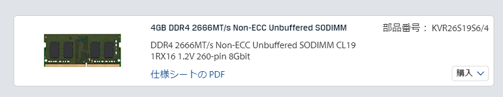
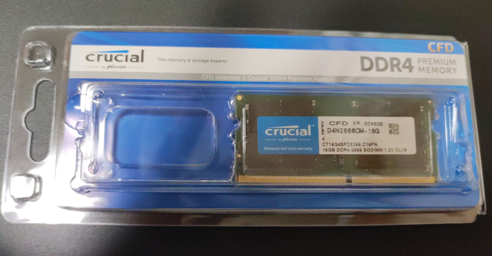
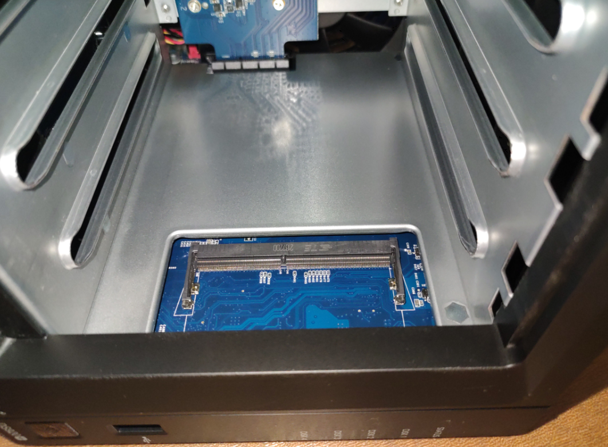
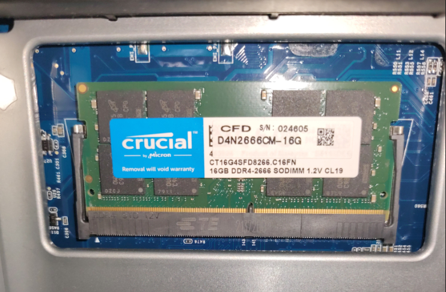
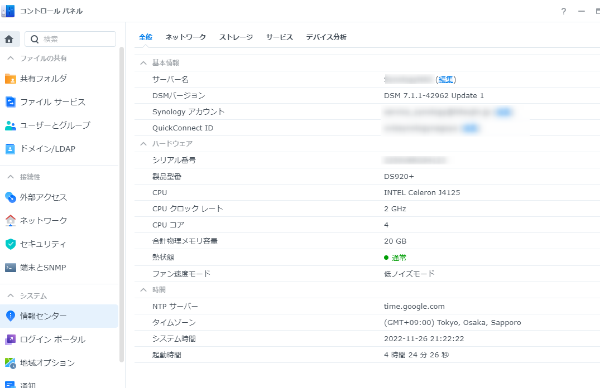

今年QNAPのNASからSynologyのNAS、DS920+に乗り換えました。  
実家にもSynologyのNASを置いてまして、インターネット経由でファイルをバックアップしてます。  
以前はResilio Syncを使ってたんですが、大量のファイルがあると失敗することがあり、利用を断念。Synologyが標準で提供するSynology Drive ShareSyncに乗り換えました。めちゃくちゃ安定しているので助かる。  

で、それくらいならもっと安いNASにしてもよかったのですが、DS920+だとDockerや仮想マシンが利用できる、ということで奮発しました。  

ただ、DS920+はメモリーが4GBしか載ってません。正直Dockerや仮想マシンを使うにはちょっと少なすぎる。  
そんなわけでメモリーを増設することにしました。  

<!-- more -->

### 増設メモリーの選定

DS920+は1スロット空いており、公式には4GBの換装が可能、つまり計8GBまでが搭載可能となってます。  
が、調べてみると16GBのメモリーも搭載できたという報告があったので、今回はそれにチャレンジ。  

当たり前ですけどもSynology純正メモリーに16GBメモリーなんてものがないので、非純正品のメモリーになります。  

対応メモリーとして発売されているメモリーのスペックを見てみると

- DDR4 SO-DIMM
- PC4-21300 2666MHz
- Non-ECC
- CL19
- 1.2V

[oembed:"https://www.kingston.com/jp/memory/search/model/101121/synology-diskstation-ds920"]

となっているため、これに準じたメモリーを探し、下記のメモリーを購入。  

[oembed:"https://www.cfd.co.jp/biz/product/detail/d4n2666cm-16g.html#product-specification"]

[amazon:B086R8T446]

### メモリーの増設

メモリーが届いたので早速増設開始。  

[oembed:"https://synology-fan.com/nasdiy-03/"]

DS920+はメモリーの増設が非常に簡単で、ドライブトレイを全部取り外すと、メモリースロットが顔を出します。  

メモリーの差し込み位置を間違えないように斜めに差し込めば増設完了。  

### 動作確認  

増設が終わったので電源投入。  
失敗の場合、起動せず電源ボタンのランプが青く点滅したままになるそう。  
少々ドキドキしたものの、正常にDSMが起動しました。  

コントロールパネルを見ると、ちゃんと合計物理メモリ容量が16GB足された20GBになってます。  

これだけあればDockerでいくつか起動させても困らなそう。