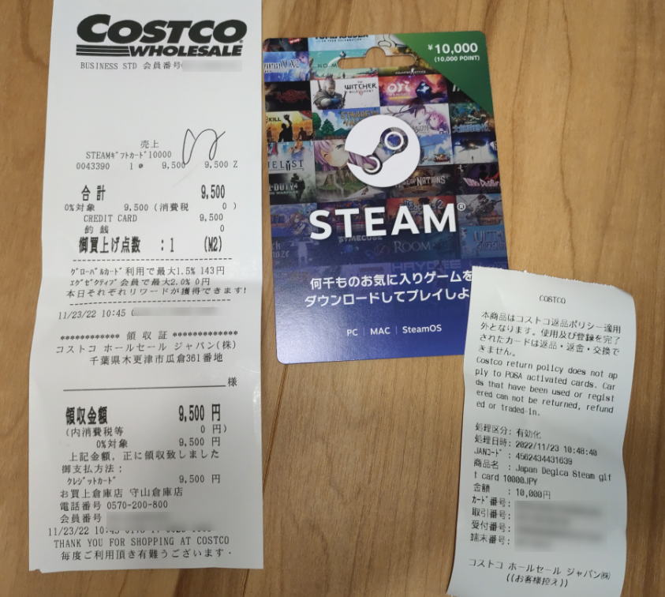
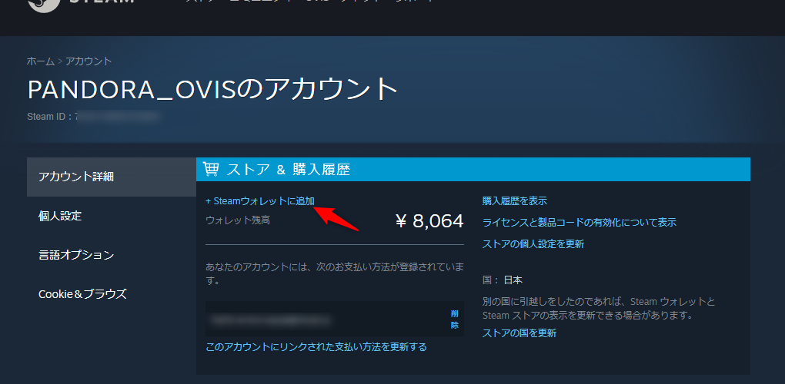
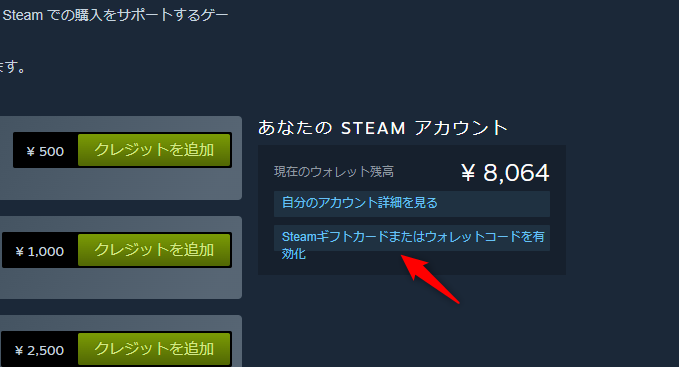
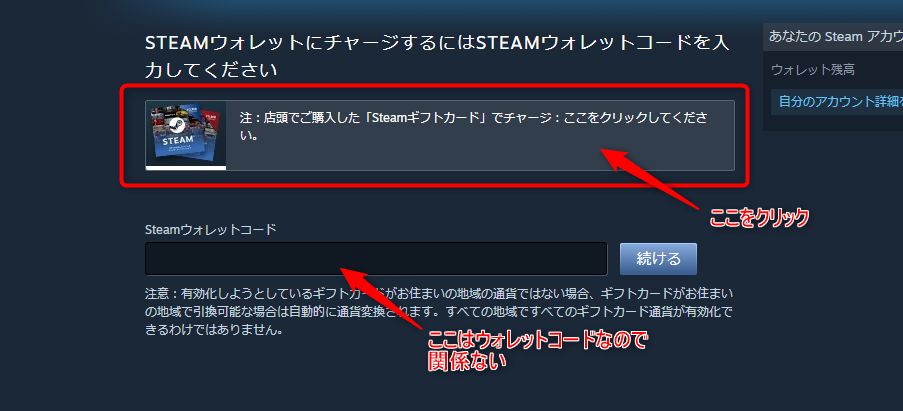
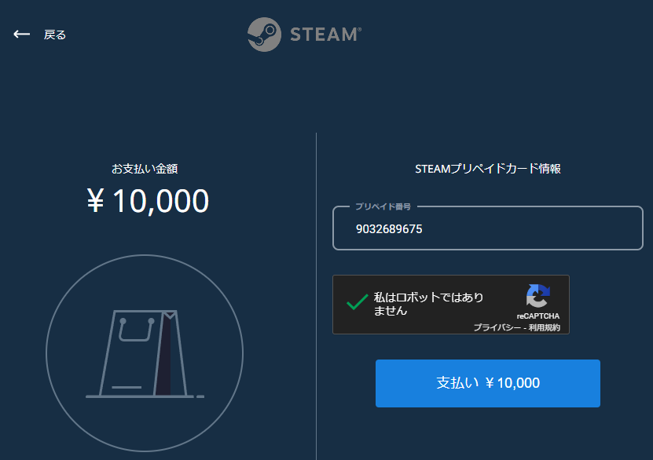
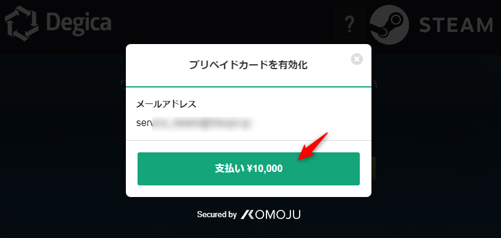
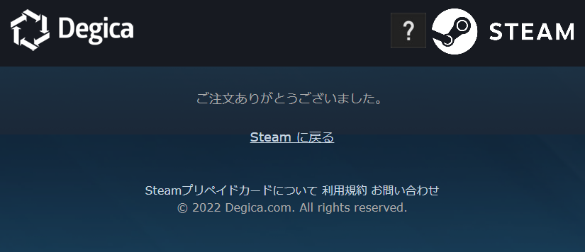
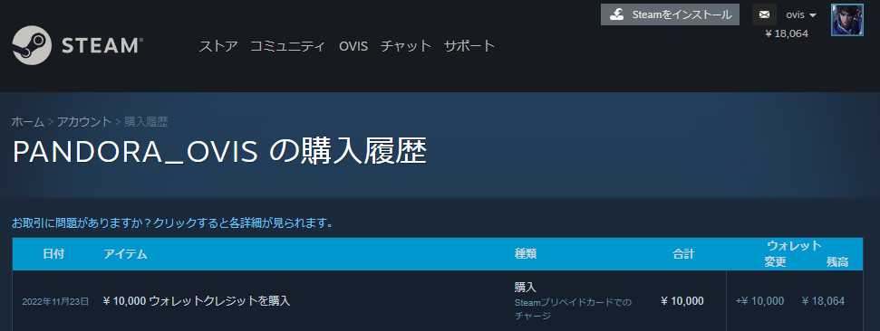
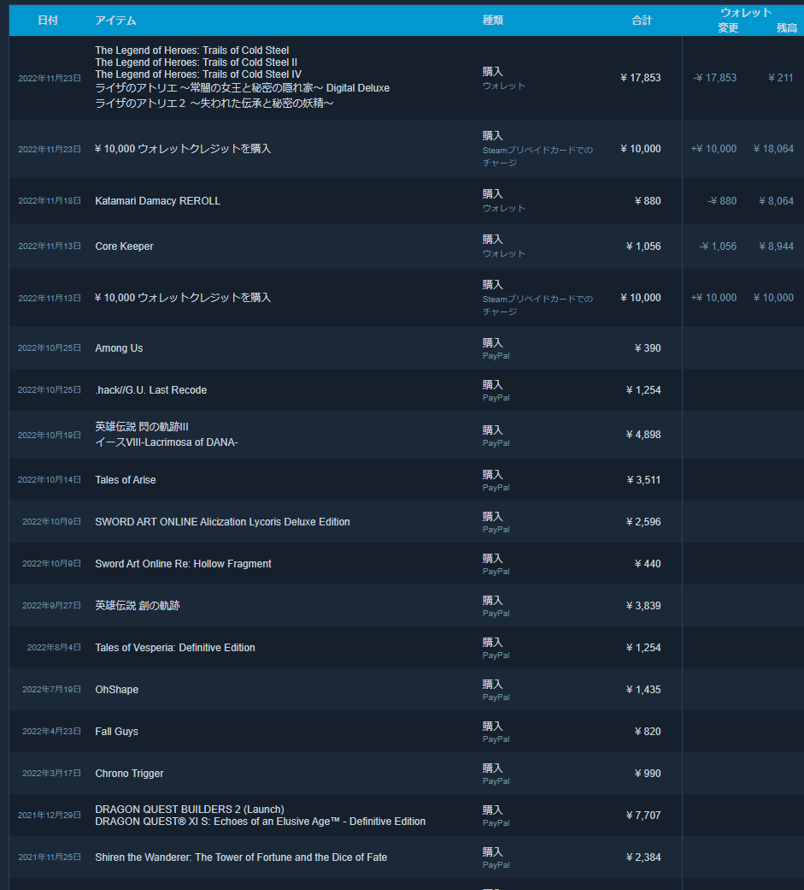

もうタイトルのまま。  

### コストコ

名古屋市守山区にあるコストコホールセール 守山倉庫店。  
割合近いところに住んでるので月に数回買い物に行ってます。  

### STEAMギフトカード

たまたまコストコからくるメールマガジンを読んでいたところ、STEAMギフトカードが目に入ってきました。  

10000円分のギフトカードが9500円で購入可能。5%オフ。  
これ別にセールというわけでなく、実は常設の商品らしい。  

ちょうどオータムセールが始まり、欲しかったゲームがいくつかセールになりそうだったので、購入してきました。  

### ギフトコードの登録  

そんなわけで買ってきたギフトカードがこちら。  

いわゆるPOSAカードなので、レジで支払いを完了して初めて有効化されます。  
コインで削ってでてきた番号も有効化しないとただの数字の羅列。  

Steamにログインしたらアカウント画面から、`Steamウォレットに追加` をクリック。  

`Steamギフトカードまたはウォレットコードを有効化` をクリック。  

この画面はウォレットコード入力ページなので、 `注：店頭でご購入した「Steamギフトカード」でチャージ：ここをクリックしてください。` と書かれた欄をクリック。  

購入した額(今回は10000)を入力し、 `Steamウォレットチャージ` をクリック。  

`支払い\10,000` のボタンをクリック。  

ここでようやく番号入力ページになるので、プリペイド番号にギフトカード裏の番号を入力し、reCAPTCHAのチェックを入れてから`支払い\10,000` のボタンをクリック。  

これで購入完了。  

ちゃんと購入履歴にクレジットが追加されてます。  

ちなみにギフトカード自体は購入してから180日間有効らしいんですが、ウォレットの有効期限はないので、チャージしてしまえば有効期限を気にする必要はないみたい。  

### 積んだゲーム

そんなわけで日本ファルコムの軌跡シリーズと、アトリエシリーズをポチポチしました。  
今年たくさんゲームを買ったけど、結局どれもやってないという。いつやるのやら。  

