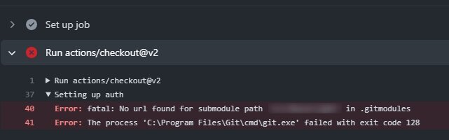

セルフランナーでの挙動なので通常環境で起きるかどうか検証してないのですが、とりあえずメモとして。  

とある案件でNuGetパッケージが更新されず、GitHub上のリポジトリは更新されているライブラリを利用するため、Submoduleを利用してました。  
最近NuGetパッケージも更新されるようになり、Submoduleを利用する必要性が薄れたため、Submoduleを削除してNuGetパッケージを利用するプルリクエストを作成し、メインブランチにマージを行いました。  

このメインブランチに反映したものを別のブランチにもマージしてプッシュしたところ、下記のエラーが。  



GitHub Actionsのワークフローでは、`actions/checkout@v2` の処理中にSubmoduleの処理をしているのですが、ここでなぜか削除したはずのライブラリの取得でエラーになってる様子。  

```yml
    steps:
    - uses: actions/checkout@v2
      with:
        submodules: recursive
```

セルフランナーのワーキングディレクトリを消してもらったりしてもうまくいかなかったのですが、最終的にメインブランチからマージして取得せず、rebaseする形で取り込むと問題なく動きました。  
Submoduleの削除で.gitmoduleからライブラリのプロジェクト参照を消していたとしても、そのブランチのもととなる位置の段階でSubmoduleを参照している場合エラーとなる？  
