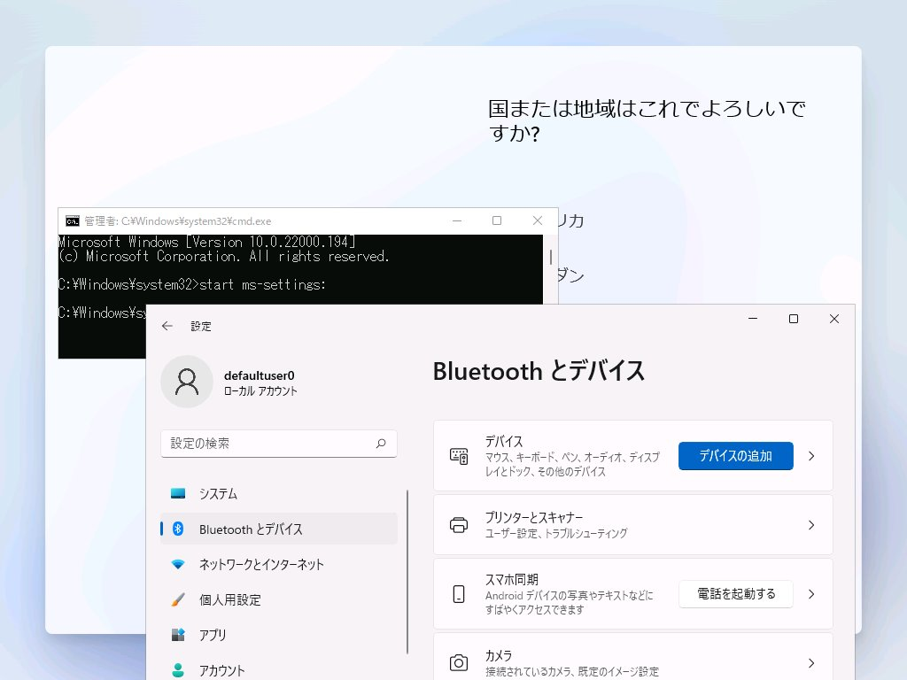

Windows 11の再インストールをする際、OOBE画面の操作でいちいちUSB接続のマウスを使う必要があるのは面倒だなぁと思っていたところ、知り合いから良い方法を教えてもらったのでメモ。  

OOBE画面では Shiftキーを押しながらF10を押すとコマンドプロンプトが起動する。  

コマンドプロンプトで `start ms-settings:` を実行すると、Windowsの設定画面が表示されるので、あとは頑張ってキーボードでBluetooth接続すればOK。  

ネットワークを切断した状態でOOBE画面を進めることができる `oobe\bypassnro` も別途覚えておくとローカルアカウントでセットアップしたいときに便利。

[oembed:"https://forest.watch.impress.co.jp/docs/serial/yajiuma/1401644.html"]